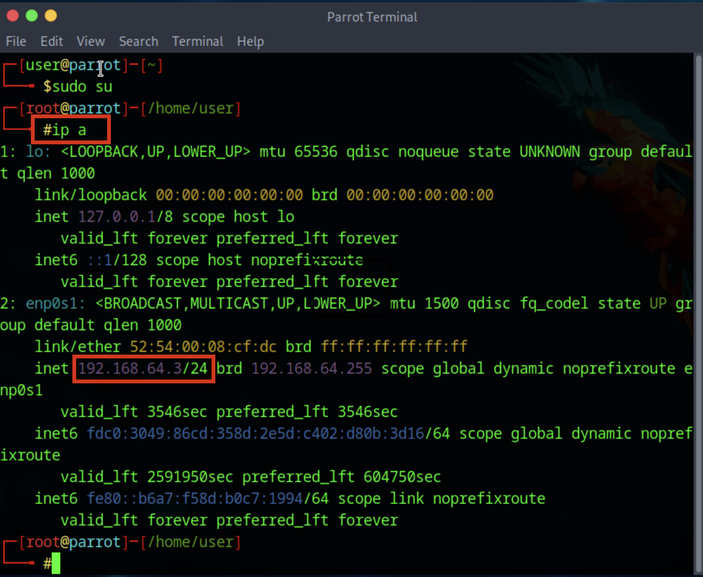
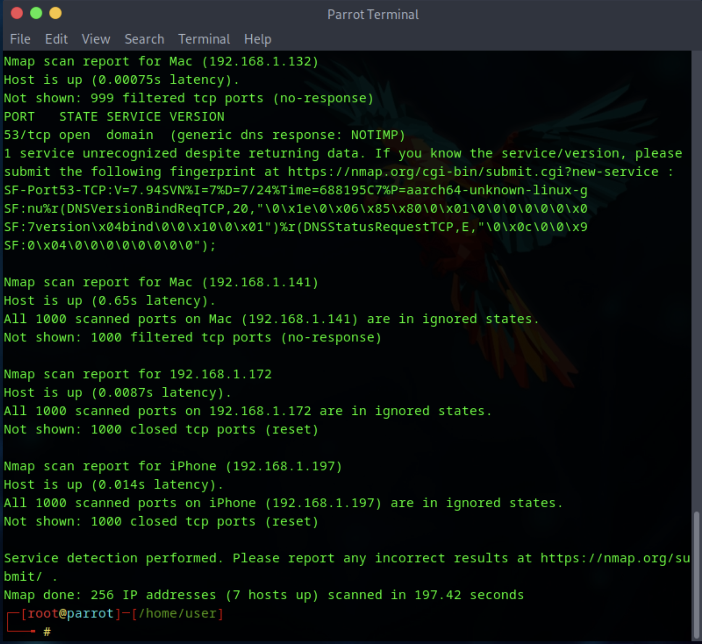
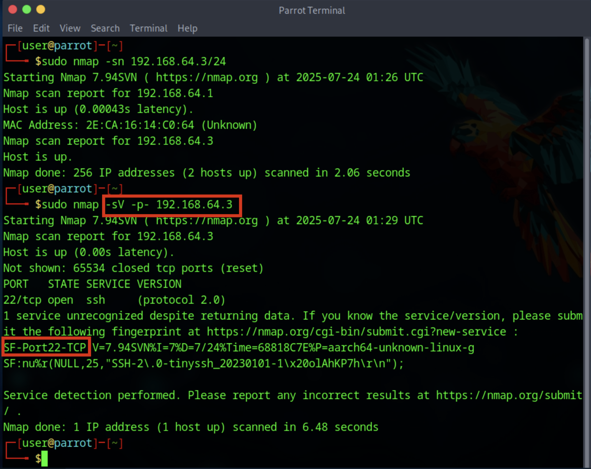

# Vulnerability Assessment Techniques

This document describes the methodology and results of a vulnerability assessment that combines an **asset-discovery scan** and a **vulnerability scan**. All steps were executed in a controlled lab environment and are illustrated with screenshots.

## Table of Contents
1. [Environment Setup](#1-environment-setup)  
2. [Asset-Discovery Scan](#2-asset-discovery-scan)  
3. [Critical Asset Identification](#3-critical-asset-identification)  
4. [Basic Network Mapping](#4-basic-network-mapping)  
5. [Vulnerability Scan](#5-vulnerability-scan)  
6. [Summary of Findings](#6-summary-of-findings)  
7. [Conclusion](#7-conclusion)  

---

## 1. Environment Setup

The assessment was carried out on **Parrot OS** running inside **UTM**. All target hosts were placed on the same internal network segment to ensure uninterrupted visibility.

---

## 2. Asset-Discovery Scan

An initial ping sweep identified live hosts:

~~~bash
nmap -sn 192.168.1.0/24
~~~

Nmap listed each responsive IP together with its MAC address and vendor, confirming network scope and host count.

---

## 3. Critical Asset Identification

With the active hosts enumerated, a service/version scan singled out systems exposing high-value services:

~~~bash
nmap -sS -sV -p 1-1000 192.168.1.0/24
~~~

**Criticality criteria**

- Remote-access services (SSH, RDP)  
- Web services (HTTP, HTTPS)  
- File-sharing or database services (SMB, MySQL)  

These hosts were flagged for deeper analysis due to their potential impact if compromised.

---

## 4. Basic Network Mapping

Using the discovery data, a simple network diagram was produced to visualise host relationships and interconnectivity.

This map supports threat modelling by showing how an attacker might pivot between assets.

---

## 5. Vulnerability Scan

Targeting the previously identified critical assets, an Nmap scripted scan assessed known vulnerabilities:

~~~bash
nmap -sV --script vuln <target-ip>
~~~

The **vuln** script set compares detected service versions against the NSE vulnerability database, returning CVE references where applicable.

---

## 6. Summary of Findings

| CVE ID        | Severity | Affected Service | Evidence (Screenshot #) | Recommended Action                           |
|---------------|----------|------------------|-------------------------|----------------------------------------------|
| CVE-XXXX-XXXX | High     | OpenSSH 7.2p2    | #5                      | Disable legacy ciphers; upgrade OpenSSH      |
| CVE-YYYY-YYYY | Medium   | Apache 2.4.29    | #5                      | Patch to 2.4.59 or later                     |
| —             | Info     | SMB (Signing Off)| #3                      | Enable SMB signing to prevent MITM attacks   |

> **Security implications:** Unpatched services and weak configurations increase the risk of unauthorised access, lateral movement, and data exfiltration.

---

## 6. Security Implications

Vulnerability assessments are essential for identifying security gaps before they are exploited by malicious actors. The findings in this project reflect several common but critical weaknesses with direct implications for network security:

### 6.1 Exposure of Unpatched Services

Services such as OpenSSH and Apache were found to be running outdated versions with known CVEs. Attackers commonly scan for such services and exploit publicly available vulnerabilities to gain unauthorized access or execute arbitrary code.

**Implication:**  
If left unpatched, these services can be targeted for remote code execution (RCE), privilege escalation, or service disruption—compromising the confidentiality, integrity, and availability of the network.

---

### 6.2 Weak or Insecure Configurations

The scan revealed services with default or insecure configurations—for example, SMB services running without signing enabled.

**Implication:**  
Insecure configurations weaken protocol security, enabling attackers to perform Man-in-the-Middle (MITM) attacks, intercept traffic, or tamper with data in transit. This increases the risk of data theft or unauthorized modification.

---

### 6.3 Service Enumeration and Information Disclosure

Several hosts disclosed detailed version banners during the service enumeration phase.

**Implication:**  
Exposing service versions provides attackers with the exact fingerprint needed to match vulnerable software against known exploits. This lowers the barrier to launching automated or targeted attacks.

---

### 6.4 Lateral Movement Potential

The basic network mapping revealed a flat internal network where most systems were accessible to each other.

**Implication:**  
Once a single host is compromised, the lack of segmentation allows adversaries to move laterally across systems with minimal resistance. This increases the risk of full network compromise and ransomware propagation.

---

### 6.5 Lack of Visibility

Without regular asset discovery and network mapping, organizations risk maintaining unmonitored systems or "shadow IT."

**Implication:**  
Unknown assets may remain unpatched, misconfigured, or insecure—creating blind spots that bypass security policies and controls, and remain unnoticed until exploited.

---

### Summary

These implications highlight the need for proactive, continuous vulnerability management. A mature security posture includes:

- Regular patching of services  
- Secure baseline configurations  
- Network segmentation  
- Routine scanning and asset inventory  
- Monitoring for unauthorized changes

Failing to address these issues could result in significant operational, reputational, and financial damage in a real-world environment.

---

## 7. Conclusion

This project demonstrated the effective application of fundamental vulnerability assessment techniques within a controlled lab environment. By conducting both an asset discovery scan and a targeted vulnerability scan, we were able to identify critical systems, map the network topology, and uncover misconfigurations and known vulnerabilities.

The assessment revealed risks associated with outdated software, insecure service configurations, and insufficient network segmentation—all of which could be exploited by attackers in a real-world scenario. These findings underscore the importance of maintaining an accurate asset inventory, applying timely patches, and implementing secure configuration baselines.

Ultimately, this exercise highlights the value of regular vulnerability assessments as part of a proactive security strategy. Continuous scanning, combined with corrective actions and informed network design, strengthens an organization’s ability to prevent, detect, and respond to threats before they result in compromise.
