# Identify and Analyze Cyber Threats

## Cyber Threat Analysis Report: FSP-0991.exe

### Executive Summary

`FSP-0991.exe` is a **confirmed malware sample**, associated with the **Formbook** infostealer family and utilizing AutoIt for obfuscation and loading. Multi-AV and sandbox analysis show high confidence in its capabilities for credential theft, data exfiltration, process injection, defense evasion, and command-and-control over HTTP. The malware is typically distributed via malspam and masquerades as a legitimate Windows process for stealth and persistence.

<!--
Insert a screenshot of the overall sandbox/AV summary verdict here:

-->


---

## 1. File Overview

| Attribute          | Value                                                           |
|--------------------|-----------------------------------------------------------------|
| **File Name**      | FSP-0991.exe                                                   |
| **MD5**            | b30321d43393f41c9c9f9dddca07fcba                               |
| **SHA1**           | d6756065657fd7856fee70f5ce17bea7869a482d                       |
| **SHA256**         | 63d2e9f885c7b2df3fc23658a5c13d3df968fbe205d9c973f4f42c775bd787af |
| **File Size**      | 1,286,144 bytes (~1.3 MB)                                      |
| **File Type**      | Windows PE, AutoIt, .CPL masquerading as .EXE                  |
| **First Seen**     | 2025-07-22                                                     |
| **Distribution**   | Email attachment (malspam)                                     |
| **Malware Family** | Formbook (Infostealer), AutoIt loader                          |

<!--
Insert a screenshot of file hashes and properties from VirusTotal or MalwareBazaar here:

-->
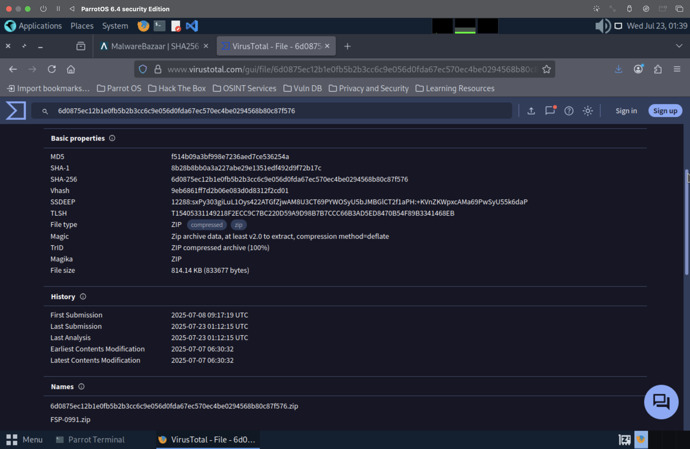
---

## 2. Detection & Classification

### Multi-AV Verdict

- **VirusTotal**: 40+ engines detect as `Trojan.AutoIt`, `Formbook`, `Trojan.Injector`, etc.
- **CyberFortress**: 90.2% score - **Malicious** | APT: True | Classification: `#AutoIt #Emotet`
- **MalwareBazaar**: Labeled as **Formbook**, distributed by malspam.

| Engine       | Detection Name                    |
|--------------|-----------------------------------|
| Microsoft    | Trojan:Win32/AutoitInject!rfn     |
| TrendMicro   | Trojan.Win32.FORMBOOK.YXFGHZ      |
| Fortinet     | AutoIt/Formbook.AK!tr             |
| Sophos       | Mal/AuItInj-D                     |
| ...          | ...                               |

<!--
Insert a screenshot of VirusTotal detections (list of engines) here:

-->
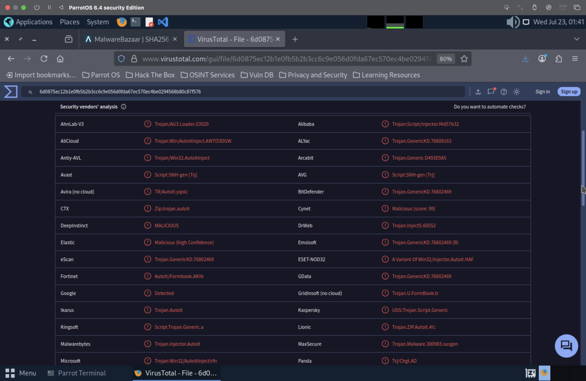
---

## 3. Behavioral Analysis

### 3.1 Process Activity

- **Initial Launch**: `"C:\Program Files\Common Files\FSP-0991.exe"`
- **Injected/Spawned**: `svchost.exe`
- **Process Masquerading**: Masquerading as system process (T1036).

<!--
Insert a screenshot of the process tree or process list from CyberFortress or any sandbox:

-->
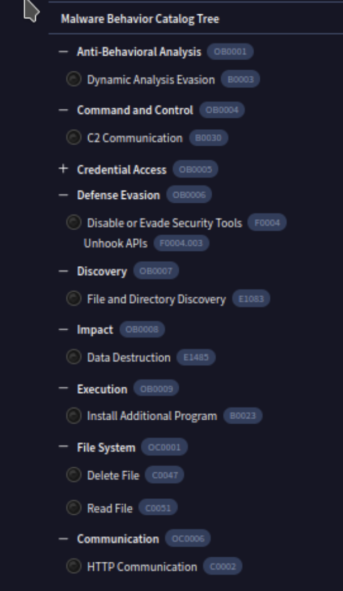
*Source: Hybrid Analysis Sandbox ([full report](https://tinyurl.com/22wyonyk)).*

### 3.2 Persistence & Defense Evasion

- **Registry Modification**: Creates or modifies Run key for persistence.
- **Masquerading**: System-like name and path.
- **Process Injection**: Uses svchost.exe for code execution (T1055).
- **Hides artifacts**: Defense evasion (T1564).

### 3.3 Network Activity

The sample established connections to several external domains and IPs, including suspicious hosts and legitimate-looking URLs, indicating command-and-control (C2) activity:

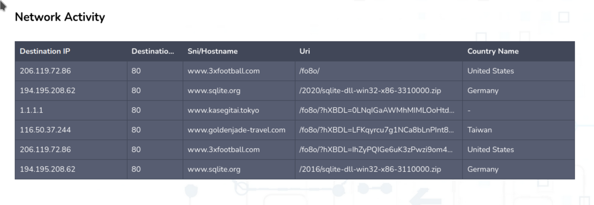
*Observed during sandbox execution. Source: CyberFortress ([full report](https://cyber-fortress.com/docs/result/index.php?id=686cdf90900df8e7f86874e6)).*

- **Key C2 destinations:**
  - www.3xfootball.com (United States)
  - www.goldenjade-travel.com (Taiwan)
  - www.kasegitai.tokyo
  - www.sqlite.org (Germany) *(could be abused for downloads or C2 relay)*


### 3.4 Dropped & Extracted Artifacts

- **Dropped**: `aut9DD0.tmp`, `dump.pcap`, `svchost.exe`
- **Memory Dumps**: Example svchost.exe

<!--
Insert a screenshot showing dropped or extracted files/artifacts:

-->
### 3.5 Memory Analysis

During the sandbox execution, memory dumps were captured for both the main malware process (`FSP-0991.exe`) and an injected `svchost.exe` process.  
This confirms **process injection** (MITRE ATT&CK T1055) and the presence of malicious code in memory, further supporting the detection of stealth and persistence techniques.

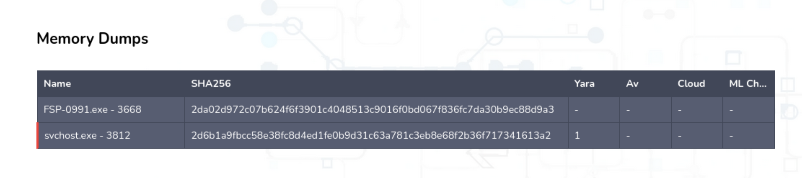  
*Source: CyberFortress ([full report](https://cyber-fortress.com/docs/result/index.php?id=686cdf90900df8e7f86874e6)).*

> The dumped memory images can be further analyzed to extract in-memory payloads, decrypted strings, or runtime configuration, providing deeper threat intelligence.
---

## 4. Threat Analysis

### 4.1 MITRE ATT&CK Mapping

| Technique              | ID       | Description                            |
|------------------------|----------|----------------------------------------|
| Hide Artifacts         | T1564    | Hiding indicators/artifacts            |
| Masquerading           | T1036    | Imitates system files/processes        |
| Process Injection      | T1055    | Code injection into svchost.exe        |
| Application Layer C2   | T1071    | C2 over HTTP                           |
| Encrypted Channel      | T1573    | Encrypted C2                           |
| Command/Scripting      | T1059    | AutoIt script                          |
| Active Scanning        | T1595    | Recon and lateral movement             |
| Privilege Escalation   | T1055    | Via process injection                  |


*This visual was created based on sandbox evidence from Hybrid Analysis ([full report](https://tinyurl.com/22wyonyk)).*

### 4.2 Severity & Impact

| Risk                  | Description                                   |
|-----------------------|-----------------------------------------------|
| **Credential Theft**  | Keylogger / stealer (Formbook)                |
| **Data Exfiltration** | Exfiltrates files and credentials             |
| **Persistence**       | Survives reboots                              |
| **Network Spread**    | Lateral movement                              |
| **Defense Evasion**   | Obfuscation, scripting, masquerading          |

---

## 5. Indicators of Compromise (IOCs)

### 5.1 File Hashes

- **MD5**: b30321d43393f41c9c9f9dddca07fcba
- **SHA1**: d6756065657fd7856fee70f5ce17bea7869a482d
- **SHA256**: 63d2e9f885c7b2df3fc23658a5c13d3df968fbe205d9c973f4f42c775bd787af

### 5.2 File/Process Paths

- `C:\Program Files\Common Files\FSP-0991.exe`
- `C:\Users\Public\svchost.exe`
- `aut9DD0.tmp`, `dump.pcap`

### 5.3 Network

| IP / Domain                    | Description      |
|-------------------------------|------------------|
| 206.119.72.86 (3xfootball.com) | C2               |
| 116.50.37.244 (goldenjade...)  | C2               |
| 1.1.1.1 (kasegitai.tokyo)      | C2               |
| 194.195.208.x (sqlite.org)     | Legitimate/C2?   |

<!--
Insert a screenshot of the IOC table or URL list from sandbox, VirusTotal, or MalwareBazaar:

-->

---

## 6. Remediation & Mitigation

1. **Isolate** the infected host from the network.
2. **Quarantine and delete** all related files and processes.
3. **Full system scan** with updated AV/EDR.
4. **Review and restore** registry Run keys.
5. **Change all credentials** used on the infected system.
6. **Monitor and block** outbound network traffic to known C2 domains/IPs.

<!--
Insert a screenshot of remediation recommendations or alerts from your security tool:

-->

---

## 7. References

- [MalwareBazaar: Formbook Sample](https://bazaar.abuse.ch/sample/8208d70472361b29ee7a71a31ce3231ad68eb2355f6f7a66a2ffe3470d6de43e/)
- [CyberFortress Report](https://cyber-fortress.com/docs/result/index.php?id=686cdf90900df8e7f86874e6)
- [VirusTotal Analysis](https://www.virustotal.com/gui/file/6d0875ec12b1e0fb5b2b3cc6c9e056d0fda67ec570ec4be0294568b80c87f576)
- [Formbook - Malpedia](https://malpedia.caad.fkie.fraunhofer.de/details/win.formbook)
- [MITRE ATT&CK - Formbook](https://attack.mitre.org/software/S0417/)

---

## 8. Conclusion

`FSP-0991.exe` is an **advanced infostealer** (Formbook) distributed via malspam, with sophisticated evasion and persistence techniques.  
**Immediate incident response is critical.**

<!--
Insert a final screenshot of the incident closure, summary, or any dashboard if available:

-->
---
<h1 style="font-size: 50px; font-weight: bold;">Phishing Template Creation Using Social-Engineer Toolkit (SET) on Parrot OS</h1>

This tutorial walks through the process of creating a phishing page using the Social-Engineer Toolkit (SET) on Parrot OS. It demonstrates how to clone a login page and capture user credentials in a controlled environment.

> ⚠️ This guide is intended **strictly for educational purposes** and **authorized penetration testing** only.

---

## Table of Contents

- [Overview](#overview)  
- [Requirements](#requirements)  
- [Step-by-Step Guide](#step-by-step-guide)  
- [Disclaimer](#disclaimer)

---

## Overview

SET allows ethical hackers and cybersecurity professionals to simulate social engineering attacks. In this tutorial, we’ll use:

- **Credential Harvester Attack Method**
- **Site Cloner**  

This combination allows cloning real websites and capturing login credentials locally for testing purposes.

---

## Requirements

- Parrot OS or Kali Linux with SET installed  
- Sudo/root access  
- The following image files saved in the same directory as this README:

  - `1_Launching SET.png`  
  - `2_SET_main_menu.png`  
  - `3_website_attack vectors.png`  
  - `4_credential_harvester.png`  
  - `5_Site_Cloner.png`  
  - `6_phishing_page_ready.png`  
  - `7_captured_credentials.png`  

---

## Step-by-Step Guide

### Step 1: Launch SET

Open a terminal and run:

```bash
sudo setoolkit
```

This launches the SET main interface.

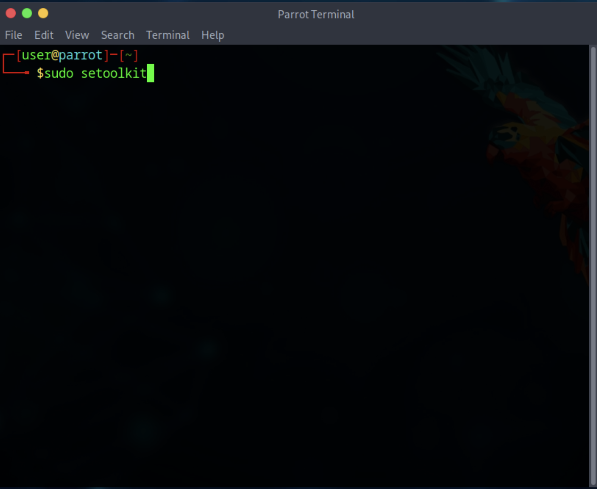

---

### Step 2: Select "Social-Engineering Attacks"

From the main menu, choose:

```
1) Social-Engineering Attacks
```

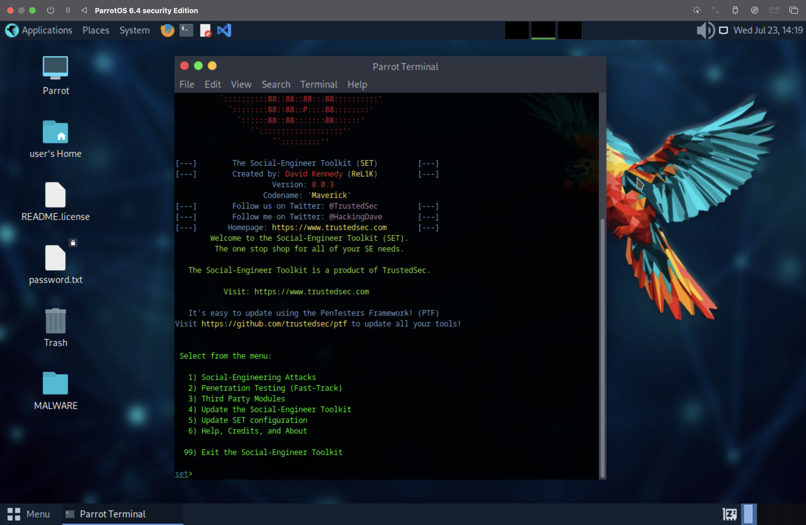

---

### Step 3: Select "Website Attack Vectors"

Next, select:

```
2) Website Attack Vectors
```

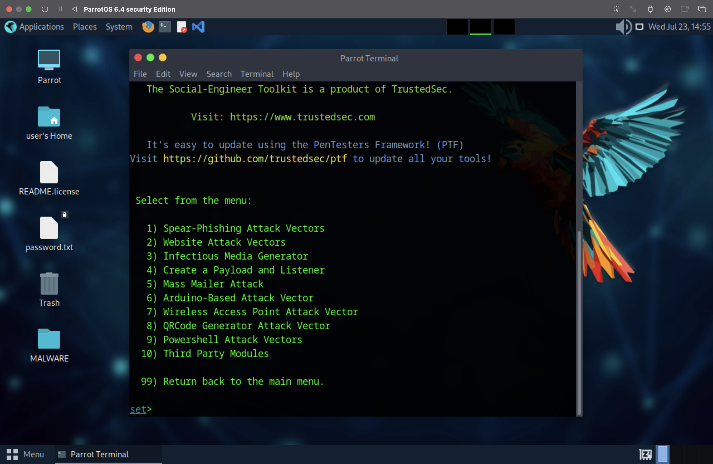

---

### Step 4: Choose "Credential Harvester Attack Method"

Then, choose:

```
3) Credential Harvester Attack Method
```

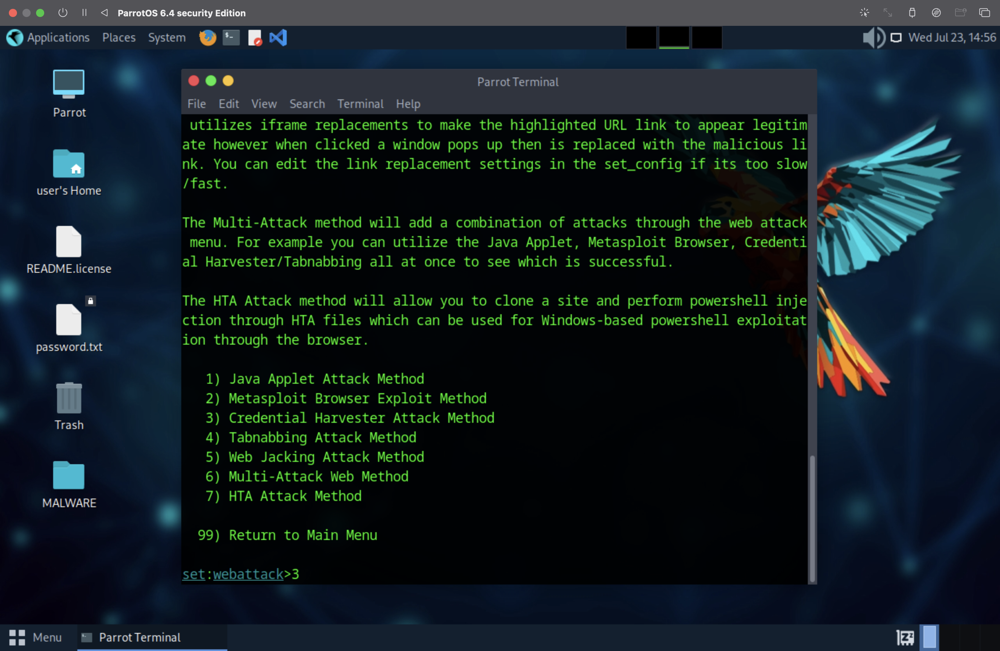

---

### Step 5: Choose "Site Cloner"

Now choose:

```
2) Site Cloner
```

You’ll be prompted to enter the URL of the website to clone. For example:

```
https://accounts.google.com
```


---

### Step 6: Configure Local Hosting

SET will ask for your local IP address (e.g., `192.168.1.100`) to host the cloned site. After entering it, SET will serve the cloned login page.

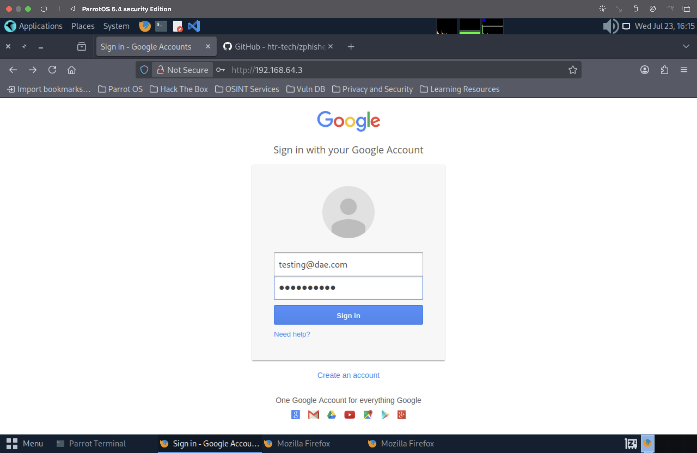

---

### Step 7: Test and Capture Credentials

Using another device on the same network, visit the IP address provided by SET in a browser. When someone enters credentials on the cloned page, they’ll be logged in your terminal in real time.

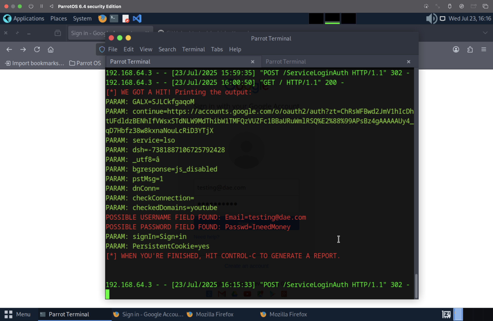

---

## Disclaimer

This tutorial is provided for **educational** and **authorized testing** only.  
Using these techniques in real-world environments **without proper consent** is illegal and unethical.  
Always obtain **explicit permission** before conducting any form of penetration testing.

---


# Advanced Persistent Threat (APT) Mapping Report

## Campaign: Formbook Infostealer (`FSP-0991.exe`)  
**Date of Analysis:** July 22, 2025  
**Prepared by:** Javier Napoles | SOC Analyst Candidate  

---

## 1. Executive Summary

This report maps a real-world malware sample (`FSP-0991.exe`) associated with the **Formbook** infostealer family to the **MITRE ATT&CK® Framework**. The malware demonstrates sophisticated evasion techniques, credential theft, and persistent command-and-control (C2) activity over HTTP/S, consistent with tactics observed in APT campaigns involving infostealers.

---

## 2. Overview of Malware Sample

| Attribute         | Value                                  |
|------------------|----------------------------------------|
| **File Name**    | FSP-0991.exe                           |
| **Malware Family** | Formbook (Infostealer)               |
| **Type**         | Trojan · AutoIt · .CPL masquerading    |
| **First Seen**   | July 22, 2025                          |
| **Distribution** | Malspam with malicious attachment      |
| **SHA256**       | `63d2e9f885c7b2df3fc23658a5c13d3df968fbe205d9c973f4f42c775bd787af` |

---

## 3. MITRE ATT&CK Mapping

| **Tactic**              | **Technique ID & Name**                                                                  | **Observed Behavior**                                                              |
|-------------------------|------------------------------------------------------------------------------------------|-------------------------------------------------------------------------------------|
| Execution               | [T1059](https://attack.mitre.org/techniques/T1059/) – Command and Scripting Interpreter  | Uses AutoIt scripting to load and execute payloads                                 |
| Defense Evasion         | [T1036](https://attack.mitre.org/techniques/T1036/) – Masquerading                       | Disguises as `svchost.exe` in a system path                                        |
|                         | [T1055](https://attack.mitre.org/techniques/T1055/) – Process Injection                  | Injects into `svchost.exe`                                                         |
|                         | [T1564](https://attack.mitre.org/techniques/T1564/) – Hide Artifacts                     | Drops hidden temp files with misleading names                                      |
| Persistence             | [T1547.001](https://attack.mitre.org/techniques/T1547/001/) – Registry Run Keys         | Creates registry entry for auto-start                                              |
| Credential Access       | [T1056.001](https://attack.mitre.org/techniques/T1056/001/) – Input Capture (Keylogging) | Captures keystrokes via Formbook keylogger module                                 |
| Command & Control       | [T1071.001](https://attack.mitre.org/techniques/T1071/001/) – Web Protocols              | C2 via HTTP/S to attacker-controlled domains                                       |
|                         | [T1573](https://attack.mitre.org/techniques/T1573/) – Encrypted Channel                  | C2 communications appear encrypted                                                 |
| Discovery               | [T1595](https://attack.mitre.org/techniques/T1595/) – Active Scanning                    | Potential network recon for lateral movement                                       |
| Privilege Escalation    | [T1055](https://attack.mitre.org/techniques/T1055/) – Process Injection                  | Leverages injection for possible elevation of privilege                            |
| Exfiltration            | [T1041](https://attack.mitre.org/techniques/T1041/) – Exfiltration Over C2 Channel      | Data exfiltration to remote C2 servers                                             |

---

## 4. Indicators of Compromise (IOCs)

| **Type**       | **Value**                                  |
|----------------|---------------------------------------------|
| SHA256         | `63d2e9f885c7b2df3fc23658a5c13d3df968fbe205d9c973f4f42c775bd787af` |
| File Path      | `C:\Program Files\Common Files\FSP-0991.exe` |
| Injected Proc  | `svchost.exe`                              |
| C2 Domains     | `www.3xfootball.com`, `goldenjade-travel.com`, `kasegitai.tokyo` |
| C2 IPs         | `206.119.72.86`, `116.50.37.244`            |

---

## 5. Threat Severity Assessment

| **Risk Factor**       | **Description**                                      |
|------------------------|------------------------------------------------------|
| Credential Theft       | Formbook logs keystrokes to steal credentials        |
| Persistence            | Registry key ensures malware runs at startup        |
| Evasion                | AutoIt scripting and masquerading avoid detection    |
| Exfiltration           | Data sent to external C2 channels                    |
| Network Spread         | Network scanning may indicate lateral movement       |

---

## 6. Recommended Actions

1. **Isolate** the infected host from all networks immediately.
2. **Terminate** malicious and injected processes (`FSP-0991.exe`, `svchost.exe`).
3. **Delete** dropped artifacts such as `aut9DD0.tmp`, `dump.pcap`.
4. **Perform a full system scan** with updated AV/EDR solutions.
5. **Reset all user credentials** on the affected endpoint.
6. **Block C2 domains and IPs** at firewall and DNS level.
7. **Monitor** for further activity or compromised hosts in the network.

---

## 7. References

- [MITRE ATT&CK: Formbook](https://attack.mitre.org/software/S0417/)
- [Malpedia: Formbook](https://malpedia.caad.fkie.fraunhofer.de/details/win.formbook)
- [CyberFortress Report](https://cyber-fortress.com/docs/result/index.php?id=686cdf90900df8e7f86874e6)
- [VirusTotal Analysis](https://www.virustotal.com/gui/file/6d0875ec12b1e0fb5b2b3cc6c9e056d0fda67ec570ec4be0294568b80c87f576)

---


**Prepared by:**  
[Javier Napoles / future SOC Analyst]  
[7-22-25]
