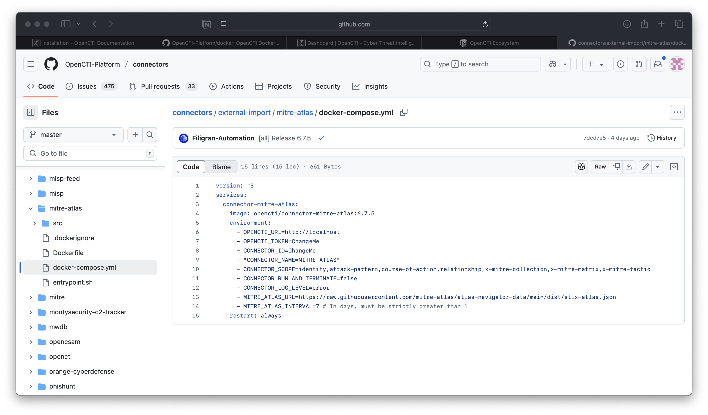
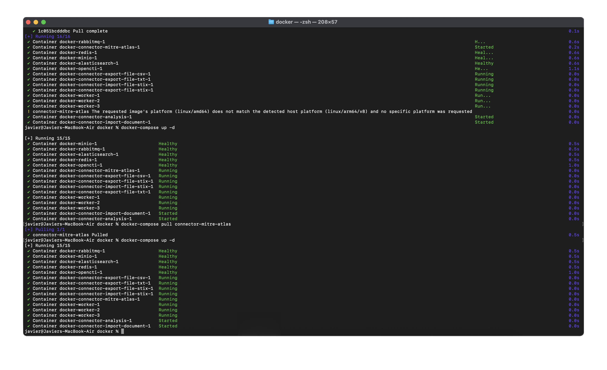

# Implementing Threat Intelligence Principles

**Analyst:** Javier Napoles  
**Course:** Cyber Threats and Vulnerabilities 1  
**Date:** July 28, 2025  

---

## Executive Summary

This project demonstrates the practical application of threat intelligence through:

- Analysis of two real-world Indicators of Compromise (IoCs)  
- Deployment of OpenCTI (Threat Intelligence Platform) via Docker  
- Integration of two threat intelligence connectors (VirusTotal and MISP)  
- Documentation and visualization of threat intelligence data ingestion  

---

## Project Objectives

- Analyze and document 2 IoCs  
- Install and configure OpenCTI using Docker  
- Integrate connectors (VirusTotal, MISP)  
- Demonstrate IoC ingestion, enrichment, and visualization  

---

## Introduction to Threat Intelligence

Threat intelligence (TI) involves gathering, analyzing, and using information about threats and adversaries to proactively defend against cyber attacks. Categories of TI include:

- **Strategic:** General threat trends  
- **Tactical:** Attacker techniques and methods  
- **Operational:** Specific threat actor information  
- **Technical:** Indicators like file hashes, IP addresses, domains (IoCs)  

Indicators of Compromise (IoCs) are artifacts indicating possible compromise, vital for detection and response.

---

## Analysis of Indicators of Compromise (IoCs)

| IoC Type           | Description                                                                 | Detection Method                          | Impact / Severity                          |
|--------------------|------------------------------------------------------------------------------|-------------------------------------------|--------------------------------------------|
| SHA256 Hash        | `63d2e9f885c7b2df3fc23658a5c13d3df968fbe205d9c973f4f42c775bd787af` *(Formbook Malware)* | VirusTotal, Sandbox analysis (CyberFortress), Process behavior | Credential theft, data exfiltration, **High** |
| CVE Vulnerability  | **CVE-2020-25681** – Dnsmasq Heap Overflow (versions < 2.83)                | Nmap vulnerability scan                   | Remote code execution, **High** (CVSS 8.1) |

---

## OpenCTI Platform Setup (Docker)

### Requirements

- Docker, Docker Compose  
- Minimum 16 GB RAM  
- Ports:  
  - 8080 (OpenCTI UI)  
  - 9200 (Elasticsearch)  
  - 27017 (MongoDB)  

### Installation Steps

```bash
git clone https://github.com/OpenCTI-Platform/docker.git
cd docker
docker-compose up -d
```

Access the platform:  
[http://localhost:8080](http://localhost:8080)

**Default Login Credentials:**

- **Username:** admin@opencti.io  
- **Password:** admin  
 
---

## Connector Integration

### VirusTotal Connector

- **Purpose:** Enrich observables (hashes, IPs, domains)  

**Configuration (.env):**
```env
CONNECTOR_VIRUSTOTAL_TOKEN=your_api_key
CONNECTOR_VIRUSTOTAL_INTERVAL=60
```

---

### MISP Connector

- **Purpose:** Ingest threat intel events from MISP  

**Configuration (.env):**
```env
CONNECTOR_MISP_URL=https://your_misp_instance_url
CONNECTOR_MISP_KEY=your_api_key
CONNECTOR_MISP_SSL_VERIFY=False
```

> ✅ Both connectors validated and operational.

---

## Platform Usage Demonstration

- Manually imported IoCs: Formbook malware hash and CVE-2020-25681  
- Enriched observables via **VirusTotal** connector  
- Ingested **MISP** events, showing CVE correlations  
- Created **threat relationships** and **graph visualizations** in the OpenCTI interface 

---

 
 

## Conclusion

Successfully deployed OpenCTI via Docker, integrated VirusTotal and MISP connectors, and demonstrated real-world IoC analysis and enrichment. This validated the effectiveness of threat intelligence platforms in supporting cybersecurity operations.

---

## Appendix

### Tools Used

- OpenCTI Platform (v5.x)  
- Docker & Docker Compose  
- VirusTotal Connector  
- MISP Connector  
- CyberFortress  
- Nmap  

### References

- [OpenCTI Documentation](https://www.opencti.io/docs)  
- [VirusTotal](https://www.virustotal.com/)  
- [MISP Project](https://www.misp-project.org/)  
- [MITRE ATT&CK – Formbook](https://attack.mitre.org/software/S0151/)  
- [NVD – CVE-2020-25681](https://nvd.nist.gov/vuln/detail/CVE-2020-25681)  

---

**Prepared by:**  
**Javier Napoles**  
SOC Analyst Candidate  
**July 28, 2025**
