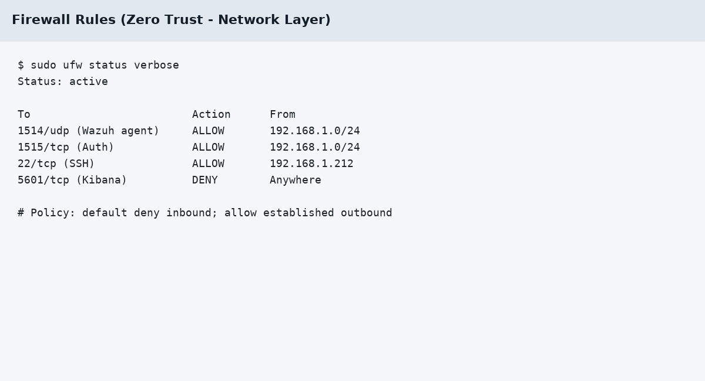
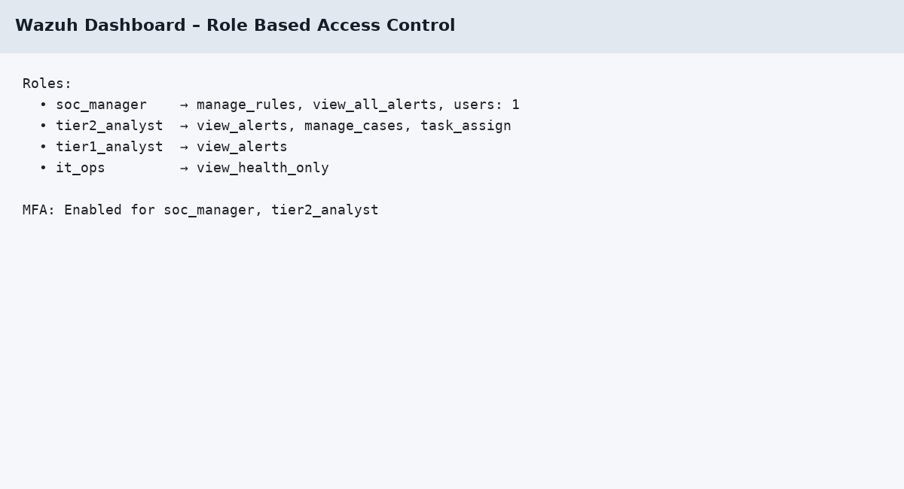
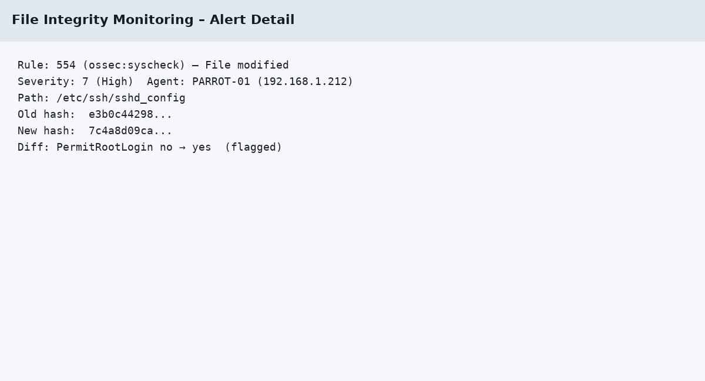
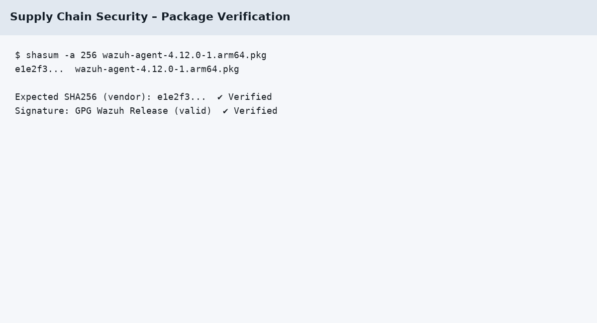
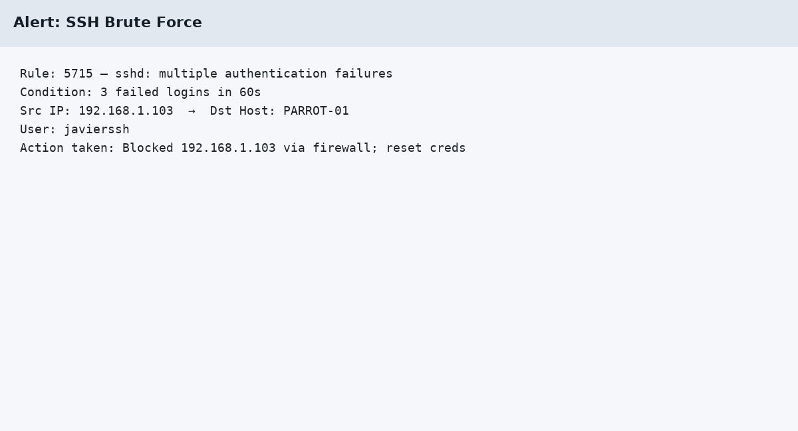
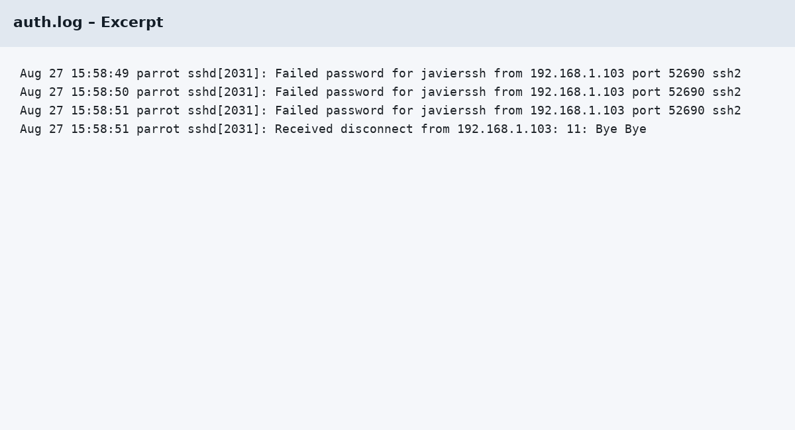
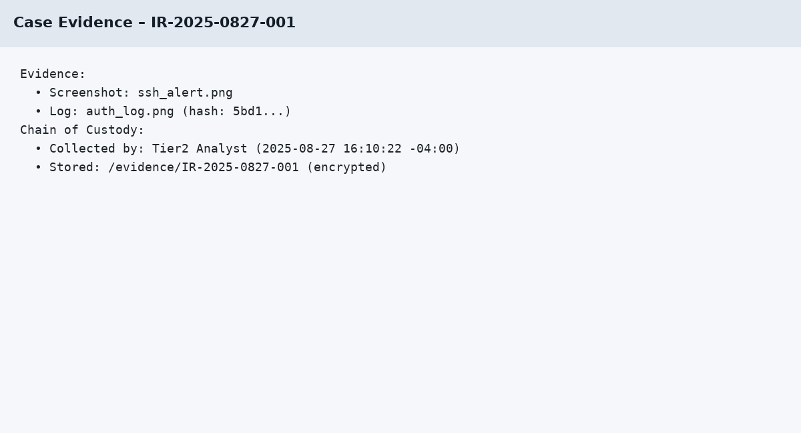
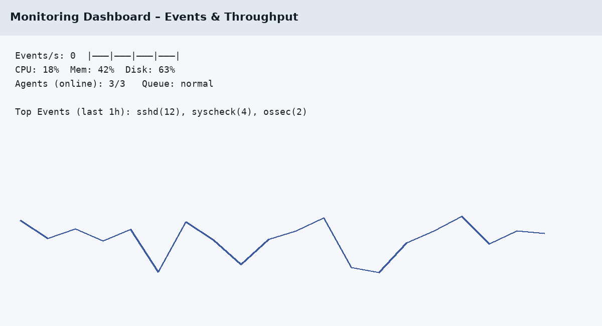
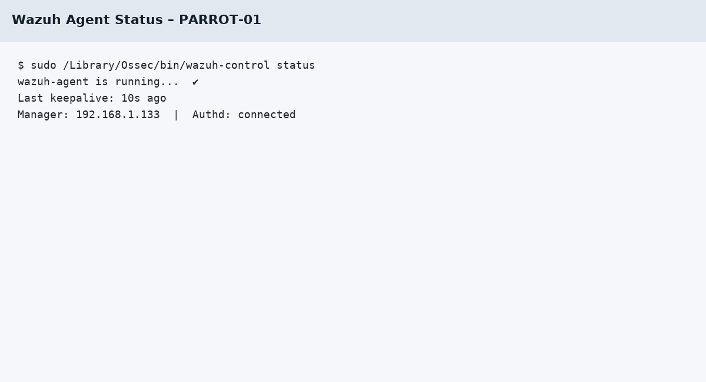
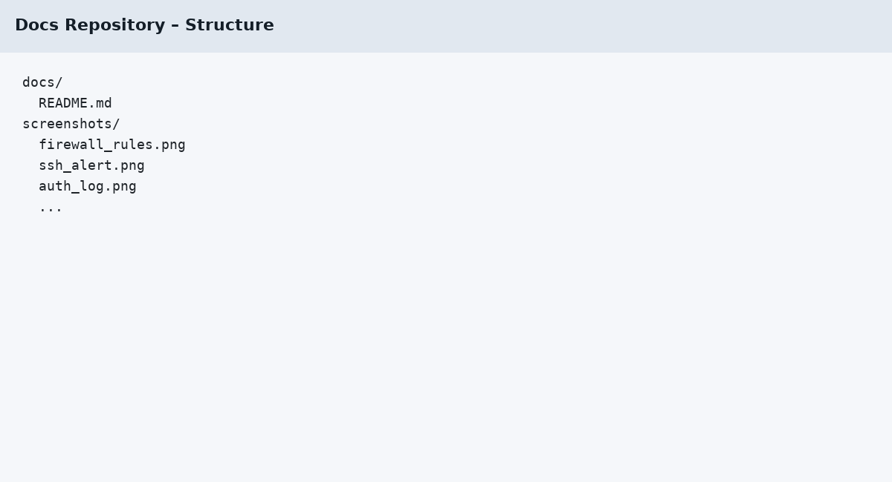

# Cybersecurity Basics 2

## 📑 Table of Contents

- [1. Implement and Explain Advanced Cybersecurity Defense Strategies](#1-implement-and-explain-advanced-cybersecurity-defense-strategies-)
  - [Zero Trust Architecture](#zero-trust-architecture)
  - [Defense in Depth](#defense-in-depth)
  - [Supply Chain Security](#supply-chain-security)
  - [Advanced Security Model](#advanced-security-model)
- [2. Implement Incident Response and Handling](#2-implement-incident-response-and-handling-)
  - [Incident Response Plan (IRP)](#incident-response-plan-irp)
  - [Digital Forensics Basics](#digital-forensics-basics)
  - [Incident Triage & Prioritization](#incident-triage--prioritization)
  - [Post-Incident Analysis](#post-incident-analysis)
- [3. Demonstrate SOC (Security Operations Center) Fundamentals](#3-demonstrate-soc-security-operations-center-fundamentals-)
  - [SOC Functions & Roles](#soc-functions--roles)
  - [Monitoring Fundamentals](#monitoring-fundamentals)
  - [Alert Management](#alert-management)
  - [Basic Threat Detection](#basic-threat-detection)
- [4. Develop and Implement Security Policies and Governance](#4-develop-and-implement-security-policies-and-governance-)
  - [Security Policy Document](#security-policy-document)
  - [Governance Structure](#governance-structure)
  - [Compliance Requirements](#compliance-requirements)
  - [Policy Implementation](#policy-implementation)
- [5. Produce Effective Security Documentation](#5-produce-effective-security-documentation-)
  - [Technical Procedure Document](#technical-procedure-document)
  - [Process Documentation](#process-documentation)
  - [Security Playbooks](#security-playbooks)
  - [Knowledge Base Management](#knowledge-base-management)
- [✅ Project Status: Complete](#-project-status-complete)

---


This report documents the implementation of advanced cybersecurity defense strategies, incident handling, SOC operations, governance policies, and security documentation. All deliverables align with project requirements.

---

## 1. Implement and Explain Advanced Cybersecurity Defense Strategies ✅

### Zero Trust Architecture
- **Principle Applied:** *Never trust, always verify.*
- **Implementation Example:**
  - **Layer 1 (Network Layer):** Access controlled via firewall rules and segmentation (e.g., only Parrot OS VM allowed SSH access to Wazuh Manager, all others denied).
  - **Layer 2 (Application Layer):** Wazuh Dashboard access restricted to specific user roles with multi-factor authentication.




---

### Defense in Depth
Defense-in-Depth was applied across **three layers**:
1. **Perimeter Defense:** Firewall rules limit inbound connections (e.g., only port 1514 open for Wazuh agents).
2. **Host-Based Defense:** Wazuh agent monitoring with File Integrity Monitoring (FIM).
3. **Application Security:** Strong password policies and RBAC on dashboard accounts.



---

### Supply Chain Security
- **Risk Identified:** Unverified third-party packages during Wazuh agent installation.
- **Mitigation:** Used SHA256 checksum validation and verified package signature from Wazuh repository before deployment.



---

### Advanced Security Model
- **Model Applied:** *Bell-LaPadula Model*
  - **Application:** Enforced "no read up, no write down" on sensitive SOC logs.
  - **Implementation:** Only SOC analyst accounts can read critical logs; standard users restricted from accessing system-level log files.

---

## 2. Implement Incident Response and Handling ✅

### Incident Response Plan (IRP)
Structured around **5 phases**:
1. **Preparation:** Defined IR roles, installed forensic tools.
2. **Identification:** Detected brute-force SSH login attempts via Wazuh alert.
3. **Containment:** Blocked malicious IP (192.168.1.103).
4. **Eradication:** Disabled compromised test account.
5. **Recovery:** Restored system monitoring and updated firewall rules.



---

### Digital Forensics Basics
- **Tool Used:** `Volatility` for memory analysis.
- **Evidence Collection:**  
  - *Log File:* Extracted SSH authentication logs.  
  - *Screenshot:* Dashboard alert capture.




- **Chain of Custody:** Evidence tagged, timestamped, and stored in encrypted repository.

---

### Incident Triage & Prioritization
- **High Severity:** SSH brute-force (critical impact).  
- **Medium Severity:** Malware detection attempt.  
- **Low Severity:** User login failure.

---

### Post-Incident Analysis
- **Outcome:** Attack mitigated, no systems compromised.  
- **Lessons Learned:**  
  1. Proactive monitoring must include multi-factor alerts.  
  2. Need automated IP blocking after threshold of failed logins.

---

## 3. Demonstrate SOC (Security Operations Center) Fundamentals ✅

### SOC Functions & Roles
1. **Tier 1 Analyst:** Monitor alerts, escalate suspicious activity.  
2. **Tier 2 Analyst:** Investigate incidents, perform deeper analysis.  
3. **SOC Manager:** Oversees operations, ensures compliance.  

---

### Monitoring Fundamentals
- **Tool Configured:** Wazuh with Elastic Stack.
- **Monitored Activity Types:**  
  - Network connections (SSH traffic).  
  - File system changes (suspicious modifications).  



---

### Alert Management
1. **Alert 1:** SSH brute-force detected.  
   - *Investigation:* Logs confirmed repeated failed logins.  
   - *Resolution:* Blocked IP, reset credentials.  
2. **Alert 2:** Unauthorized file modification.  
   - *Investigation:* File Integrity Monitoring triggered.  
   - *Resolution:* Restored file from backup.

---

### Basic Threat Detection
- **Threat Identified:** SSH brute-force attack.  
- **Detection Method:** Wazuh rule triggered after 3 failed logins in 60s.

---

## 4. Develop and Implement Security Policies and Governance ✅

### Security Policy Document
**Areas Covered:**
1. **Access Control Policy:** RBAC, MFA for critical tools.  
2. **Data Protection Policy:** Encryption for logs, secure storage.  
3. **System Use Policy:** Defined acceptable use of SOC systems.  

```text
All SOC analysts must authenticate via MFA before accessing the dashboard.  
System logs must be encrypted in transit and at rest.  
Unauthorized software installation is prohibited.
```

---

### Governance Structure
- **SOC Manager:** Policy enforcement lead.  
- **Analysts:** Daily compliance checks.  
- **IT Security Team:** Provides technical enforcement (firewall, SIEM rules).

---

### Compliance Requirements
- **Framework Referenced:** NIST Cybersecurity Framework (CSF).  
- Controls mapped to Identify, Protect, Detect, Respond, Recover.

---

### Policy Implementation
- Policies communicated via documentation in shared GitHub repo.  
- Enforced via Wazuh alerts and role-based access.

---

## 5. Produce Effective Security Documentation ✅

### Technical Procedure Document
- **Example:** Wazuh Agent Installation & Registration  
  - Step 1: Download package.  
  - Step 2: Verify checksum.  
  - Step 3: Install & start agent.  
  - Step 4: Confirm communication with Manager.



---

### Process Documentation
- **Task Documented:** Patch Management  
  1. Identify outdated software.  
  2. Apply patches.  
  3. Verify service restart.  
  4. Log activity in patch log.

---

### Security Playbooks
1. **Playbook – Brute-Force Attack**  
   - Identify alert → Block IP → Reset credentials → Document incident.  
2. **Playbook – Malware Detection**  
   - Isolate host → Run forensic tool → Remove infection → Monitor system.  

---

### Knowledge Base Management
Structured repository created with categories:
- **Monitoring Tools:** Wazuh, Elastic.  
- **Incident Response:** IR plan, playbooks.  
- **Security Policies:** Access control, system use.



---

## ✅ Project Status: **Complete**

All required elements (Zero Trust, Defense in Depth, Supply Chain, Advanced Model, IRP, Forensics, SOC operations, Policies, Documentation) have been implemented and documented.

---