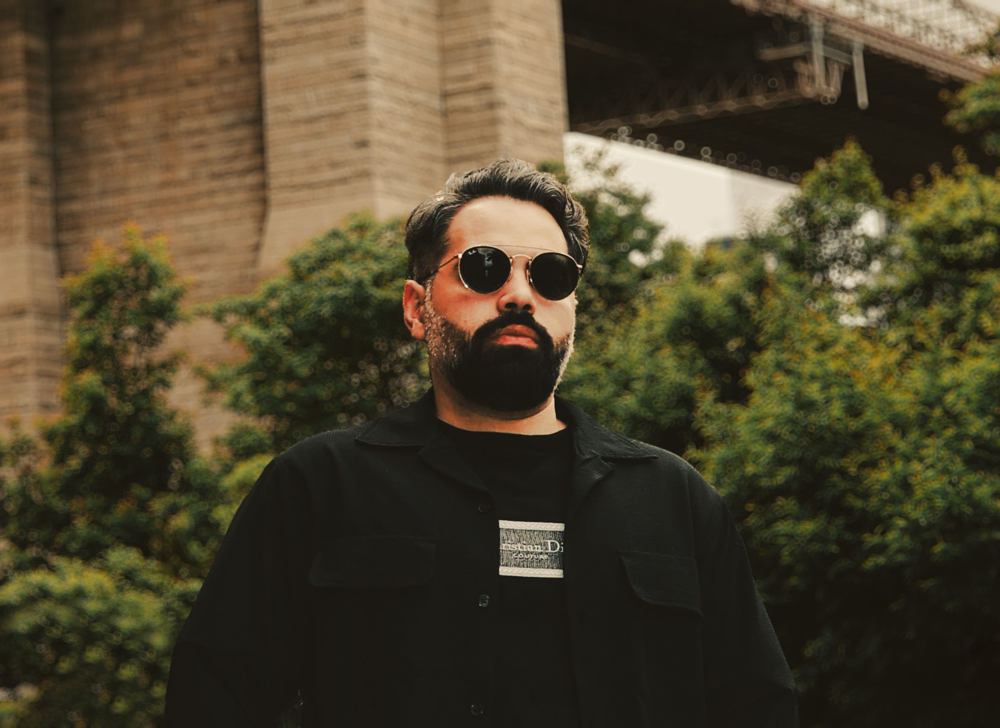

  

## 👋 Welcome to My Portfolio

Hi there! I'm **Javier**, a creative thinker turned cybersecurity enthusiast with a background in graphic design and threat detection.  
This site showcases the skills, projects, and progress I’ve made in tech and security.

---

## 📝 Latest Commit Posts


<ul>

  <li>
    <a href="{{ c.html_url }}">{{ c.message | split: "\n" | first | escape }}</a>
    — {{ c.author }} on {{ c.date | date: "%b %d, %Y %I:%M %p" }}
  </li>

</ul>

<!-- COMMITS-START -->
- [Test pushing](https://github.com/Jnapfx/Javier-6-months-projects/commit/2018f418be8f0720e33b03e224b708d38980279f) (2018f41) [2025-08-04]
<!-- COMMITS-END -->

---
Take a look around:
- 🐙 [Check out my Github](https://github.com/Jnapfx)  
- 🛠️ [View My Projects](projects.md)  
- 📄 [Download My Resume](assets/files/JAVIER_RESUME.pdf)
- 💼 [Connect on LinkedIn](https://www.linkedin.com/in/javier-napoles-3513031a7)

Thanks for visiting! Let’s connect and grow together. 🚀

