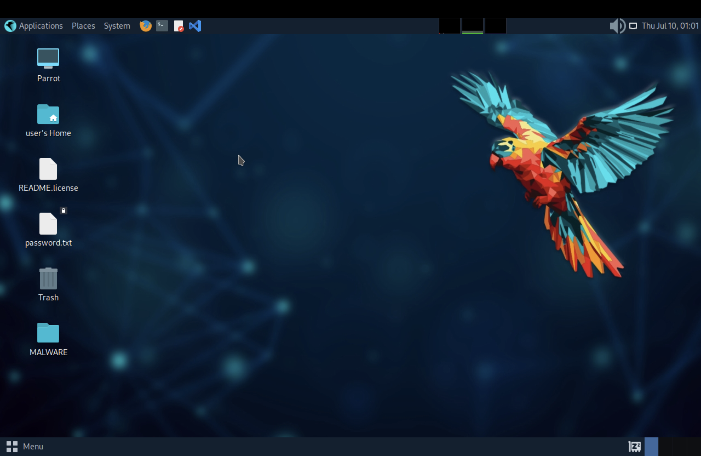
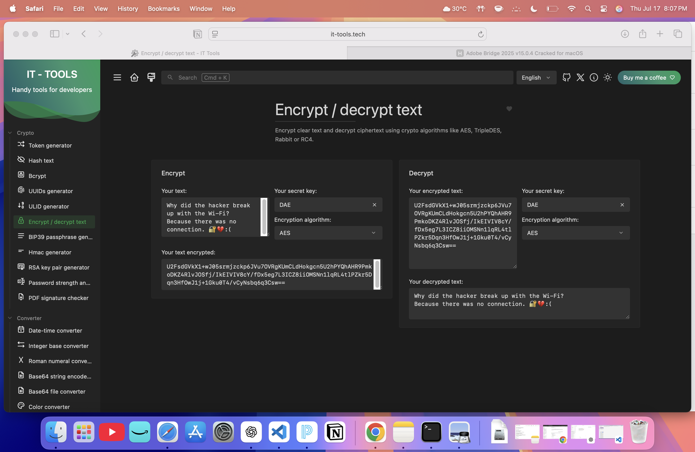
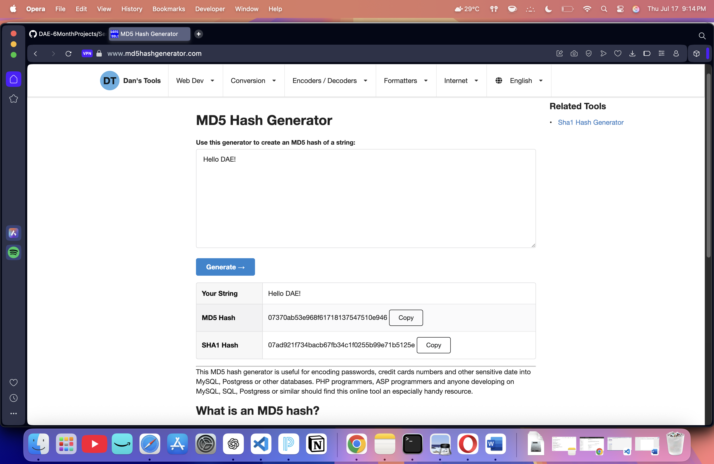
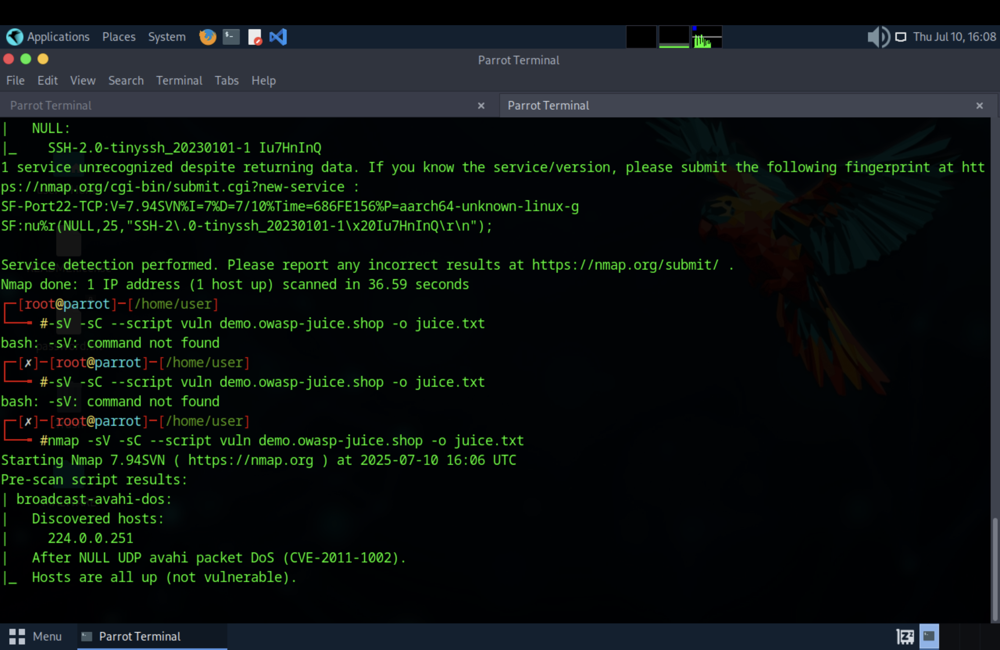
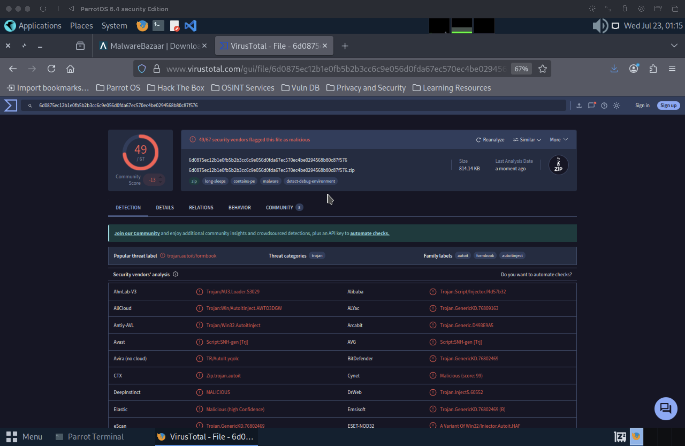
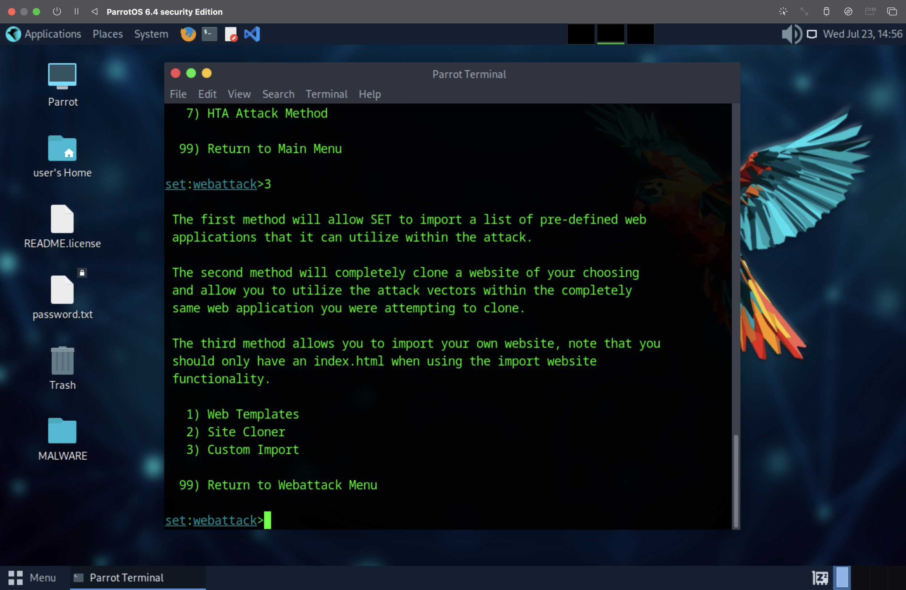
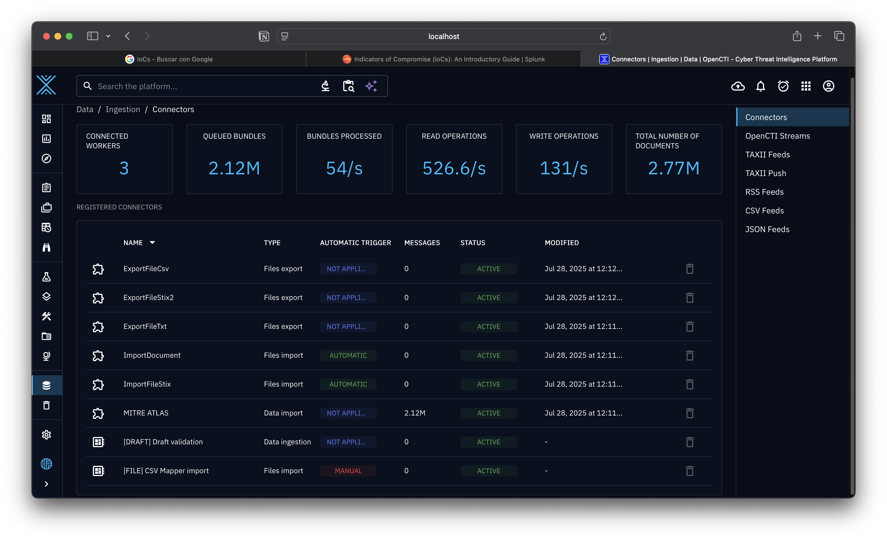

# Main project 
*Author: Javier Napoles* &nbsp;|&nbsp; *Date: July 31, 2025*
---

# "Divide & Defend: A Hands-On SOC Lab Project with Micro-Segmentation"

This project simulates the core responsibilities of a SOC Analyst by building a functional lab environment using virtual machines and open-source tools. It emphasizes practical skills in threat detection, alert triage, and incident response. A key focus is the use of micro-segmentation as a proactive defense strategy to enhance network security.

---

## 1&nbsp;&nbsp;Lab Foundations

| Area | What I Did | Key Screenshot |
|------|------------|----------------|
| **Virtualization** | Built a dual-VM lab in **UTM**, installing Parrot OS and Kali Linux side-by-side. |  |
| **Networking** | Created an **internal network** so the VMs can ping, scan, and attack each other—my sandbox for every exercise that followed. | *(Add your preferred network-test screenshot here if desired)* |

---

## 2&nbsp;&nbsp;Governance & Policy

| Area | What I Did |
|------|------------|
| **Comprehensive Security Policy** | Wrote a single policy that maps every control back to the **CIA triad**. |
| **Legal & Ethical Compliance** | Added language on data-handling laws and professional codes of conduct. |
| **Incident Response Plan (IRP)** | Drafted a lightweight IRP so every technical exercise ties back to process. |

*(No screenshots needed—policy text lives in `documentation/cybersecurity_basics_1/comprehensive_security_policy/`.)*

---

## 3&nbsp;&nbsp;Core Security Tools & Concepts

| Topic | Hands-On Work | Screenshot |
|-------|---------------|------------|
| **Encryption Refresher** | Practiced AES encryption/decryption and generated MD5 & SHA hashes to compare strengths and weaknesses. |    |
| **Baseline Scanning** | Ran **Nmap** service-detection scans to fingerprint hosts and spot open ports. |  |

---

## 4&nbsp;&nbsp;Threat Analysis & Offensive Practice

| Exercise | What I Learned | Screenshot |
|----------|----------------|------------|
| **Malware Analysis** | Submitted `FSP-0991.exe` to **VirusTotal**, reviewed detections, and documented key IOCs & behaviors. |  |
| **Phishing Simulation** | Used the **Social Engineering Toolkit (SET)** to clone a Google login page in lab. |   |
| **APT Research** | Mapped a real Dridex-style campaign to **MITRE ATT&CK** tactics & techniques. |  |

---

## 5&nbsp;&nbsp;Vulnerability Assessment & Risk Management

| Step | Output | Screenshot |
|------|--------|------------|
| **Asset Discovery** | Enumerated hosts/services with an Nmap sweep. |  |
| **OpenVAS Scan** | Generated a detailed vulnerability list with severity ratings. |  |
| **Network Mapping** | Produced a quick **network map** to visualize exposure. |  |
| **Risk Treatment** | Flagged two critical risks and proposed patching + segmentation; created a basic risk-monitoring checklist. | *(Checklist lives in the project docs)* |

---

## 6&nbsp;&nbsp;Threat Intelligence Implementation

| Task | Proof-of-Work | Screenshot |
|------|--------------|------------|
| **OpenCTI Deployment** | Brought up **OpenCTI** via Docker Compose and verified successful login. |  |
| **Connector Integration** | Enabled two data-feed connectors; containers show healthy state. |   |
| **IoC Lifecycle** | Parsed two IoCs end-to-end—collection, enrichment, contextual pivoting inside OpenCTI. |

---

### Next Up
1. Finish tuning Wazuh dashboards and add more targeted detection rules.  
2. Begin micro-segmentation experiments to isolate critical lab assets.  
3. Enrich OpenCTI with custom malware-family data and automation scripts.

---

> **How to use:** Clone the repo, keep the `documentation/` folder structure unchanged, and this README will render with all screenshots inline.

<iframe width="100%" height="150" scrolling="no" frameborder="no" allow="autoplay" src="https://w.soundcloud.com/player/?url=https%3A//api.soundcloud.com/playlists/1475634163&color=%23ff5500&auto_play=true&hide_related=false&show_comments=true&show_user=true&show_reposts=false&show_teaser=true"></iframe>
<a href="https://soundcloud.com/wonderlandbeats-chill" title="WonderlandBeats(Chill &amp; Relax Mixes on YouTube)" target="_blank" style="color: #cccccc; text-decoration: none;">WonderlandBeats(Chill &amp; Relax Mixes on YouTube)</a> · <a href="https://soundcloud.com/wonderlandbeats-chill/sets/zelda-lofi-relax-music" title="🗡️ Zelda Chill Music 🗡️ Relaxed Lofi Music | Chill + Instrumental Ambient | Legend of Zelda" target="_blank" style="color: #cccccc; text-decoration: none;">🗡️ Zelda Chill Music 🗡️ Relaxed Lofi Music | Chill + Instrumental Ambient | Legend of Zelda</a>

  

