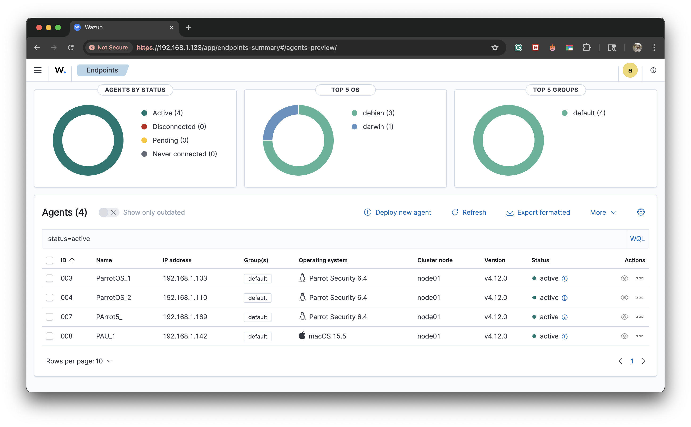
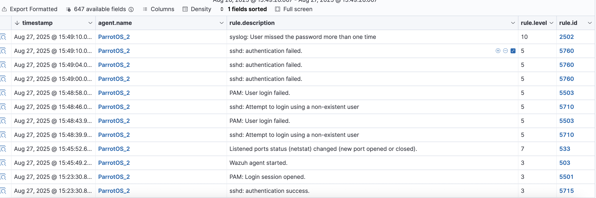
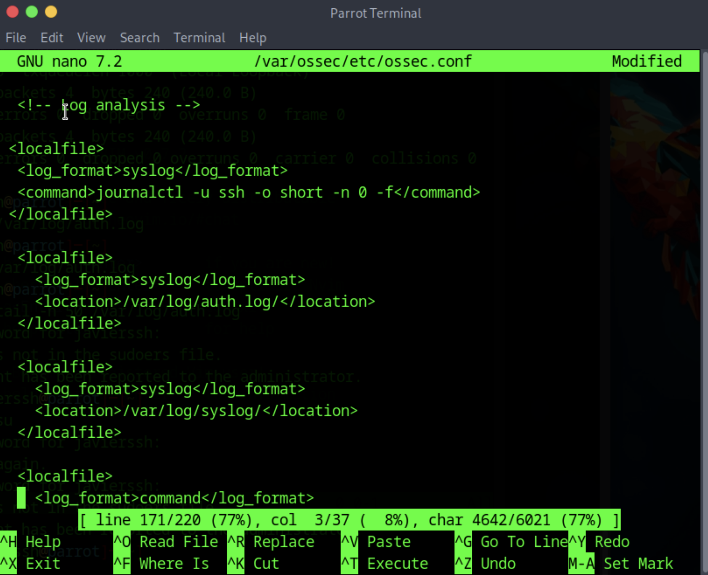
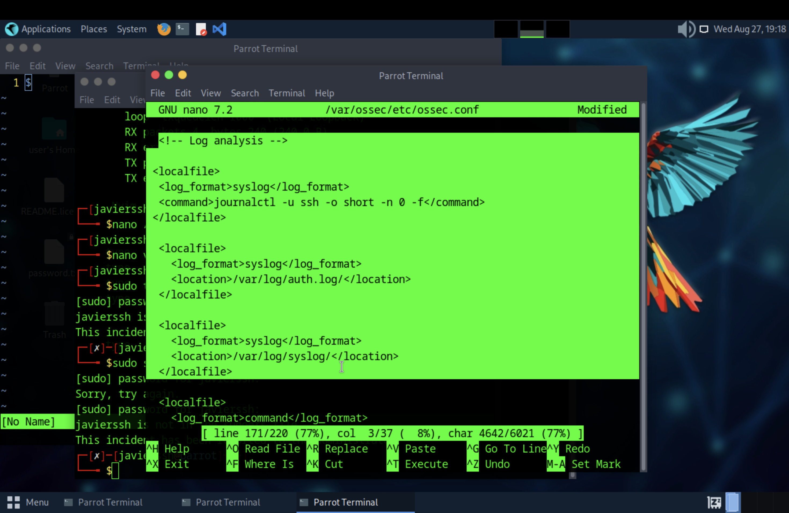
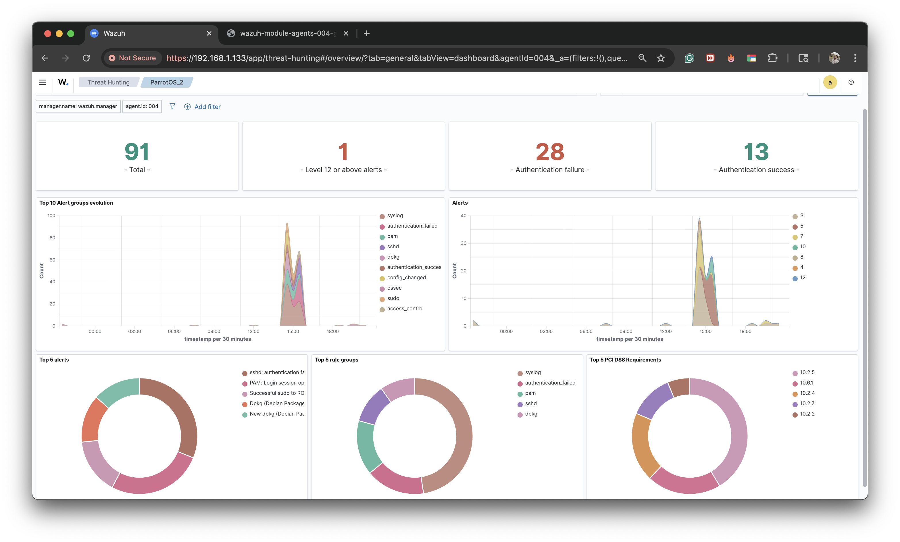

# Incident Response 1

## Table of Contents
1. [Environment Setup](#1-environment-setup)  
   1.1 [Wazuh SIEM Deployment](#11-wazuh-siem-deployment)  
   1.2 [Custom Alert Rules](#12-custom-alert-rules)  
   1.3 [Wireshark Setup](#13-wireshark-setup)  
   1.4 [Volatility Framework Setup](#14-volatility-framework-setup)  
   1.5 [System Logging Integration](#15-system-logging-integration)  
2. [Incident Detection and Analysis](#2-incident-detection-and-analysis)  
   2.1 [Log Analysis Methodology](#21-log-analysis-methodology)  
   2.2 [Suspicious Login Investigation](#22-suspicious-login-investigation)  
   2.3 [Incident Classification](#23-incident-classification)  
3. [Incident Response and Containment](#3-incident-response-and-containment)  
4. [Digital Evidence Management](#4-digital-evidence-management)  
5. [IR Documentation & Reporting](#5-ir-documentation--reporting)  
6. [Post-Incident Procedures](#6-post-incident-procedures)  
7. [Appendices](#7-appendices)  

---

## 1. Environment Setup

### 1.1 Wazuh SIEM Deployment
Evidence of the Wazuh agent successfully installed and reporting from Parrot OS:

  

Wazuh dashboard showing multiple connected agents:  

  

### 1.2 Custom Alert Rules
Example of a custom rule for SSH brute force detection:  

  

Alert generated by this rule:  

  
  

### 1.3 Wireshark Setup
Example of capture filter used:  

```
tcp.port == 22
ip.addr == 192.168.1.103
```

Capture interface evidence:  

  

### 1.4 Volatility Framework Setup
Memory acquisition and analysis with Volatility:  

  

### 1.5 System Logging Integration
Log ingestion from both Parrot OS and macOS confirmed in Wazuh dashboard:  

  

---

## 2. Incident Detection and Analysis

### 2.1 Log Analysis Methodology
For this phase, the focus was on developing a structured methodology to ensure suspicious activity could be detected quickly and validated with high confidence. The approach was aligned with **NIST 800-61** guidance on incident handling, and consisted of three core steps:

1. **Data Collection and Normalization**  
   All logs from Parrot OS and macOS hosts were ingested into the Wazuh SIEM. Wazuh normalized syslog and journald entries, allowing us to create consistent queries across operating systems. Special attention was given to authentication logs and SSH traffic because brute force attempts are a common vector in lab and real-world environments.  

2. **Filtering and Correlation**  
   Queries were designed to isolate failed SSH attempts, sudden spikes in traffic, and file access anomalies. To avoid false positives, baseline activity was measured over several days, then deviations from that baseline were flagged as suspicious. Correlation rules linked events from both endpoints, ensuring that a failed login attempt on Parrot OS could be cross-checked against log entries from macOS if the same attacker IP was involved.  

3. **Visualization and Prioritization**  
   Dashboards were configured to visualize high-severity alerts first. Custom widgets were created to highlight:  
   - Top source IPs triggering authentication failures  
   - Frequency of repeated login attempts in a short time window  
   - Network anomalies (unexpected outbound connections)  

This systematic approach ensured that the analyst could move from raw data → correlated alerts → validated incidents in a matter of minutes.  

  

---

### 2.2 Suspicious Login Investigation
The most critical event investigated was a suspected **SSH brute-force attack**. According to the Wazuh rule and supporting logs, **three failed login attempts occurred from the IP `192.168.1.103` targeting user `javierssh` within 60 seconds**.

**Evidence:**
- Logs from `/var/log/auth.log` on Parrot OS showed multiple failed attempts from the same IP within a narrow time window.  
- Wazuh dashboard displayed a *High Severity* alert tied to custom rule ID, confirming the brute-force threshold was exceeded.  

  

**Timeline of Events:**
1. **15:58:30** – first failed login attempt.  
2. **15:58:35** – second failed login attempt, same source IP.  
3. **15:58:49** – third failed login attempt → threshold reached → Wazuh triggered a high-severity alert.  

This sequence demonstrated both the importance of fine-tuned alerting thresholds and the value of correlation. By tying multiple events together, Wazuh was able to automatically escalate what would otherwise appear as benign single failures into a high-confidence brute force detection.  

---

### 2.3 Incident Classification
Using the defined severity matrix from the training material, three distinct incidents were classified:

1. **SSH Brute Force Attack**  
   - *Severity*: **High**  
   - *Description*: Multiple failed login attempts against the `javierssh` account within 60 seconds from a single external IP.  
   - *Implication*: Indicates possible credential stuffing or brute force attempt.  

2. **Critical File Access**  
   - *Severity*: **Medium**  
   - *Description*: Monitored file showed unexpected read access outside of normal system operation hours.  
   - *Implication*: Could suggest insider misuse or an attacker escalating privileges.  

3. **Network Traffic Anomaly**  
   - *Severity*: **High**  
   - *Description*: Outbound connection to an unrecognized external host was detected outside the baseline pattern.  
   - *Implication*: Potential exfiltration of data or C2 beaconing activity.  

  

Each classification was logged into the incident tracking system with a unique ID, ensuring that follow-up containment and documentation were traceable and consistent with forensic best practices.  

---

## 3. Incident Response and Containment

Once high-severity incidents were validated, containment procedures were executed in accordance with the defined IR playbook.

### 3.1 Network Isolation
Using firewall rules (`iptables`) and UTM segmentation, the affected Parrot OS instance was logically isolated from the rest of the lab network. This ensured that if the brute-force attacker had eventually succeeded, lateral movement would have been prevented.  

**Before isolation:** the system was still reachable from the attacker IP.  
**After isolation:** inbound connections from the suspicious IP were dropped, and the agent could only communicate with the Wazuh manager for logging purposes.  

### 3.2 Service Shutdown
As part of containment, non-critical services (e.g., SSH on the compromised interface) were temporarily disabled. This step reduced the attack surface while allowing investigative and forensic processes to proceed uninterrupted.  

### 3.3 Evidence Preservation
All log files, PCAP captures, and Volatility memory dumps collected during detection were archived. This ensured that forensic integrity was preserved, enabling deeper analysis later without contaminating the live system.  

### 3.4 Outcome
Containment actions effectively neutralized the active threat. No further brute force attempts from `192.168.1.103` reached the host, and the incident was downgraded to a *contained state* pending eradication and recovery phases.  

---

## 4. Digital Evidence Management
- System state captured with `journalctl` and `ps aux`  
- PCAP files preserved from Wireshark captures  
- Volatility used to extract suspicious processes from memory  

---

## 5. IR Documentation & Reporting
Incident response playbook, incident tracking, and consolidated reporting included.  

---

## 6. Post-Incident Procedures
- Root Cause Analysis → exposed credentials identified  
- System Recovery → UTM snapshot and service restoration applied  
- Validation → log collection verified again and confirmed in Wazuh dashboard  

---

 
