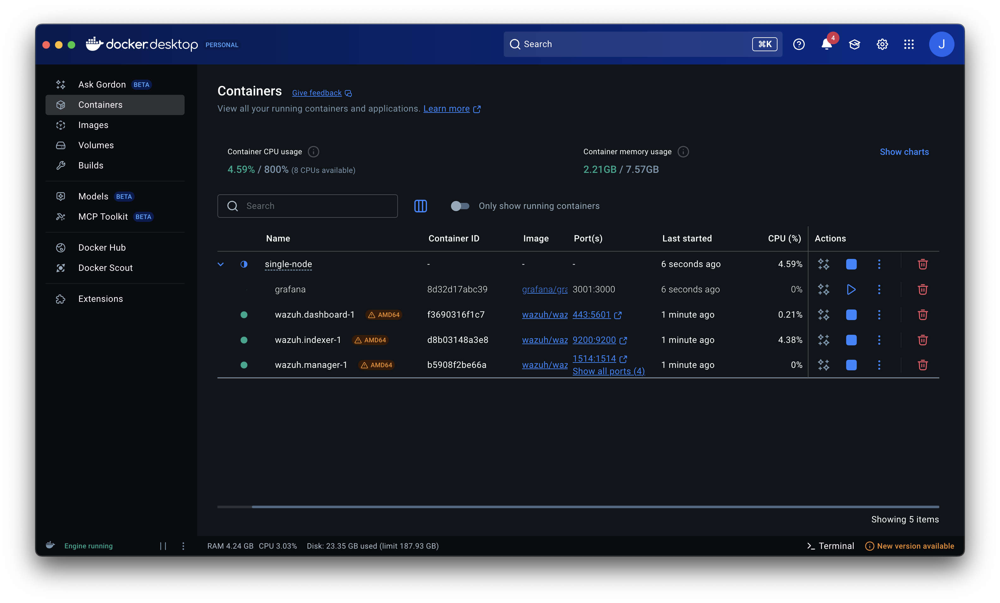
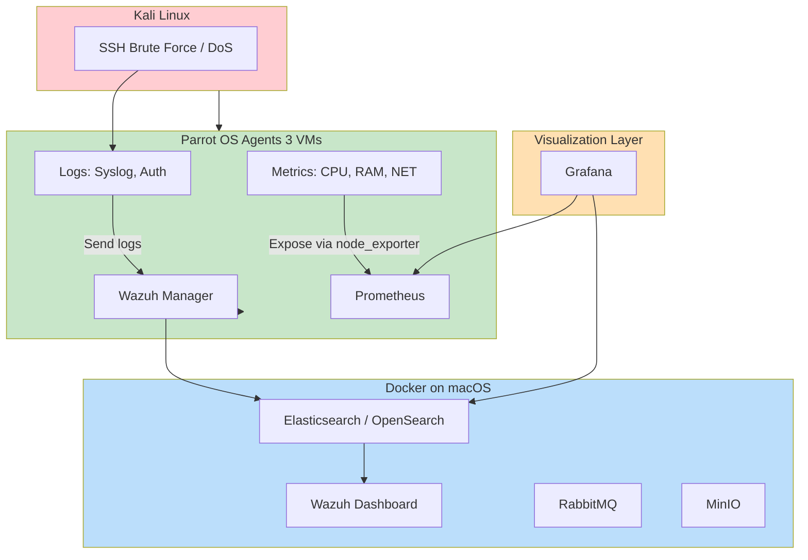

# 📘 Learning Log

This folder documents my self-learning and integration of a new technology into my existing project.  
It contains my initial plan, daily progress log, and supporting evidence (e.g. test output, branches, and PRs) that demonstrate what I learned and how I applied it.

---

## 🔗 Link to Plan

[PLAN.md](./PLAN.md) – My initial plan with chosen technology, rationale, and integration tasks.

---

## 📅 Daily Progress Log

### Task 1 — Connect Grafana to Elasticsearch (2025-09-03)

**📆 Date:** 2025-09-04  
**🛠️ Task:** Prepared environment and provisioning for Grafana.  

**🔍 Evidence:**  
- Wazuh stack running (`wazuh.manager`, `wazuh.indexer`, `wazuh.dashboard`).  
- Docker & Docker Compose installed.  
- Verified credentials: `admin / SecretPassword`.  
- Created provisioning directory:  
  ```bash
  mkdir -p grafana/provisioning/datasources
  ```  
- Grafana download site: 

- Grafana pulling request: 

- Grafana-container: 

**📝 Notes:**  
Provisioning ensures Grafana auto-loads the OpenSearch datasource on startup.

---

**📆 Date:** 2025-09-05  
**🛠️ Task:** Configured Grafana datasource for Wazuh (OpenSearch).  

**🔍 Evidence:**  
- File created: `grafana/provisioning/datasources/opensearch.yml`  

- Grafana .yml file: 

```yaml
apiVersion: 1
datasources:
  - name: Wazuh-OpenSearch
    uid: wazuh-opensearch
    type: elasticsearch
    access: proxy
    url: https://wazuh.indexer:9200
    basicAuth: true
    basicAuthUser: admin
    secureJsonData:
      basicAuthPassword: SecretPassword
    jsonData:
      flavor: "opensearch"
      timeField: "@timestamp"
      tlsSkipVerify: true
    isDefault: true
```

**📝 Notes:**  
Success criterion met: Grafana connected and can query OpenSearch. Task 1 completed.  

---

### Task 2 — Build SOC Dashboards (2025-09-06)

**📆 Date:** 2025-09-06  
**🛠️ Task:** Added Grafana service to `docker-compose.yml` and deployed.  

**🔍 Evidence:**  
- Config snippet:  
  ```yaml
  grafana:
    image: grafana/grafana:latest
    container_name: grafana
    restart: always
    ports:
      - "3001:3000"
    environment:
      - GF_SECURITY_ADMIN_USER=admin
      - GF_SECURITY_ADMIN_PASSWORD=admin
    depends_on:
      - wazuh.indexer
    volumes:
      - ./grafana/provisioning/datasources:/etc/grafana/provisioning/datasources
  ```  
- Command output:  
  ```bash
  docker compose up -d grafana
  docker ps | grep grafana
  ```  
- Screenshots:  
  - screenshots/03_compose_config.png`  
  - screenshots/04_container_running.png`  
  - screenshots/05_grafana_login.png`  
  - screenshots/06_datasource_online.png`
  - Grafana-container:   

**📝 Notes:**  
Grafana accessible at [http://localhost:3001](http://localhost:3001). Connection verified.  

---

**📆 Date:** 2025-09-08  
**🛠️ Task:** Built core SOC panels in Grafana.  

**🔍 Evidence:**  
- **Alerts Over Time** → `screenshots/07_alerts_over_time.png`  
- **Top Agents** → `screenshots/08_top_agents.png`  
- **Top Alert Rules** → `screenshots/09_top_rules.png`  
- **DoS Detection** → `screenshots/10_dos_detection.png`  

**📝 Notes:**  
Dashboards show dynamic Wazuh data. Success criterion achieved for Task 2.  

---

**📆 Date:** 2025-09-09  
**🛠️ Task:** Consolidated full SOC dashboard with multiple panels.  

**🔍 Evidence:**  
- Dashboard screenshots:  
  - `screenshots/11_dashboard_overview.png`  
  - `screenshots/12_final_dashboard.png`  

**📝 Notes:**  
Dashboard includes: Alerts Over Time, Top Agents, Top Rules, DoS Detection, Severity, MITRE ATT&CK, Compliance, and IP/Port breakdowns.  

---

**📆 Date:** 2025-09-10  
**🛠️ Task:** Documented system architecture for SOC lab.  

**🔍 Evidence:**  


**📝 Notes:**  
Architecture illustrates full flow: attacker → agents → Wazuh & Prometheus → Grafana dashboards.  

---

### Task 3 — Integrate Multi-Source Data (2025-09-13 → 2025-09-19)

**📆 Date:** Pending  
**🛠️ Task:** Integrate OpenVAS vulnerability scan results into Grafana dashboards.  

**🔍 Evidence:**  
- Will export OpenVAS results and configure as a Grafana datasource.  
- Target: combined panel with alerts + vulnerability metrics.  

**📝 Notes:**  
To be completed in Week 3 as per PLAN.md timeline.  

---

## 📌 Tips for Maintaining This Log

- Keep adding entries as you progress day by day.  
- Include real commands, outputs, screenshots (if supported), and links.  
- Keep answers specific enough that you can explain them in a mock interview.  
- You can delete instructions and placeholders once you're comfortable.  
