# 📊 Grafana Integration with Wazuh – SOC Project *Divide and Defend*

This document explains, step by step and with screenshots, how **Grafana** was integrated into the *Divide and Defend* SOC project as an advanced visualization layer for **Wazuh**.  

The goal is to have **professional SOC dashboards** to analyze alerts, rules, agents, and possible attacks in real time.

---

## 1. Prerequisites
- **Wazuh stack** running in Docker:
  - `wazuh.manager`
  - `wazuh.indexer`
  - `wazuh.dashboard`
- Docker + Docker Compose installed
- Access credentials for Wazuh Indexer:
  ```
  admin / SecretPassword
  ```

---

## 2. Environment Preparation

### 2.1 Create provisioning structure for Grafana
Inside the `single-node` folder:

```bash
mkdir -p grafana/provisioning/datasources
```

📸 Screenshot: directory structure created  
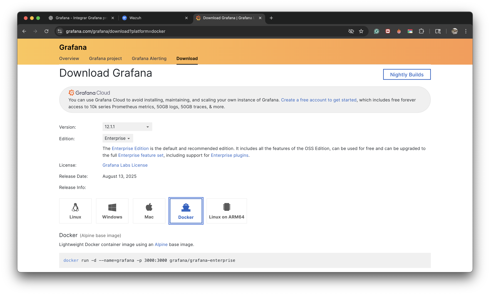

---

## 3. Data Source Configuration

File created:  
`grafana/provisioning/datasources/opensearch.yml`

```yaml
apiVersion: 1
datasources:
  - name: Wazuh-OpenSearch
    uid: wazuh-opensearch
    type: elasticsearch
    access: proxy
    url: https://wazuh.indexer:9200
    basicAuth: true
    basicAuthUser: admin
    secureJsonData:
      basicAuthPassword: SecretPassword
    jsonData:
      flavor: "opensearch"
      timeField: "@timestamp"
      tlsSkipVerify: true
    isDefault: true
```

📸 Screenshot: Data source config  
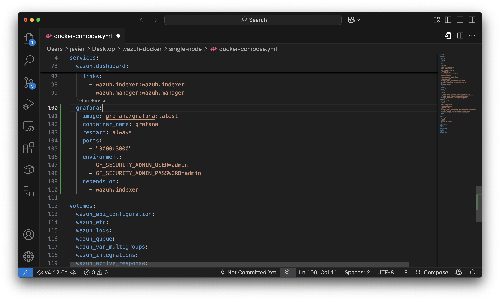

---

## 4. Add Grafana to `docker-compose.yml`

In the `services:` section:

```yaml
  grafana:
    image: grafana/grafana:latest
    container_name: grafana
    restart: always
    ports:
      - "3001:3000"
    environment:
      - GF_SECURITY_ADMIN_USER=admin
      - GF_SECURITY_ADMIN_PASSWORD=admin
    depends_on:
      - wazuh.indexer
    volumes:
      - ./grafana/provisioning/datasources:/etc/grafana/provisioning/datasources
```

📸 Screenshot: Grafana block in docker-compose.yml  
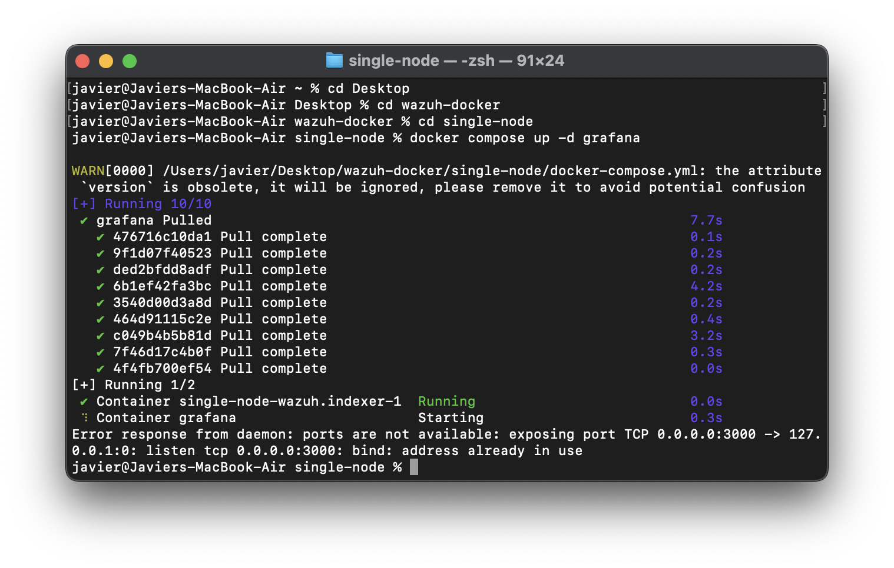

---

## 5. Deploy Grafana

Start the service:

```bash
docker compose up -d grafana
docker ps | grep grafana
```

📸 Screenshot: Grafana container running  
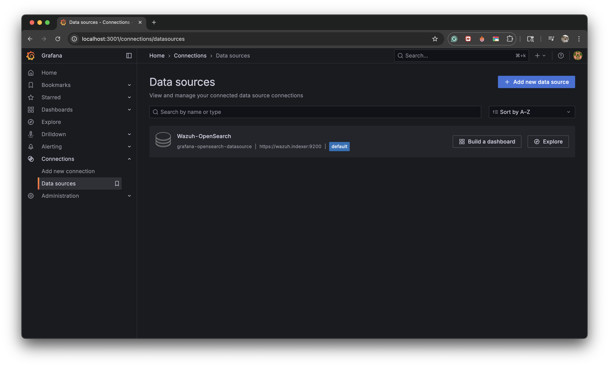

---

## 6. Access Grafana

URL: [http://localhost:3001](http://localhost:3001)  
Default credentials:
- User: `admin`
- Password: `admin` (will be changed on first login)

📸 Screenshot: Grafana login  
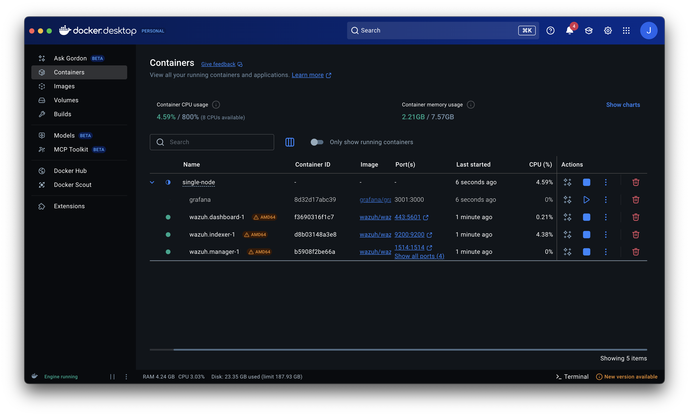

📸 Screenshot: Data source connected  
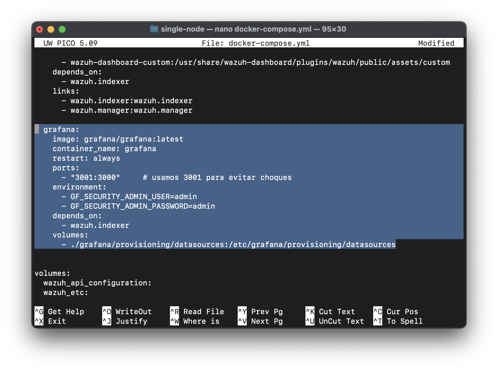

---

## 7. SOC Panels

### 7.1 Alerts Over Time
- Query: `*`
- Group by: Date Histogram (`@timestamp`)
- Metric: Count
- Visualization: Time series

📸  
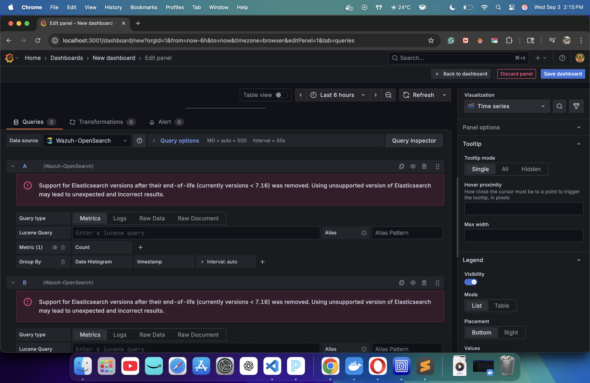

---

### 7.2 Top Agents
- Group by: Terms → `agent.name.keyword`
- Metric: Count
- Visualization: Pie chart

📸  
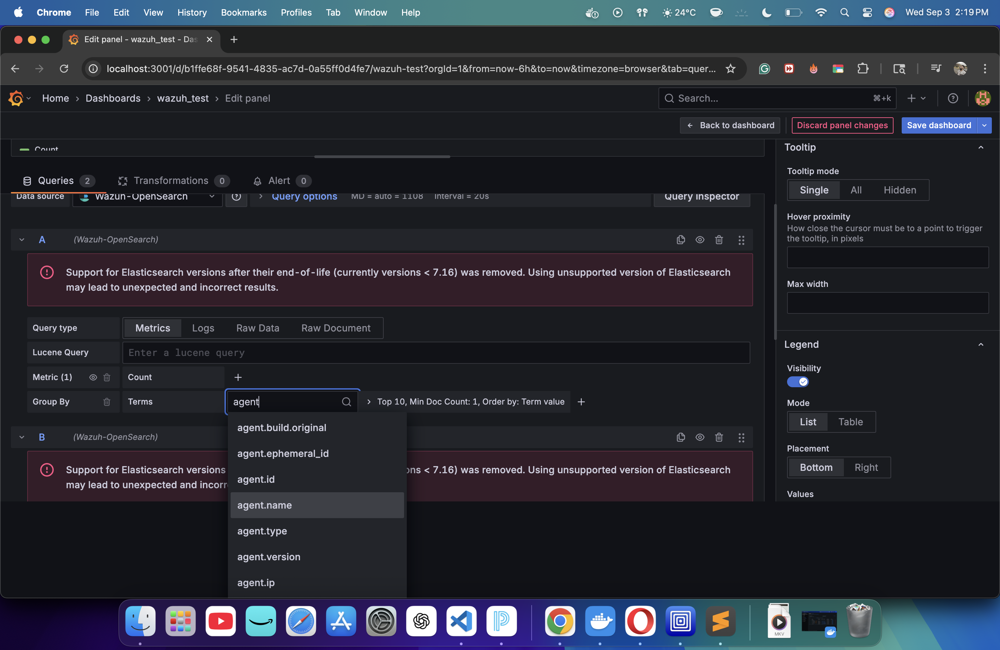

---

### 7.3 Top Alert Rules
- Group by: Terms → `rule.description.keyword`
- Metric: Count
- Visualization: Horizontal bar chart

📸  
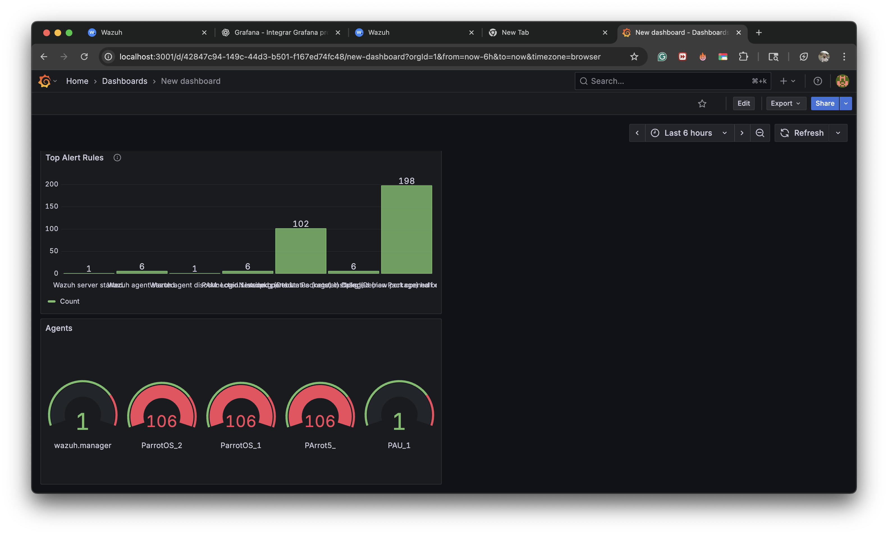

---

### 7.4 DoS Detection
- Query:  
  ```
  rule.description:*DoS* OR rule.groups:dos
  ```
- Group by: Date Histogram (`@timestamp`)
- Visualization: Time series

📸  
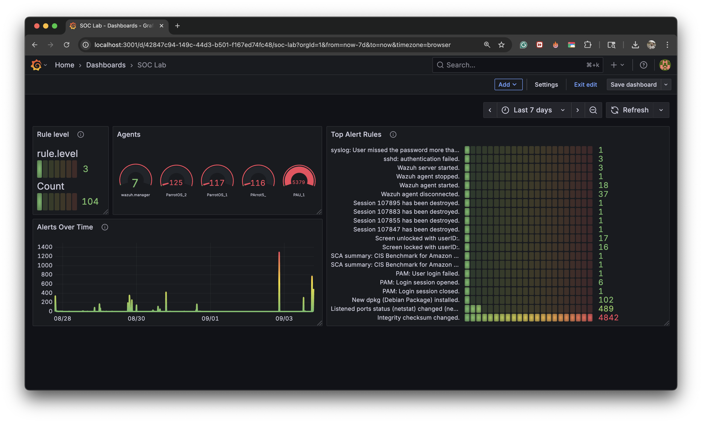

---

## 8. Complete SOC Dashboard

Consolidated panels:
- Alerts Over Time  
- Top Agents  
- Top Rules  
- DoS Detection  
- Severity (`rule.level`)  
- Top Source IPs (`srcip`)  
- Top Destination Ports (`dstport`)  
- MITRE ATT&CK (tactics & techniques)  
- Compliance (GDPR, NIST)

📸  
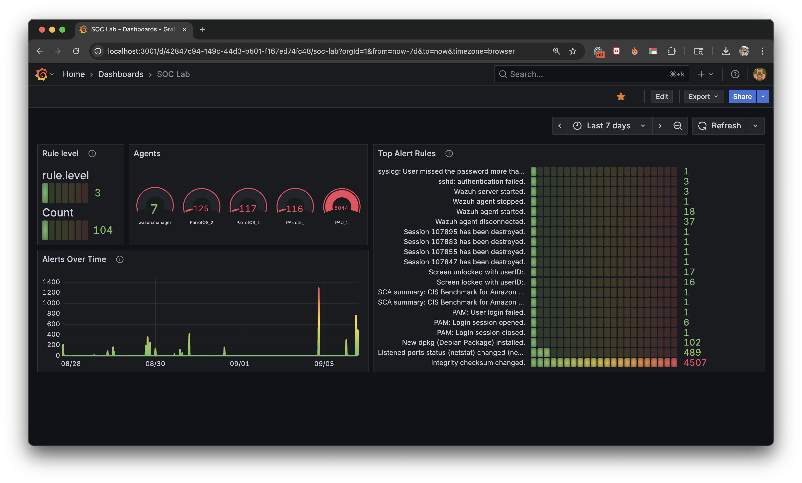

---

## 9. Notes
- Use `.keyword` fields when available to group exact values.  
- For system metrics (CPU/RAM/Disk), enable **syscollector** or use **Prometheus + node_exporter**.  
- Dashboards can also be provisioned via `grafana/provisioning/dashboards/`.

---

## 10. Conclusion
The Grafana integration enables:
- Advanced visualization of alerts and agents.  
- Real-time monitoring of DoS attempts and authentication failures.  
- Context aligned with **MITRE ATT&CK** and compliance frameworks.  
- Professional SOC dashboards to showcase the *Divide and Defend* project.

📸  
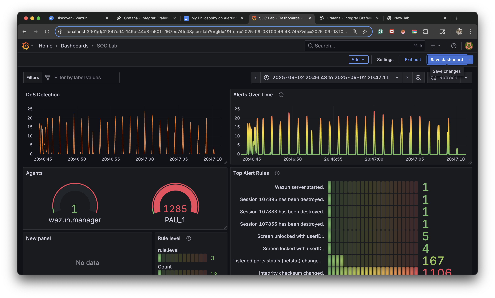

## 11. System Architecture Diagram

f```mermaid
flowchart TD
 subgraph Parrot_OS_Agents["Parrot OS Agents 3 VMs"]
        WM["Wazuh Manager"]
        A1["Logs: Syslog, Auth"]
        P["Prometheus"]
        A2["Metrics: CPU, RAM, NET"]
  end
 subgraph Attacker["Kali Linux"]
        K1["SSH Brute Force / DoS"]
  end
 subgraph Docker_on_Mac["Docker on macOS"]
        ES["Elasticsearch / OpenSearch"]
        WD["Wazuh Dashboard"]
        MQ["RabbitMQ"]
        MINIO["MinIO"]
  end
 subgraph Visualization["Visualization Layer"]
        G["Grafana"]
  end
    A1 -- Send logs --> WM
    A2 -- Expose via node_exporter --> P
    K1 --> A1
    WM --> ES
    ES --> WD
    Parrot_OS_Agents --> WM
    G --> ES & P
    Attacker --> Parrot_OS_Agents

    style Parrot_OS_Agents fill:#C8E6C9
    style Attacker fill:#FFCDD2
    style Visualization fill:#FFE0B2
    style Docker_on_Mac fill:#BBDEFB


