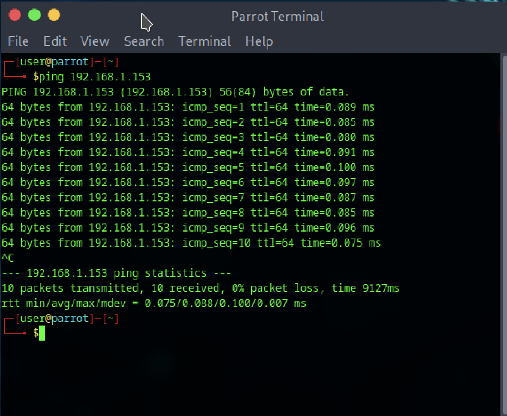
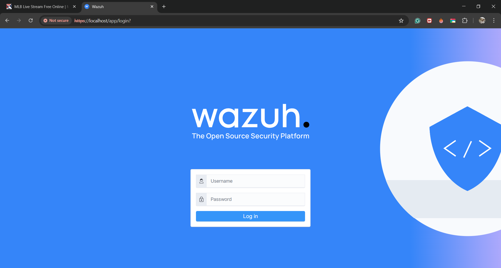
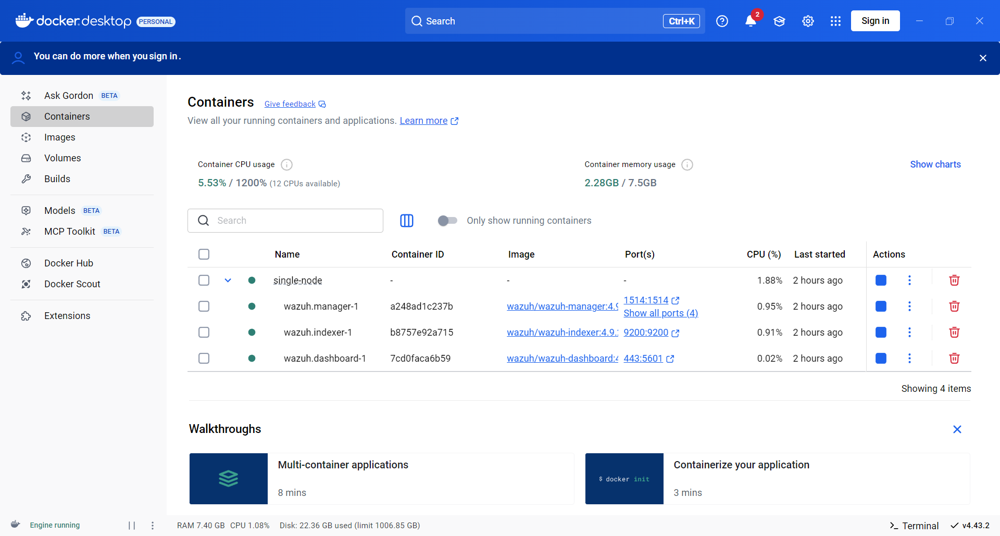
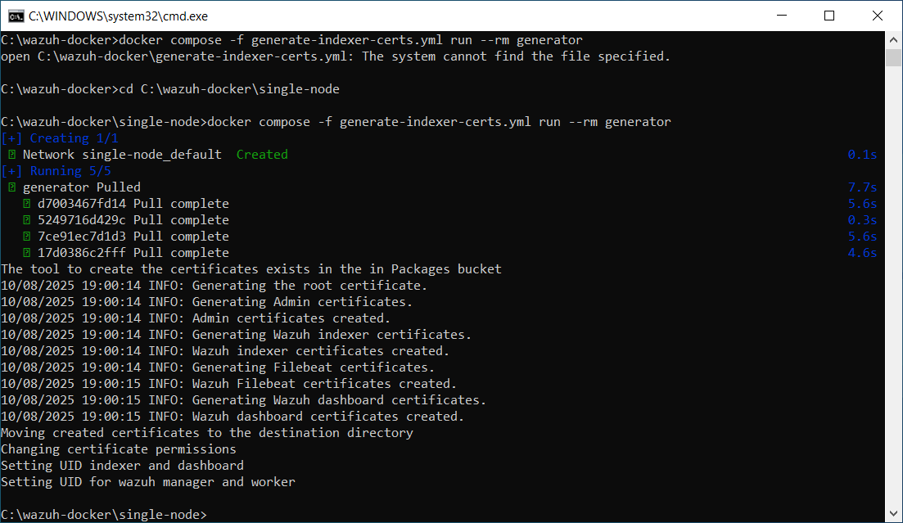
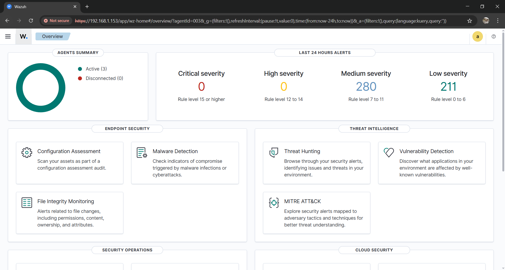
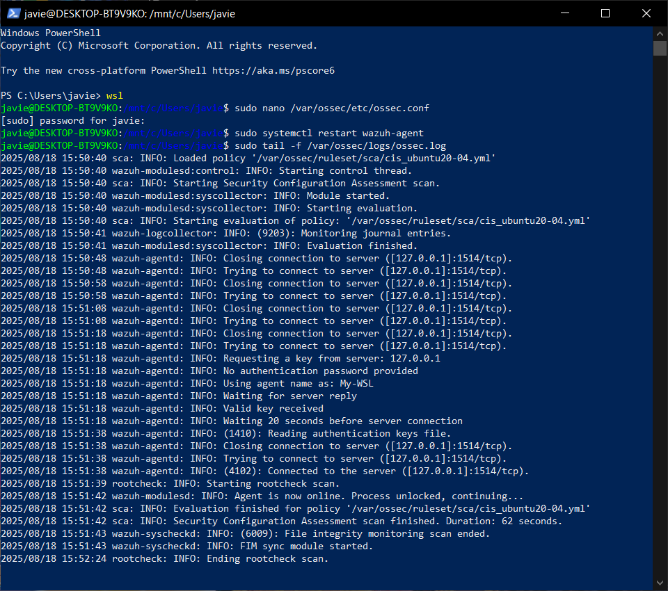

# Monitoring Environment Setup with Wazuh

## 1. Introduction
The objective of this project is to design, implement, and validate a basic monitoring environment using Wazuh SIEM.  
The project demonstrates the ability to install and configure a monitoring platform, collect logs from heterogeneous sources (Windows and Linux), implement custom detection rules, and establish a basic workflow for alerting and notifications.

---

## 2. Architecture Overview
The monitoring environment consists of the following components:
- **Wazuh Manager**: Deployed on Docker (Windows host). Responsible for receiving logs, applying rules, and generating alerts.
- **Wazuh Agents**: Installed on both Linux (Parrot OS and WSL) and Windows 10 endpoints. Responsible for forwarding logs.
- **Dashboard (Kibana)**: Provides visibility into collected data, alerts, and system status.

**Network configuration**: All systems are on the same subnet (192.168.1.x) using bridge networking. TCP port 1514 was configured to allow agent communication with the manager.

---

## 3. Environment and Network Configuration
To ensure connectivity between manager and agents:
- Firewall rules were updated to allow TCP/UDP on port 1514.
- Ping tests between Windows and Parrot OS confirmed connectivity.
- Additional screenshots document successful firewall and agent configuration.

  
  
  
  

---

## 4. Wazuh Manager Installation
The manager was deployed using Docker containers:
1. Pulled the official Wazuh Docker images.
2. Configured the docker-compose file to launch the manager, indexer, and dashboard.
3. Verified successful login to the Wazuh dashboard.

  
  
  
  
  

---

## 5. Agent Installation and Log Collection

### Linux Agents (Parrot OS / WSL)
- Installed using package manager.
- Configured with manager IP and agent key.
- Verified connectivity using `wazuh-agent status`.

Collected logs:  
- Authentication logs (`/var/log/auth.log`)  
- System logs (`/var/log/syslog`)  

### Windows Agent
- Installed using MSI package.
- Configured with manager IP.
- Collected logs from Windows Event Viewer (Security channel).

**Evidence of connectivity and logs:**  
  
  
  
  
  

---

## 6. Custom Alert Rules

Custom rules were defined in `/var/ossec/etc/rules/local_rules.xml`. Three detection scenarios were implemented.

### 6.1 Authentication Detection
Detects multiple failed SSH login attempts, often associated with brute force attacks.  
**MITRE ATT&CK Technique**: T1110 (Brute Force).  
```xml
<rule id="100100" level="10">
  <if_group>sshd</if_group>
  <match>Failed password for</match>
  <description>Multiple failed SSH login attempts detected</description>
  <group>authentication_failed,</group>
</rule>
```

### 6.2 File Integrity Detection
Monitors unauthorized file modifications using the Syscheck module.  
**MITRE ATT&CK Technique**: T1565 (Data Manipulation).  
```xml
<rule id="100110" level="12">
  <decoded_as>syscheck</decoded_as>
  <description>Unauthorized file modification detected</description>
  <group>file_integrity,</group>
</rule>
```

### 6.3 Network Activity Detection (DoS)
Identifies repeated dropped packets in firewall logs that may indicate a Denial-of-Service attempt.  
**MITRE ATT&CK Technique**: T1498 (Network Denial of Service).  
```xml
<rule id="100120" level="14">
  <if_group>firewalld,iptables,</if_group>
  <match>Dropped packet</match>
  <frequency>10</frequency>
  <timeframe>60</timeframe>
  <description>Potential DoS attack - multiple packets dropped</description>
  <group>dos_attack,network_activity,</group>
</rule>
```

---

## 7. Monitoring Workflow
Events follow this path:  
1. Log generated on endpoint (Windows/Linux).  
2. Forwarded by agent to Wazuh Manager over TCP/1514.  
3. Rule engine processes the event.  
4. If conditions match, an alert is generated.  
5. Alerts are displayed in the dashboard and routed via email or Slack.

Example configuration in `ossec.conf`:
```xml
<global>
  <email_notification>yes</email_notification>
  <email_to>soc-team@example.com</email_to>
  <smtp_server>smtp.example.com</smtp_server>
</global>
```

---

## 8. Evidence of Detection
- Screenshots from Wazuh dashboard showing triggered alerts.  
- Example notifications received via configured channels.  

---

## 9. Limitations and Future Work
- Current setup is limited to one manager and two agents.  
- Notification routing is basic (email). Integration with SIEM pipelines or SOAR tools could enhance automation.  
- Future work may include:  
  - Collecting logs from additional endpoints (web servers, databases).  
  - Implementing anomaly detection using Wazuh machine learning modules.  
  - Integrating with threat intelligence feeds.  

---

## 10. Conclusion
This project successfully demonstrates:  
- Installation and basic configuration of Wazuh.  
- Verified network connectivity and agent registration.  
- Log collection from Windows and Linux.  
- Custom detection rules covering authentication, file access, and network activity.  
- A functional monitoring workflow with alert routing.

This environment provides a foundation for more advanced SOC use cases, including incident response and threat hunting.

---
