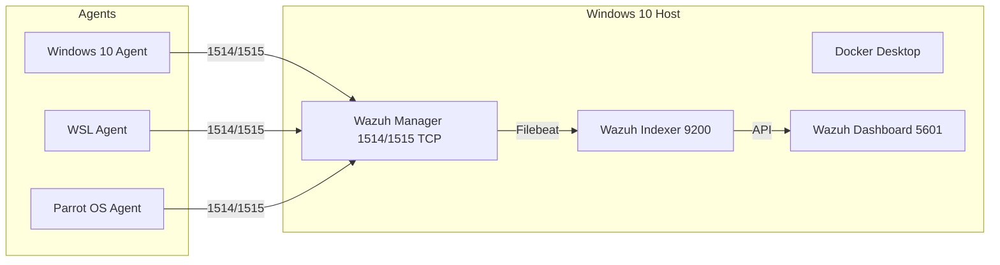
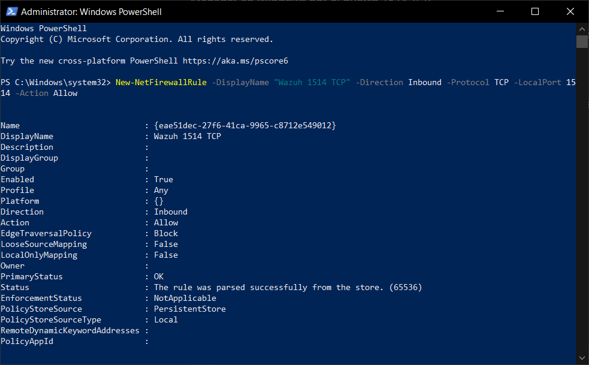
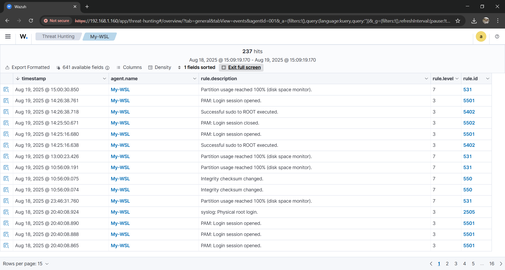
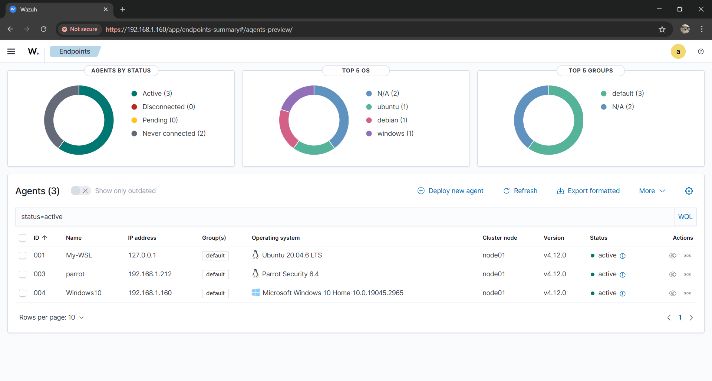

# Monitoring Implementation 
> **Project:** Divide & Defend: A Hands-On SOC Lab Project with Micro-Segmentation 
> **Date Range:** Aug 20–24, 2025  
> **Hosts:** Windows 10 (Wazuh Manager + Dashboard), Ubuntu/WSL, Parrot OS  
> **Analyst:** Javier Napoles

This README documents the full monitoring implementation including **architecture**, **integration of 3+ data sources**, **configuration**, **screenshots evidence**, **performance baselines**, and **health checks**.

---

## 1) Architecture Diagram



---

## 2) Evidence – Screenshots

- **wazuh_setup.PNG**

  

- **wazuh_docker_dashboard.PNG**

  

- **wazuh_setup_2.PNG**

  

- **static_ip.PNG**

  

- **logs_parrot.PNG**

  

- **windows_ping_successfuly.PNG**

  

- **log_windows10.PNG**

  

- **windows_firewall_opening.PNG**

  

- **1514_TCP_opening_for_parrot_agent.PNG**

  

- **wazuh_docker_containers.PNG**

  

- **log_WSL.PNG**

  

- **microsegmentation_rule_windows.PNG**

  

- **wazuh-agent_wsl_cheking_connection_success.PNG**

  

- **wazuh_agents.PNG**

  

---

## 3) Integrated Data Sources

- **Windows 10 Host:** Wazuh Windows Agent (logs: Security, System, Application)
- **WSL Linux:** Wazuh Agent (logs: auth.log, syslog)
- **Parrot OS Linux:** Wazuh Agent (logs: auth.log, syslog)

---

## 4) Manager Platform (Docker)

Docker Compose excerpt:
```yaml
version: "3.9"
services:
  wazuh.manager:
    image: wazuh/wazuh-manager:4.8.0
    ports:
      - "1514:1514/udp"
      - "1515:1515/tcp"
  wazuh.indexer:
    image: wazuh/wazuh-indexer:4.8.0
  wazuh.dashboard:
    image: wazuh/wazuh-dashboard:4.8.0
    ports:
      - "5601:5601"
```

---

## 5) Performance Baselines

| Metric | Baseline | Warning | Critical |
|--------|----------|---------|----------|
| EPS | 8–20 | >30 | >60 |
| CPU % | 20–40 | >70 | >85 |
| Mem GB | 1.2–2.0 | >3.0 | >4.0 |
| Dashboard ms | <800 | >1500 | >3000 |
| Heartbeat | <30s | >3m | >10m |
| Queue depth | <500 | >2000 | >5000 |
| Indexer free % | >30 | <20 | <10 |

---

## 6) Health Monitoring

- **Collection:** check agent status via dashboard or `agent_control -l`
- **Processing:** check analysis queue and EPS
- **Storage:** check indexer disk usage

---

## 7) Integration Steps

1. Configure static IPs & firewall rules  
2. Deploy Wazuh stack via Docker Compose  
3. Enroll Windows, WSL, and Parrot agents  
4. Verify event ingestion in dashboard  
5. Establish baselines and save to JSON  
6. Configure periodic health checks  

---

## 8) Verification Checklist

- [x] Containers running  
- [x] Dashboard accessible  
- [x] 3 agents sending data  
- [x] Logs visible from Windows/WSL/Parrot  
- [x] Firewall rules confirmed  

---

## 9) Appendix

- **Ports:** 1514/1515 TCP, 5601 TCP, 9200 TCP  
- **Safety:** Restore point created  
