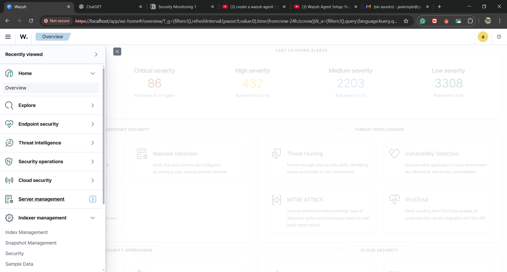
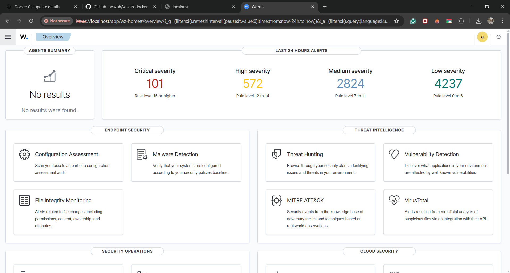
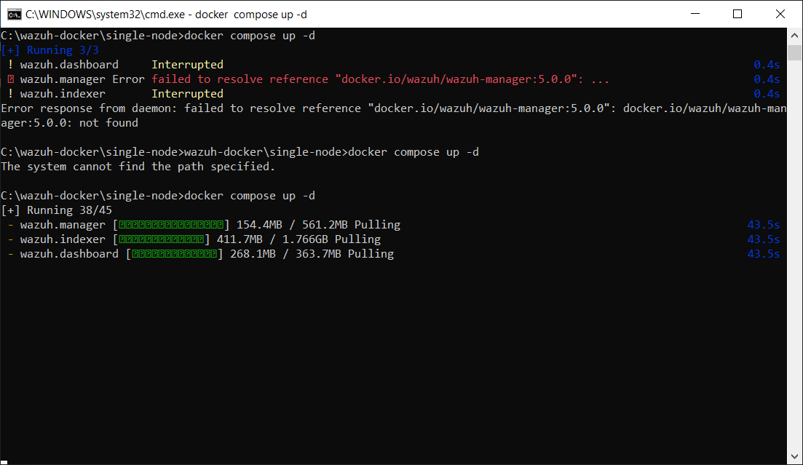
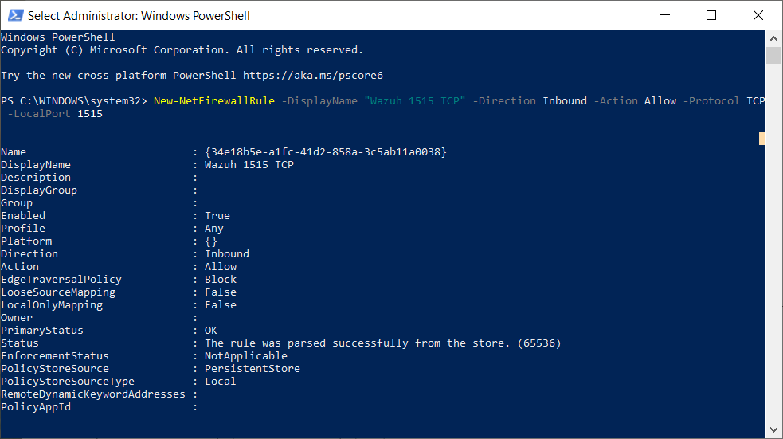

# Wazuh Setup: Step‑by‑Step with My Screenshots

This guide documents how I set up Wazuh end‑to‑end and enrolled my endpoints (macOS and Parrot OS). It includes exact commands I used and my own screenshots for each step.

> Environment I used
- **Wazuh version:** 4.x
- **Manager & Dashboards:** Docker Compose (Wazuh all‑in‑one stack) or preexisting manager
- **Agents:** macOS and Parrot OS (Debian‑based)
- **Network:** Local LAN (manager reachable on `1514/tcp` and `1515/tcp`)

---

## 1) Bring up the Wazuh Manager & Dashboards (Docker)

> Skip if your manager is already running.

```bash
# 1) Get the official compose
curl -sO https://packages.wazuh.com/4.x/docker-compose.yml

# 2) Start the stack (Wazuh Manager, OpenSearch, and Dashboards)
docker compose -f docker-compose.yml up -d

# 3) Check containers
docker ps --format "table {{.Names}}	{{.Status}}"
```

If your stack is remote, ensure the host firewall allows **1514/tcp** (events) and **1515/tcp** (agent enrollment).


## 2) Generate Agent Enrollment Commands

From **Wazuh Dashboards → Wazuh → Agents → Add agent**, select your OS and copy the suggested command(s). We’ll use those in the next steps.


## 3) Install the Agent on macOS

```bash
# Download the macOS agent package (example)
curl -L -o wazuh-agent.pkg https://packages.wazuh.com/4.x/macos/wazuh-agent-4.x.pkg

# Install the package
sudo installer -pkg ./wazuh-agent.pkg -target /

# Point the agent to your manager and enroll
sudo /Library/Ossec/bin/wazuh-control start
sudo /Library/Ossec/bin/agent-auth -m <MANAGER_IP_OR_FQDN>

# Verify status
sudo /Library/Ossec/bin/wazuh-control status
# Tail logs if needed
sudo tail -f /Library/Ossec/logs/ossec.log
```
> Make sure your Mac can reach the manager on ports **1514/tcp** and **1515/tcp**.

## 4) Install the Agent on Linux (Parrot OS / Debian / Ubuntu)

```bash
# Add Wazuh repo
curl -s https://packages.wazuh.com/key/GPG-KEY-WAZUH | sudo gpg --dearmor -o /usr/share/keyrings/wazuh.gpg
echo "deb [signed-by=/usr/share/keyrings/wazuh.gpg] https://packages.wazuh.com/4.x/apt/ stable main" |   sudo tee /etc/apt/sources.list.d/wazuh.list

sudo apt update

# Install agent
sudo apt install wazuh-agent -y

# Configure manager address in ossec.conf
sudo sed -i 's/<address>.*<\/address>/<address><MANAGER_IP_OR_FQDN><\/address>/' /var/ossec/etc/ossec.conf

# Start and enroll
sudo systemctl enable wazuh-agent --now
sudo /var/ossec/bin/agent-auth -m <MANAGER_IP_OR_FQDN>

# Check status & logs
sudo systemctl status wazuh-agent --no-pager
sudo tail -n 100 /var/ossec/logs/ossec.log
```

If you’re on **ARM64** hardware, ensure the package/VM architecture matches (don’t install `amd64` on `arm64`). If networking fails, confirm the correct interface and that the manager is reachable.

## 5) Verify the Agent is Online

In **Wazuh Dashboards → Agents**, the status should show **Active**. You should see incoming events under **Security events** shortly after enrollment.


## 6) Troubleshooting Notes I Hit

- `ERROR: (1216): Unable to connect ... 'Network is unreachable'` → Check the manager IP, container host firewall, and that ports **1514/tcp** and **1515/tcp** are open. Confirm your VM’s network mode (bridged/NAT) can reach the manager.
- `Waiting for server reply (not started)` → Ensure the manager service is healthy and version compatible with your agent.
- Architecture mismatch (`amd64` vs `arm64`) → Match your VM/host architecture to the package build.

Use these quick checks:
```bash
# From agent → test connectivity
nc -vz <MANAGER_IP> 1514
nc -vz <MANAGER_IP> 1515

# Re-run enrollment if needed
sudo /var/ossec/bin/agent-auth -m <MANAGER_IP_OR_FQDN>
```

## My Screenshots

Below are my screenshots organized by step. Replace `<MANAGER_IP_OR_FQDN>` in commands above with your actual manager address.


### Architecture & Manager Up






### Misc / Extra






