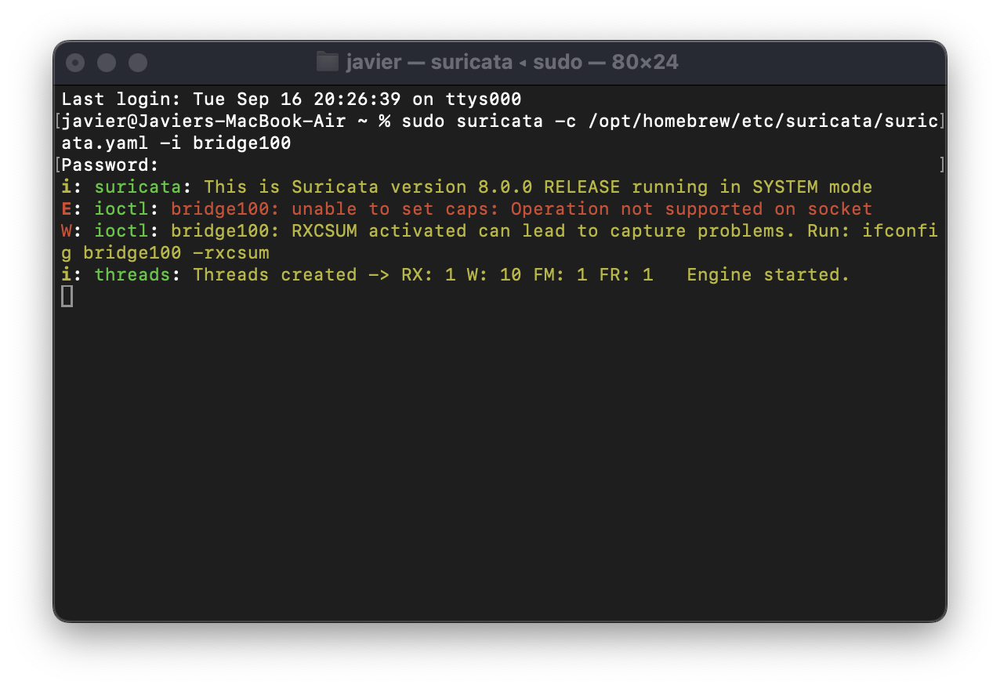
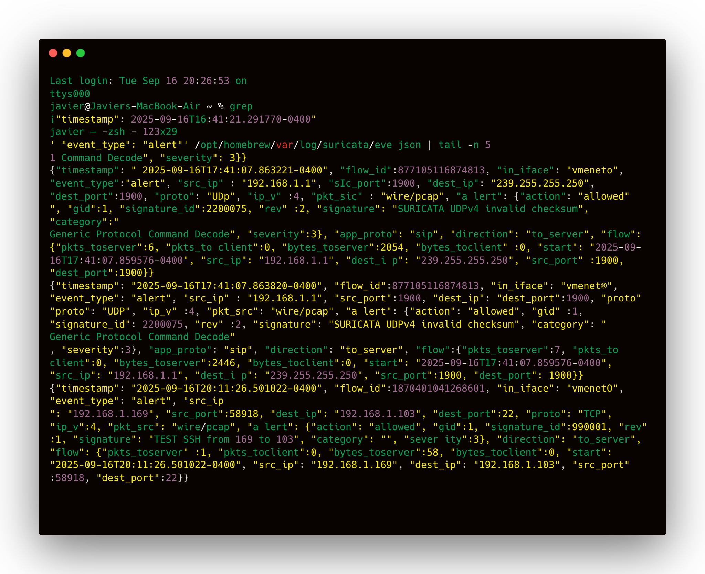
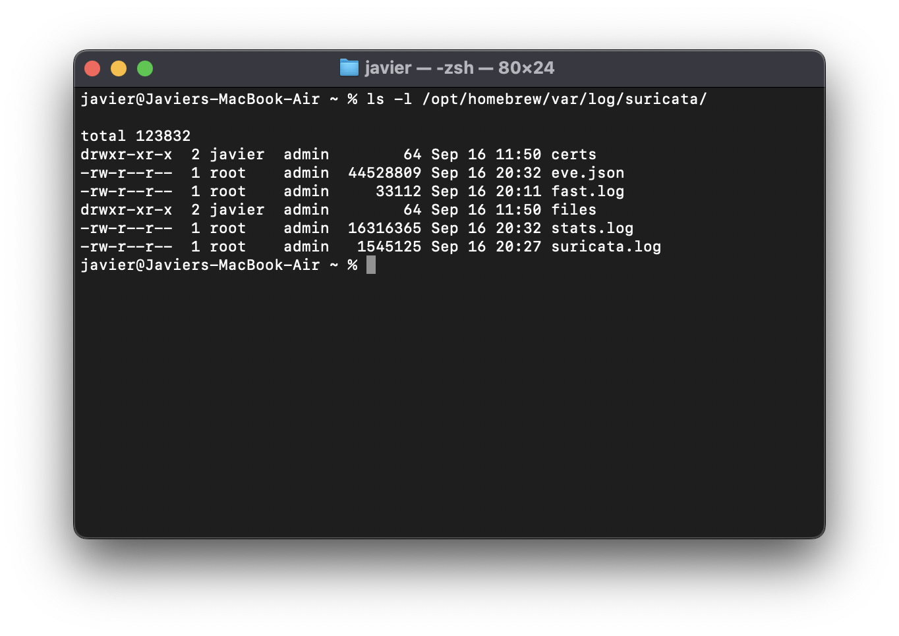
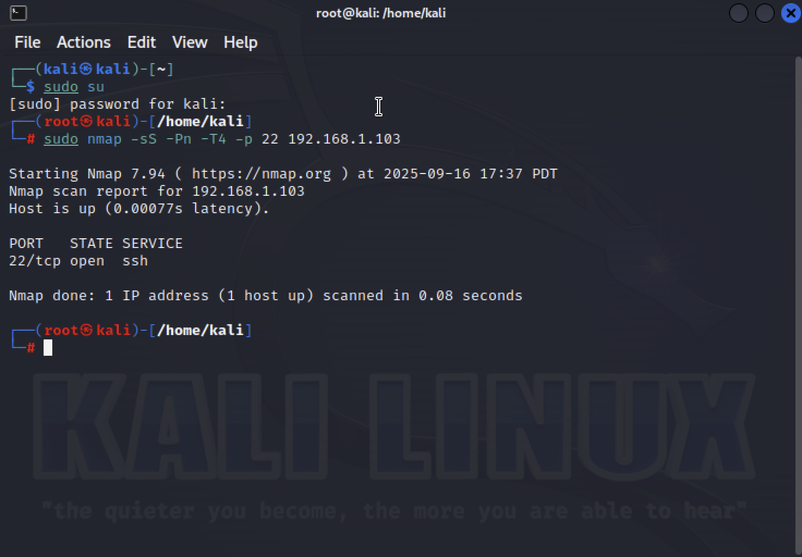
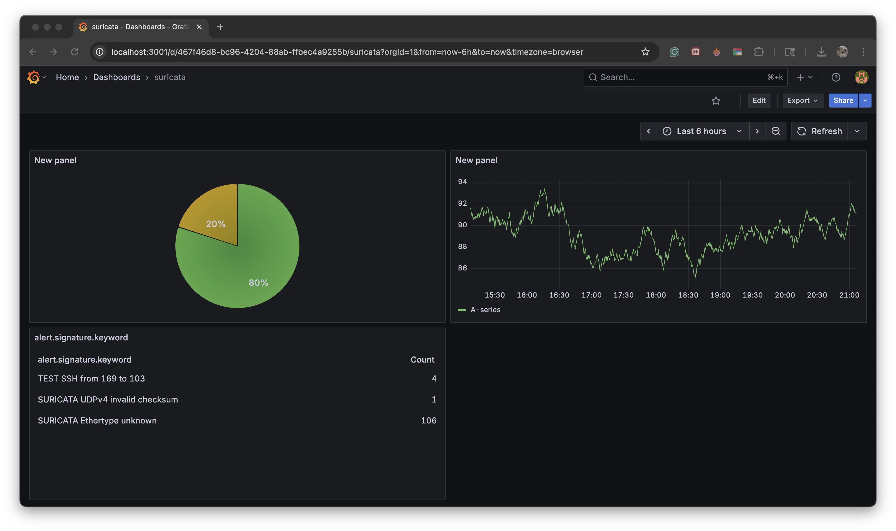

# Advanced Monitoring Design

## Introduction
This project documents a comprehensive design for complex event processing in an enterprise environment. The goal is to integrate **Suricata** as a network intrusion detection system (NIDS), process and forward events to a centralized logging pipeline, and visualize alerts in **Grafana** for advanced monitoring and incident response.  

The design demonstrates the full monitoring lifecycle: from event generation, collection, processing, correlation, to visualization.  

---

## Event Stream Sources
- **Network Traffic**: Monitored through Suricata deployed on the monitoring interface (`bridge100`).  
- **Logs**: Suricata produces JSON (`eve.json`) and fast logs (`fast.log`) with alerts, protocol metadata, and flow data.  
- **Attack Simulation**: Controlled scans from Kali Linux using Nmap to trigger Suricata alerts.  

---

## Processing Engine Selection
- **Suricata IDS**  
  - Chosen for its high-performance packet inspection and ability to output structured JSON events.  
  - Rules allow for custom signatures (e.g., detecting SSH brute force).  
  - *Evidence: Suricata Engine Startup*  
    

- **Filebeat OSS 7.10.2**  
  - Deployed as the lightweight log shipper to forward Suricata logs (`eve.json`) into OpenSearch.  
  - Provides reliable log ingestion without requiring a heavyweight agent.  

- **OpenSearch**  
  - Stores and indexes Suricata logs, providing search and query capabilities.  

---

## Action Framework Components
- **Alerting**: Suricata generates alerts on suspicious traffic (e.g., SSH scan attempts).  
- **Forwarding**: Filebeat forwards alerts to OpenSearch for indexing.  
- **Visualization**: Grafana dashboards query OpenSearch to display metrics and alert distribution.  
- **Response**: Alerts can be integrated with orchestration tools (e.g., Wazuh, SOAR platforms) for automated remediation in an enterprise context.  

---

## Advanced Correlation Methods
- **Pattern-based correlation**  
  - Example: Detect repeated SSH connection attempts from the same source IP.  
  - Implemented in Suricata rules (`TEST SSH from 169 to 103`).  
  - *Evidence: Suricata Fast Log Alerts*  
    

- **Statistical correlation**  
  - Example: Track the rate of failed connections over time; deviations from baseline indicate anomalies.  
  - Achieved by aggregating Suricata flow and alert data in Grafana.  

- **Contextual correlation**  
  - Example: Enrich Suricata alerts with asset context (server role, criticality).  
  - Enables prioritization of alerts that target sensitive enterprise systems.  

---

## Machine Learning & Behavior Analysis
- **Use Case 1 – Anomaly Detection**  
  Train models on network flow statistics (bytes transferred, connection durations) to detect unusual behaviors like data exfiltration.  

- **Use Case 2 – User & Entity Behavior Analytics (UEBA)**  
  Compare current SSH login patterns to historical baselines to detect credential misuse.  

- **Implementation Considerations**  
  - Requires feature extraction from Suricata flow logs (`eve.json`).  
  - Models can run in OpenSearch ML plugins or external ML frameworks (e.g., scikit-learn, TensorFlow).  
  - Integration with alert pipelines ensures suspicious behavior is automatically flagged for SOC analysts.  
  - *Evidence: Suricata Eve JSON Alerts*  
    

---

## Evidence of Installation & Functionality

### Suricata Log Directory
Suricata generates multiple log files (`fast.log`, `eve.json`, `stats.log`) confirming proper configuration.  

---

### Nmap Attack Simulation
Nmap scan from Kali Linux against host `192.168.1.103` on port 22 (SSH).  
This traffic triggers the Suricata test rule for SSH.  

---

## Final Results: Grafana Integration
The final stage demonstrates how Suricata alerts (collected via Filebeat and indexed in OpenSearch) are visualized in Grafana.  

- The **pie chart** displays distribution of detected alerts by type.  
- The **line chart** shows traffic behavior and trends over time.  
- This confirms the successful end-to-end pipeline from detection → forwarding → indexing → visualization.  

*Evidence: Suricata Dashboard in Grafana*  

---

## Conclusion
This project demonstrates a complete monitoring pipeline for enterprise environments:  
- Suricata as the event source,  
- Filebeat for log forwarding,  
- OpenSearch for indexing, and  
- Grafana for visualization.  

The setup enables advanced correlation (pattern, statistical, contextual) and provides a foundation for integrating machine learning and behavioral analytics to further strengthen enterprise security monitoring.  
