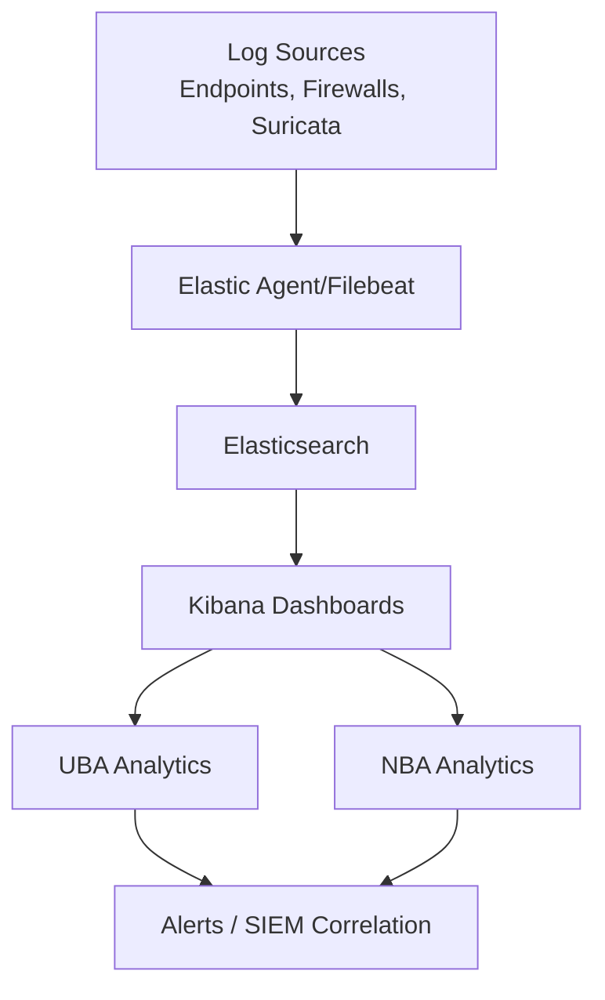
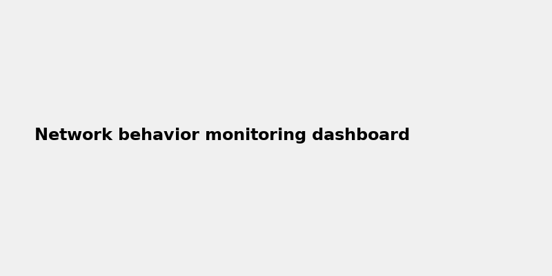

# Detection Strategy Development

**Project:** Security Monitoring 2  
**Author:** Javier Napoles  
**Date:** 2025-09-24  

---

## 1. Introduction

This document outlines the **behavioral analysis strategy** for the mock enterprise environment. The strategy focuses on both **User Behavior Analytics (UBA)** and **Network Behavior Analytics (NBA)**.  

Key objectives:  
- Establish a baselining methodology.  
- Deploy a log analysis tool (Elastic Stack).  
- Develop detection use cases for three threat scenarios.  
- Address false positive management and ongoing effectiveness measurement.  

---

## 2. Behavioral Analysis Approaches

### 2.1 User Behavior Analytics (UBA)
- Collect authentication logs, access logs, and endpoint activity.  
- Identify deviations from normal login hours, devices, or locations.  
- Detect insider threats and compromised accounts.  

### 2.2 Network Behavior Analytics (NBA)
- Monitor NetFlow, Suricata IDS alerts, and firewall logs.  
- Establish normal baselines of bandwidth, protocols, and communication patterns.  
- Detect lateral movement, beaconing, and unusual traffic flows.  

---

## 3. Baselining Methodology

| Aspect | Methodology |
|--------|-------------|
| **Data Collection** | Minimum 30 days of logs from endpoints, network, and cloud platforms. |
| **Business Cycle** | Include weekday vs weekend, shift schedules, and monthly reporting peaks. |
| **Seasonal Variations** | Compare Q1–Q4 activity, holiday periods, and summer slowdowns. |
| **Storage** | Centralized logging in Elasticsearch with timestamp normalization. |

---

## 4. Tool Deployment

### 4.1 Installation
Elastic Stack (Elasticsearch, Logstash, Kibana) was deployed for log collection and analysis.  

### 4.2 Dashboard Creation
- Created a Kibana dashboard to visualize user logins, network flows, and anomaly detection trends.  
- Dashboards demonstrate both UBA and NBA perspectives.  

*Figure 1: Elastic Stack installation verification*  

*Figure 2: Kibana login events dashboard*  

*Figure 3: Network behavior monitoring dashboard*  

---

## 5. Detection Use Cases

### 5.1 Brute Force Authentication Attack
- **Data Source:** Windows Event Logs, Suricata EVE JSON.  
- **Detection Logic:** ≥ 10 failed logins from same IP within 5 minutes.  
- **Expected Output:** Alert in Kibana dashboard, correlation to account lockout.  

---

### 5.2 Data Exfiltration via Unusual Protocol
- **Data Source:** Firewall logs, Suricata DNS/HTTP logs.  
- **Detection Logic:** Large outbound transfers to non-whitelisted IPs using uncommon ports (e.g., TCP/8080, ICMP tunneling).  
- **Expected Output:** Alert showing source host, transfer volume, and destination.  

---

### 5.3 Insider Threat – Privilege Escalation
- **Data Source:** Sysmon logs, Active Directory logs.  
- **Detection Logic:** User account assigned to Domain Admin group outside normal change window.  
- **Expected Output:** Real-time alert in Kibana with audit trail of escalation.  

---

## 6. False Positive Management

| Step | Description |
|------|-------------|
| **Baseline Refinement** | Adjust thresholds based on normal business activity. |
| **Whitelist Known Entities** | Trusted IPs, service accounts, and scheduled jobs excluded. |
| **Feedback Loop** | Analysts review alerts daily and adjust rules. |
| **Effectiveness Metrics** | Ratio of false positives to true positives, Mean Time to Detect (MTTD), and Mean Time to Respond (MTTR). |

---

## 7. Conclusion

This detection strategy establishes:  
- **UBA/NBA foundation** with baselines and dashboards.  
- **Elastic Stack deployment** for centralized log analysis.  
- **Three detection scenarios** with documented logic and expected alerts.  
- **False positive tuning methodology** for ongoing effectiveness.  

The enterprise can now proactively monitor and refine detection capabilities, ensuring alignment with business cycles and reducing noise in the SOC.

---

## Appendix: Screenshots

1. Elastic Stack installation verification  
2. Kibana login events dashboard  
3. Network behavior monitoring dashboard  
