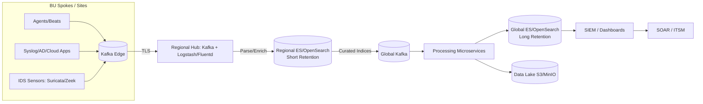
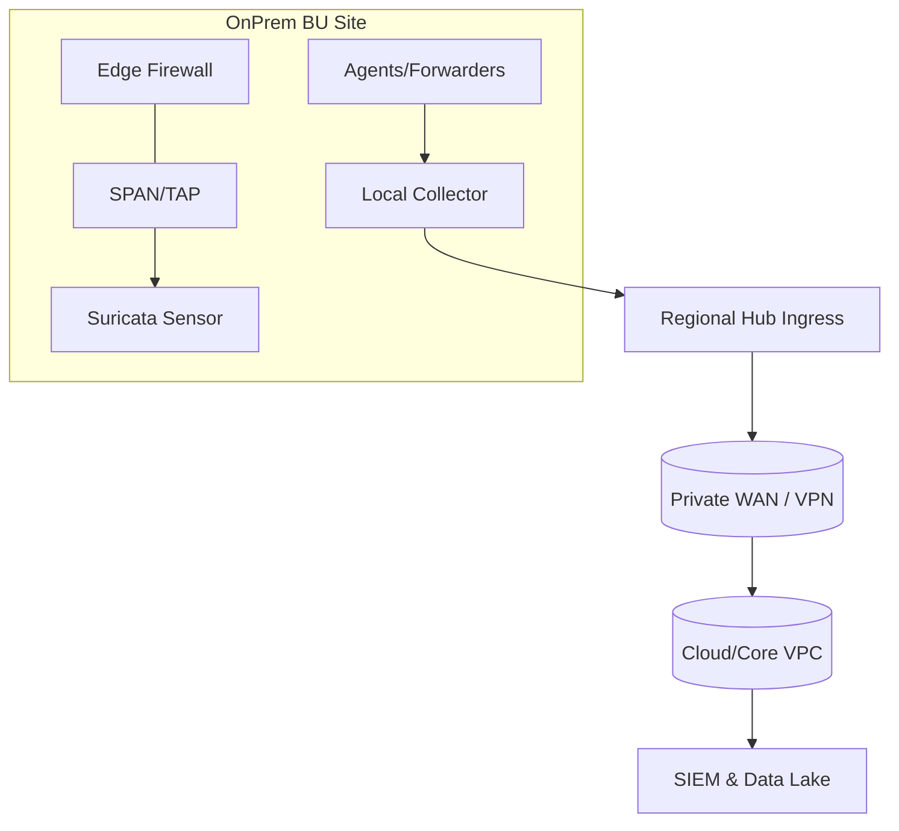
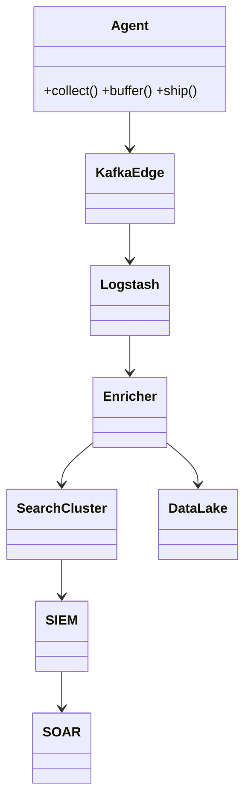
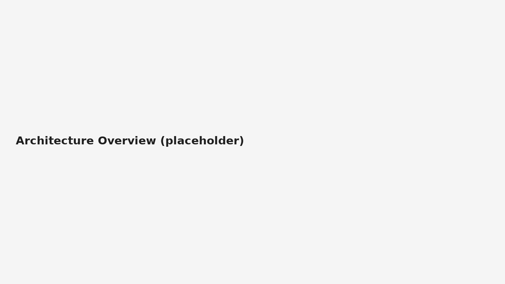
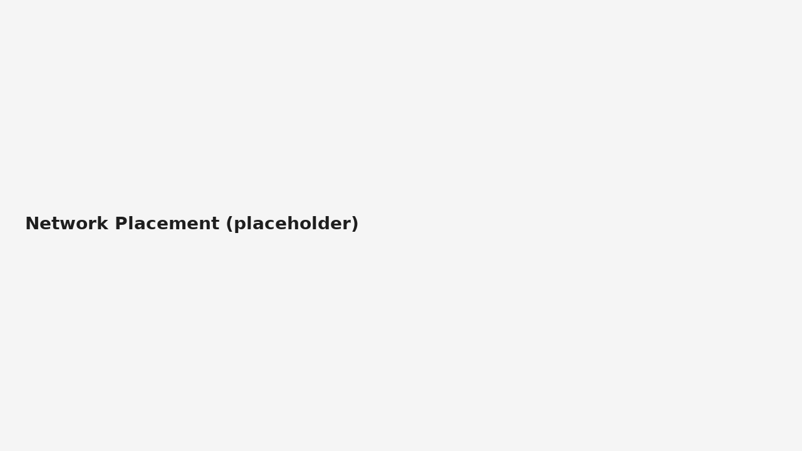
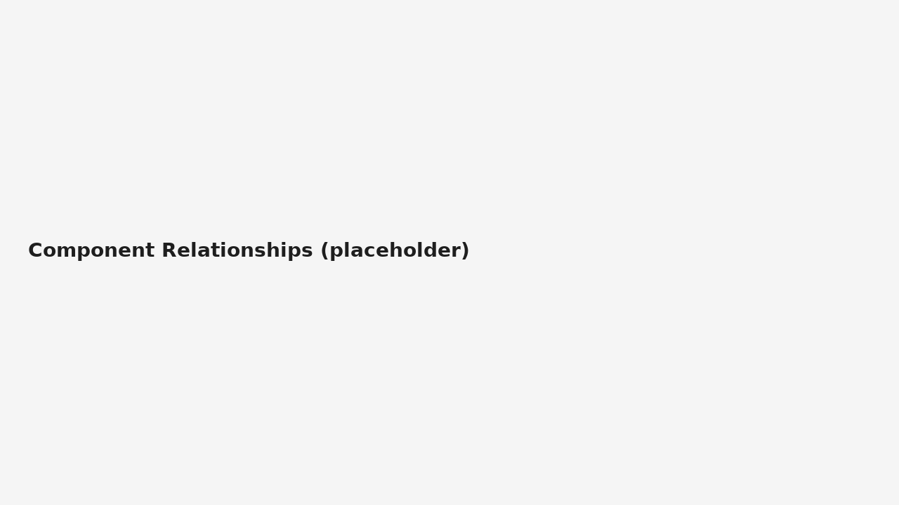
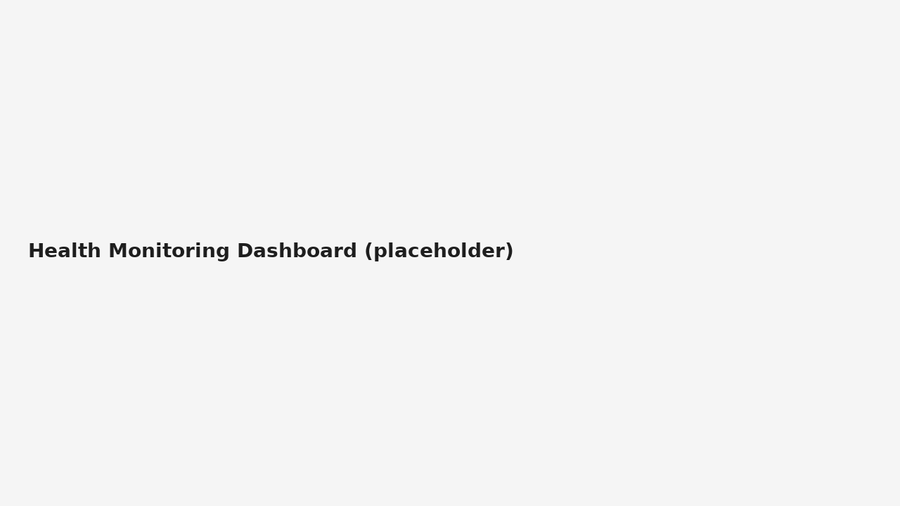
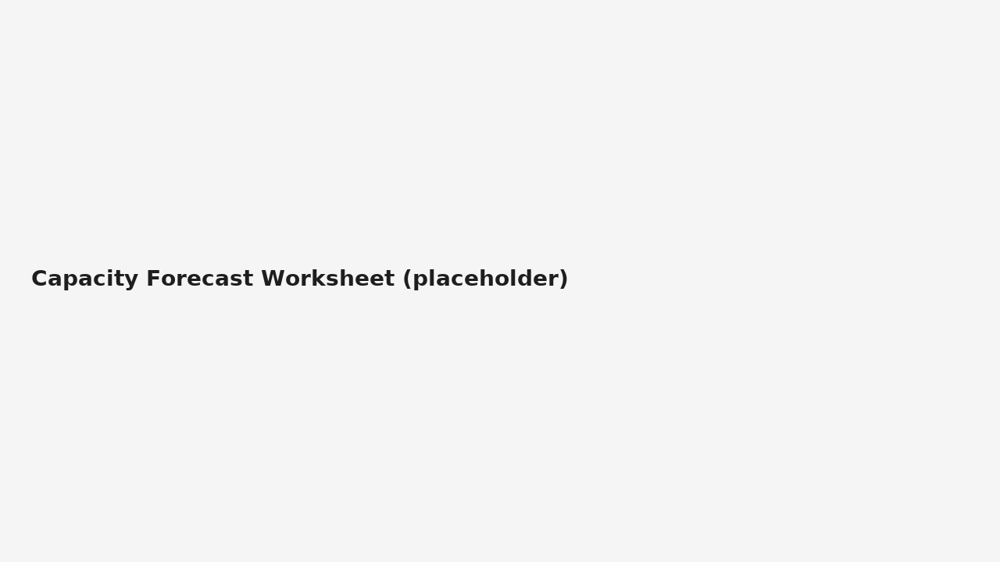

# Enterprise Monitoring Architecture Design

**Project:** Security Monitoring 2  
**Author:** Javier Napoles  
**Date:** 2025-09-24  

---

## 1. Overview

This document defines a detailed enterprise monitoring architecture for a **mock global organization** with multiple business units (BUs). The design combines **hub‑and‑spoke (regional hubs)** with **hierarchical aggregation** and **microservices** for processing, enabling low‑latency local visibility with centralized governance and scale.

**Goals**
- Unified telemetry collection across BUs and regions.
- Scalable, resilient ingestion and analytics.
- Clear communication flows and component responsibilities.
- Health monitoring of the monitoring stack itself.
- Capacity planning with current state, growth forecast, and expansion scenarios.

---

## 2. Architecture Patterns & Placement

### 2.1 Selected Patterns
- **Hub‑and‑Spoke (Regional Hubs):** Local data stays close for latency/sovereignty; curated data forwarded to global core.
- **Hierarchical Aggregation:** Spoke → Regional Hub → Global Core minimizes backhaul.
- **Microservices for Processing:** Stateless parsers/enrichers/correlators, horizontally scalable and independently deployable.

### 2.2 Component Placement
- **Spokes (BU Sites):** Agents/forwarders, sensors (Suricata/Zeek), local syslog collectors.
- **Regional Hubs:** Kafka brokers + Logstash/Fluentd; short‑retention search cluster (Elasticsearch/OpenSearch).
- **Global Core:** Long‑retention search (ES/OpenSearch or Splunk), SIEM analytics, SOAR, and data lake (S3/MinIO).

---

## 3. Architecture Diagrams

### 3.1 Global Logical Flow

### 3.2 Network Placement

### 3.3 Component Relationships

*Figure 1: Architecture overview*  

*Figure 2: Network placement*  

*Figure 3: Component relationships*  

---

## 4. Communication Flows & Scalability

| Flow | Protocol | Scale Strategy | Reliability |
|---|---|---|---|
| Agents → Kafka Edge | TLS/TCP | Scale agents; partition by BU/topic | Backpressure via Kafka |
| Edge → Regional Hub | TLS/TCP | Add brokers per region | acks=all; ISR monitoring |
| Hub → Global Core | TLS/TCP | Topic compaction/tiering | CCR/mirroring between regions |
| Processing | HTTP/gRPC | Autoscale stateless workers | DLQ for poison events |
| Alerts → SOAR/ITSM | REST/Webhook | Retry with jitter | Idempotent tickets |

**Scalability Considerations**
- Topic partitioning per data type (auth, dns, netflow, edr).  
- Hot (regional) vs warm/cold (global) storage tiers.  
- Multi‑AZ for hubs; cross‑region snapshots for core.

---

## 5. Health Monitoring for the Monitoring Stack

### 5.1 Monitoring Points
- **Agents/Forwarders:** queue size, dropped events, CPU/mem.
- **Kafka:** under‑replicated partitions, consumer lag, broker health.
- **Logstash/Fluentd:** throughput (eps), error rate, filter drop %.
- **Search (ES/OS):** heap %, GC pauses, indexing/search latency p95, disk watermark.
- **SOAR/Alerting:** alert queue depth, delivery success.
- **Network:** inter‑site RTT, loss, jitter.

### 5.2 Metrics & Thresholds (initial)
| Component | Metric | Warn | Crit |
|---|---|---:|---:|
| Agent | Local queue size | > 5k | > 20k |
| Kafka | Under‑replicated partitions | ≥ 1 | ≥ 10 |
| Kafka | Consumer lag (msgs) | > 10k | > 100k |
| Logstash | Error rate | > 1% | > 5% |
| ES | JVM heap usage | > 75% | > 90% |
| ES | Indexing latency p95 | > 200 ms | > 500 ms |
| ES | Disk usage | > 75% | > 90% |
| WAN | RTT p95 | > 150 ms | > 300 ms |

### 5.3 Alerting Policy
- **Critical** sustained > 5 min → Pager + auto‑ticket.  
- **Warning** repeated 3× in 24h → ITSM ticket + follow‑up.

*Figure 4: Health monitoring dashboard*  

---

## 6. Capacity Planning Model

### 6.1 Current State (Mock)
- **Endpoints:** 6,000 (AMER 3k, EMEA 2k, APAC 1k)  
- **Network devices:** 400  
- **Avg event size:** 0.6 KB; **baseline rate:** 450 events/endpoint/day  
- **Daily ingest (baseline):** ~ 2.6 GB/day (endpoints + network/sensors)  
- **Retention:** Regional 7d (hot), Global 180d (warm/cold)

### 6.2 Growth Forecast
Assume **20% YoY endpoint growth** and **30% more sensor coverage**.

| Year | Endpoints | Daily Ingest GB | Hot (7d) GB | Warm/Cold (180d) GB |
|---|---:|---:|---:|---:|
| Y0 | 6,000 | 2.6 | 18.2 | 468 |
| Y1 | 7,200 | 3.2 | 22.4 | 576 |
| Y2 | 8,640 | 3.9 | 27.3 | 702 |

> Add ~30% overhead for replicas, metadata, compression variance.

### 6.3 Expansion Scenarios
- **A – Regional Scale‑Up:** Add brokers + data nodes when p95 indexing latency > 300 ms for 1h.  
- **B – New Region/BU:** Deploy new hub via IaC; mirror topics to core; apply governance templates.  
- **C – Cloud Burst:** Tier Kafka/ES to object storage; replay post‑peak.

*Figure 5: Capacity forecast worksheet*  

---

## 7. Security & Governance

- mTLS everywhere; certificate rotation (ACME/PKI).  
- PII minimization at spokes; tokenization at hubs; DLP on egress.  
- RBAC least privilege; audit for rule/config/playbook changes.  
- DR: cross‑region snapshots; RPO 4h, RTO 2h; quarterly restore tests.

---

## 8. Implementation Roadmap

1. **Phase 1 – Foundations (Weeks 1–2):** Deploy two regional hubs; agent rollout to pilot sites; baseline metrics.  
2. **Phase 2 – Analytics (Weeks 3–5):** Global processing services; SIEM; base dashboards; SOAR hooks.  
3. **Phase 3 – Scale/Hardening (Weeks 6–8):** Add regions; CCR; RBAC; retention optimization.  
4. **Phase 4 – Optimization (Week 9+):** Autoscaling, cost/perf reviews, chaos tests, DR drills.

---

## Appendix: Screenshots
1. Architecture overview  
2. Network placement  
3. Component relationships  
4. Health monitoring dashboard  
5. Capacity forecast worksheet  
