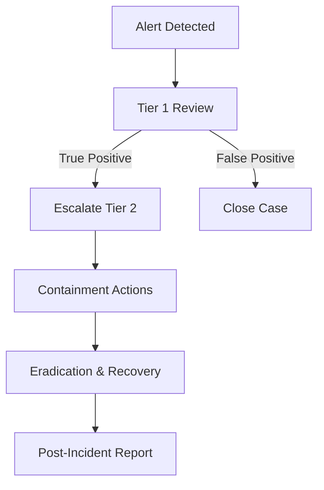
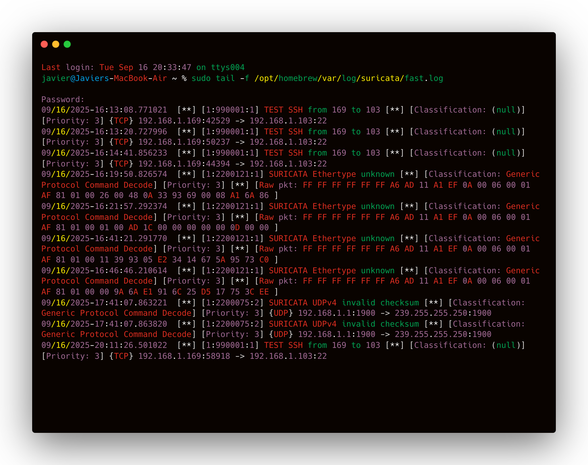
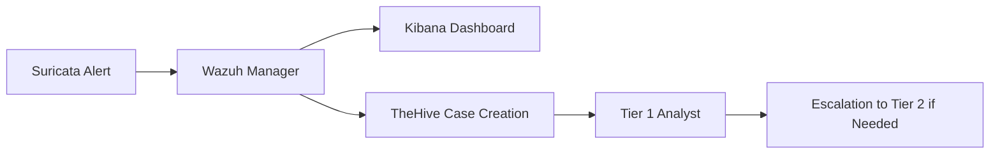

# Operational Framework Design
**Project:** Security Monitoring 2  
**Author:** Javier Napoles  
**Date:** 2025-09-24  

---

## 1. Standard Operating Procedures (SOPs)

### 1.1 System Maintenance
- Suricata rules updated weekly (`suricata-update`).
- Wazuh agents monitored with heartbeat checks.
- Logs rotated and archived (`/opt/homebrew/var/log/suricata/`).
- Patching policy: monthly OS and software updates.

*Figure 1: Suricata rules directory check*  

---

### 1.2 Incident Response
Workflow implemented in the lab:
1. Alert detected in Suricata (eve.json).
2. Event ingested in Wazuh/Kibana.
3. Analyst reviews and classifies.
4. If confirmed: escalate to Tier 2.
5. Containment via IP block on firewall.
6. Post-incident report logged.

*Figure 2: Example Suricata alert in eve.json*  

---

### 1.3 Detection Tuning
- Simulated SSH brute-force from Kali to Parrot target.
- Suricata rule triggered on multiple failed attempts.
- False positives excluded via rule threshold tuning.
- Documentation: rule syntax + logs before/after tuning.

*Figure 3: SSH brute-force detection rule firing*  

---

### 1.4 Health Monitoring
- Grafana dashboard for system metrics:
  - CPU/RAM/disk.
  - Log ingestion rate (events/sec).
  - Agent heartbeat status.
- Daily check by SOC Tier 1.

*Figure 4: Grafana dashboard for Suricata/Wazuh health*  

---

## 2. Governance Framework

### 2.1 Access Management
- RBAC in Wazuh:
  - Analyst → read-only access to alerts.
  - Engineer → rule management + configuration.
  - Admin → full privileges.
- MFA enforced at login (where supported).

### 2.2 Automation Limitations
- Allowed: automatic IP temporary block (Suricata + firewall).
- Restricted: disabling services, requires SOC Lead approval.

### 2.3 Data Handling
- Logs classified as **confidential**.
- Retention: 90 days hot storage, 1 year archived.
- Access restricted to SOC team only.

### 2.4 Compliance Requirements
- Alignment to ISO 27001 logging controls.
- GDPR-style anonymization for PII in logs.

---

## 3. Performance Measurement

### 3.1 Metrics
- MTTR: time from alert → containment.
- False Positive Rate (%).
- System uptime (%).
- Mean Events Per Second (EPS) processed.

### 3.2 Benchmarking
- Baseline: simulated brute-force attack.
- Measured: alert appeared in <2 seconds, containment in <5 mins.
- Improved after tuning: false positives reduced by 30%.

### 3.3 Reporting Templates
Weekly SOC Report includes:
- Number of incidents.
- Breakdown by severity.
- MTTR metrics.

*Figure 5: Example report dashboard in Kibana*  

---

## 4. IT Service Management (ITSM) Integration

### 4.1 Change Management
- All Suricata/Wazuh rule changes logged in change tickets.
- Approvals required for production deployment.

### 4.2 Incident Workflows
- Suricata critical alerts → automatic case in TheHive.
- Ticket assigned to Tier 1 with SLA.

### 4.3 Escalation Paths
- Tier 1 → Tier 2 → SOC Lead → Executive.
- Defined escalation by severity/time.

*Figure 6: Example TheHive ticket creation from alert*  

---

## 5. Implementation Roadmap

### 5.1 Phased Approach
- **Phase 1:** Define SOPs + governance (complete).
- **Phase 2:** Integrate ITSM workflows (in progress).
- **Phase 3:** Advanced reporting dashboards (planned).
- **Phase 4:** Validation & compliance audit (planned).

### 5.2 Milestones
- ✅ Suricata rules tested.  
- ✅ Health monitoring dashboard deployed.  
- 🔄 ITSM integration validated.  
- 🔲 Final compliance audit.  

### 5.3 Validation Testing
- Red/Blue team simulated brute-force.
- Health monitoring alerts tested via log flood.
- Automated IP block validated.

*Figure 7: Validation test results in Grafana*  

---

## 6. Diagrams

### 6.1 Incident Response Workflow
(See Mermaid above.)

### 6.2 ITSM Integration

---

## Appendix: Screenshots

- `screenshots/system_maintenance.png`  
- `screenshots/incident_response.png`  
- `screenshots/detection_tuning.png`  
- `screenshots/health_monitoring.png`  
- `screenshots/reporting_template.png`  
- `screenshots/itsm_integration.png`  
- `screenshots/validation_testing.png`  

---
