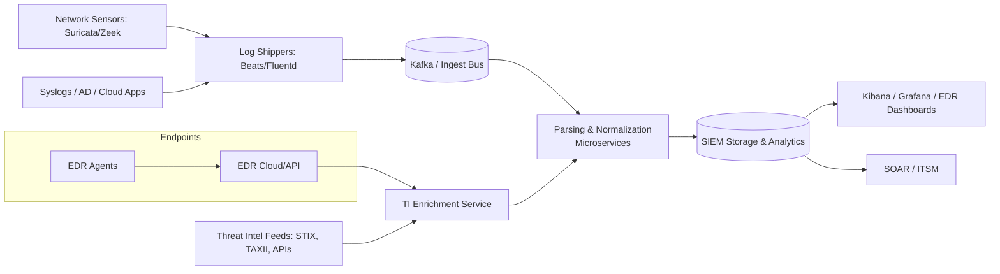
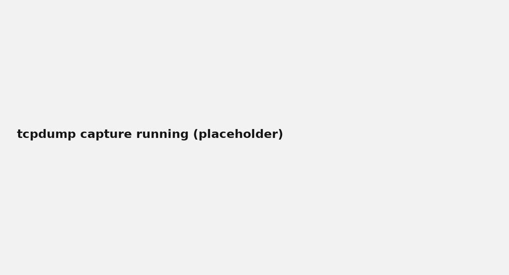
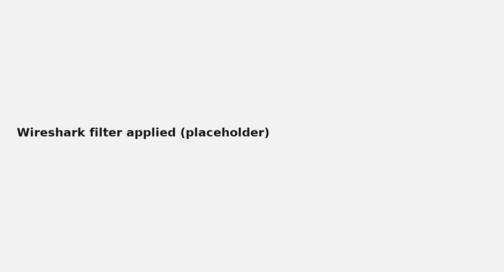
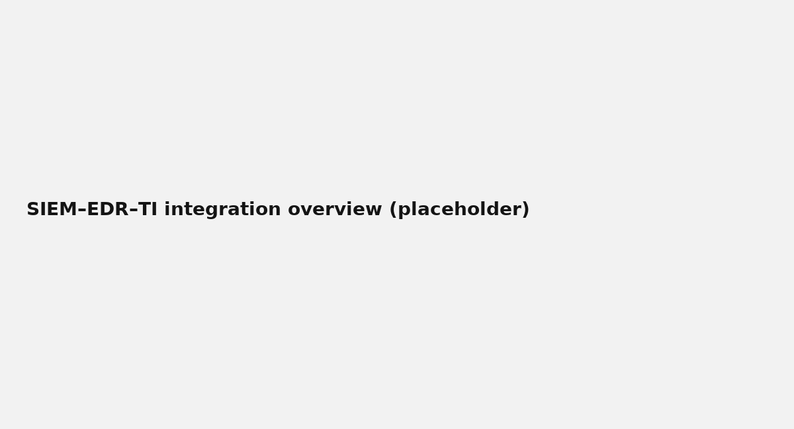

# Tool Integration Strategy

**Project:** Security Monitoring 2  
**Author:** Javier Napoles  
**Date:** 2025-09-24  

---

## 1. Purpose

This document defines a strategy to integrate **SIEM**, **EDR**, and **Threat Intelligence (TI)** in an enterprise environment. It covers integration architecture, authentication and data consistency requirements, practical packet capture (Wireshark/tcpdump) with screenshots, cross‑platform correlation challenges, and a custom analytics development plan.

---

## 2. Integration Architecture

### 2.1 High‑Level Diagram


### 2.2 Component Relationships
- **EDR** provides endpoint telemetry (process, file, auth events) and exposes an **API** for detections and alerts.
- **TI** sources (commercial, open) feed indicators via **TAXII/STIX** or REST APIs to an enrichment service.
- **Ingest Bus (Kafka)** decouples producers (agents/sensors) from consumers (parsers, SIEM).
- **SIEM** stores normalized events, runs correlation logic, and triggers SOAR/ITSM.

### 2.3 Authentication & Authorization
- **APIs:** OAuth2 client credentials or signed API keys; rotate keys every 90 days; least-privileged scopes (read:events, read:detections).
- **Ingest:** mTLS between shippers and Kafka/collectors; certificates rotated by CA/ACME.
- **Dashboards/SOAR:** SSO with SAML/OIDC; role‑based views (Tier1/Tier2/IR/Engineering).

### 2.4 Data Consistency & Reliability
- **Time Sync:** NTP across all producers; SIEM ingests in UTC.
- **Idempotency:** Use event `event.id` and producer `producer.id` to deduplicate.
- **Schema Control:** Managed mappings (ECS/OCSF) with versioned pipelines.
- **At‑Least‑Once Delivery:** Kafka acks=all, consumer offsets committed after successful index.
- **Backpressure:** Circuit breakers on parsers; DLQ for poison messages.

---

## 3. Practical Traffic Analysis (Wireshark/tcpdump)

### 3.1 Capture Setup (tcpdump)
```bash
# 1) Identify interface
ip a | grep -E "eth0|en0|wlan|vmnet"

# 2) Start a rolling capture (root)
sudo tcpdump -i <iface> -w /tmp/pcap_$(date +%F_%H%M).pcap -G 300 -W 2 -s 0

# 3) Quick live view for SSH brute force
sudo tcpdump -i <iface> 'tcp port 22 and (tcp[tcpflags] & (tcp-syn) != 0)'
```

*Figure 1: tcpdump capture running*  


### 3.2 Wireshark Analysis
1. Open the `.pcap` in Wireshark.  
2. Apply filter examples:  
   - `tcp.flags.syn == 1 && tcp.flags.ack == 0` (scan/connection attempts)  
   - `dns && dns.flags.response == 1` (DNS responses)  
   - `http.request` (HTTP reqs)  
3. Use **Statistics → Conversations** and **Endpoints** to identify top talkers.  
4. Export flows as CSV for SIEM enrichment.

*Figure 2: Wireshark filter applied*  


### 3.3 Send to SIEM
- Use **Filebeat/Packetbeat** or custom shipper to send parsed flows + metadata to SIEM index `network-*`.

*Figure 3: Packetbeat/flows dashboard*  


---

## 4. Cross‑Platform Correlation Challenges

| Challenge | Description | Strategy |
|---|---|---|
| **Data Normalization** | Different vendors/fields (e.g., `src_ip` vs `source.ip`) | Adopt **ECS/OCSF** mapping in ingest pipelines. |
| **Entity Resolution** | Same host/user seen across EDR, AD, and SIEM with different IDs | Maintain **entity graph**; keys: `user.name`, `host.hostname`, `asset_id`; reconcile via CMDB/IDP. |
| **Contextual Alignment** | Timezones, clock skew, session boundaries | Ingest to **UTC**, add `@ingest_time`, skew correction ±120s. |
| **Threat Intel Variance** | Conflicting/low‑quality indicators | Score feeds; require **minimum confidence**; decay TTL automatically. |
| **Cardinality/Costs** | Exploding labels (usernames, hashes) | Roll‑ups, sampling, and tiered storage; cost guardrails. |

**Example (Normalization to ECS)**  
```
source.ip  <- src_ip | client_ip
destination.ip <- dest_ip | server_ip
event.outcome <- action | status
user.name  <- user | username | account
```

---

## 5. Custom Analytics Development Plan

### 5.1 Use Cases (Mock Enterprise)
1. **SSH Brute Force (NBA + UBA)**  
   - Data: Suricata EVE, Packetbeat, EDR auth failures.  
   - Logic: ≥10 failures from same IP in 5 min; succeeded login within 10 min from same IP → **High**.  
   - Output: SIEM alert + SOAR auto‑block (firewall tag).

2. **Malicious Beaconing (NBA)**  
   - Data: Suricata/Zeek, TI domain/IP lists.  
   - Logic: Periodic egress to low‑reputation FQDN every 60±10s for ≥10 cycles.  
   - Output: Alert with session IDs + PCAP slice pointer.

3. **Privilege Escalation (UBA)**  
   - Data: EDR process events, AD audit (`memberOf` changes).  
   - Logic: user added to admin group outside change window; correlate with `cmd.exe /c net localgroup`.  
   - Output: Ticket with chain of evidence.

### 5.2 Development Methodology
- **Spec → Prototype → Validate → Promote** in stages.  
- Version rules with semantic versioning (`rule-ssh-bf v1.2.0`).  
- Unit tests for parsers (sample events) and **simulation datasets** for rules.  
- Canary deployment on 10% topics; rollback on FP spike.

### 5.3 Implementation Approach
- Pipelines in containers (CI/CD).  
- Config as code (Git) for parsers, mappings, and rules.  
- Dashboards templates (Kibana/Grafana JSON) stored in repo.  
- SOAR playbooks for response (isolate host, block IP, disable user).

*Figure 4: SIEM–EDR–TI integration overview*  


---

## 6. Governance, Security & Access

- **Secrets management:** Vault/KMS; no secrets in env vars/plain files.  
- **Scopes:** Separate read vs admin API keys; JIT elevation for IR engineers.  
- **Auditing:** Immutable logs for rule changes, feed changes, and playbook edits.  
- **PII:** Tokenize at ingest; DLP rules on egress and exports.

---

## 7. KPIs & Effectiveness

- **Detection Coverage** (use cases implemented / planned).  
- **TP/FP Ratio** per rule and per source.  
- **MTTD/MTTR** by severity.  
- **Data Freshness** (p95 end‑to‑end ingest latency).  
- **Cost per GB** and **Query Latency** for SIEM searches.

---

## Appendix: Screenshots

1. tcpdump capture running (`screenshots/1_tcpdump-capture.png`)  
2. Wireshark filter applied (`screenshots/2_wireshark-filter.png`)  
3. Network flows dashboard (`screenshots/3_flows-dashboard.png`)  
4. SIEM–EDR–TI integration overview (`screenshots/4_integration-overview.png`)
