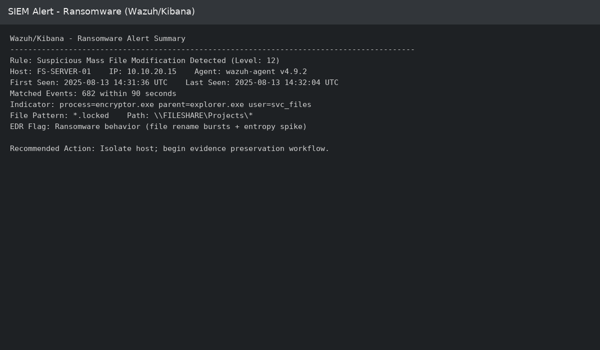
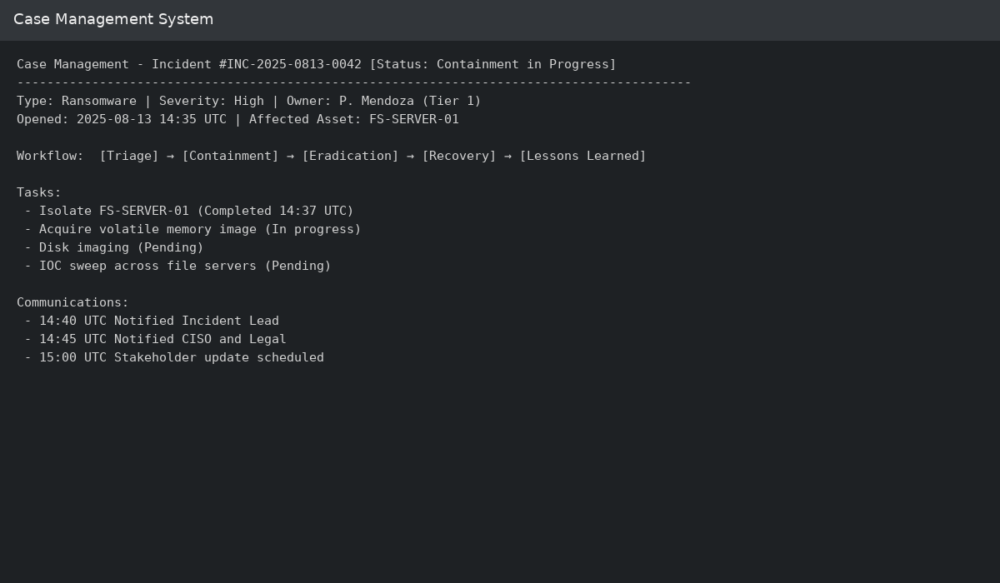
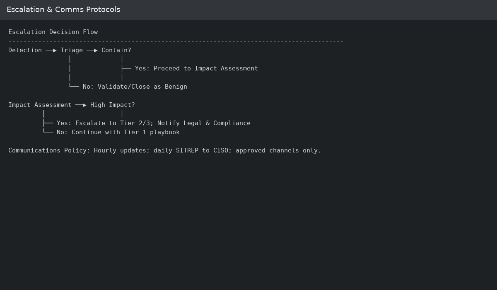
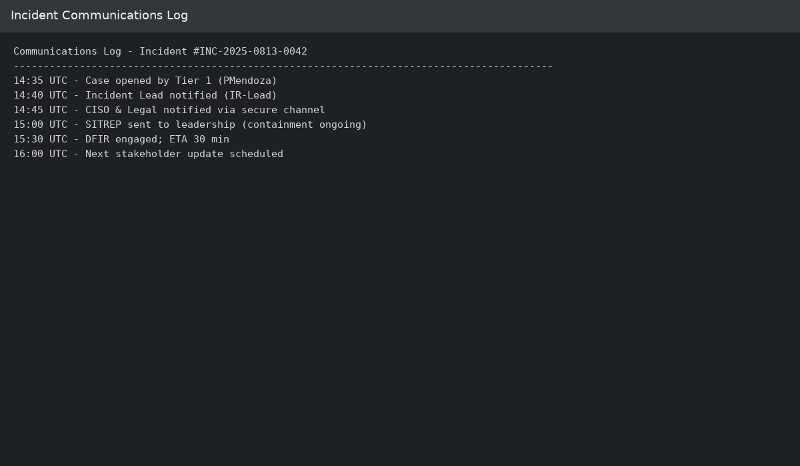
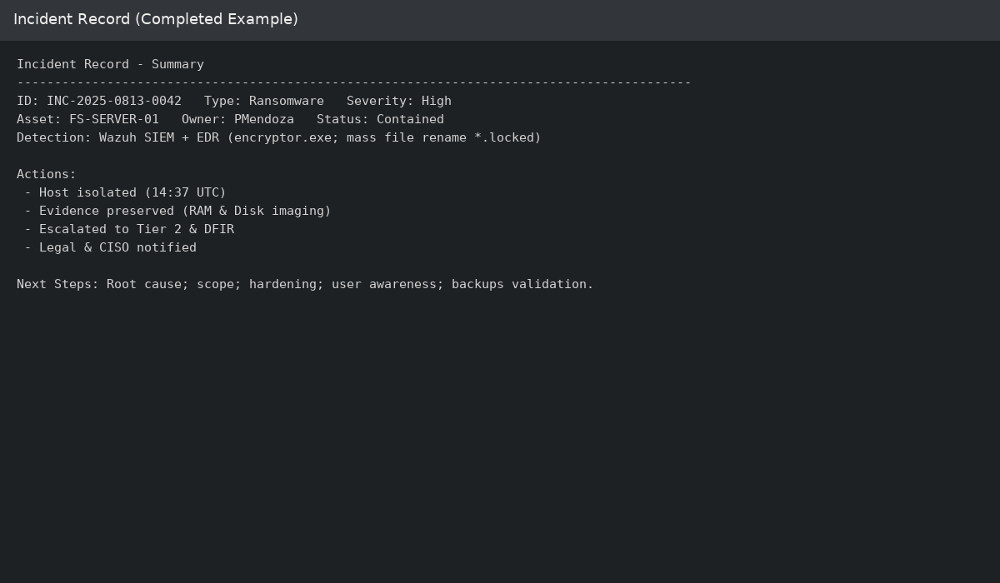

# Incident Response Methodology

## 1. Initial Response Protocols (Example: Ransomware Infection)

When a potential ransomware incident is detected:
1. **Detection & Alerting** – The SIEM generates an alert for encryption-related processes or massive file changes.
2. **Triage** – SOC Tier 1 validates the alert by reviewing logs and related events.
3. **Containment (Short-term)** – Isolate the affected host from the network to prevent further spread.
4. **Notification** – Inform the Incident Response Lead and open a case in the case management system.
5. **Preserve Evidence** – Capture memory, logs, and disk state for forensic analysis.

**Screenshot:**  

---

## 2. Case Management System Components

| **Component**         | **Purpose** |
|-----------------------|-------------|
| **Incident Record**   | Centralized record of all incident-related data. |
| **Workflow Engine**   | Automates task assignments and tracking. |
| **Communication Module** | Secure channel for internal updates and coordination. |
| **Evidence Repository** | Secure storage for logs, disk images, and screenshots. |
| **Reporting Module**  | Generates reports for management and audit purposes. |

**Screenshot:**  

---

## 3. Escalation Criteria & Communication Protocols

**Escalation Triggers:**
- Impacts critical systems or sensitive data.
- Exceeds Tier 1 containment capabilities.
- Requires external team involvement (DFIR, Legal).

**Decision Points Flow:**  

**Communication Rules:**
- Hourly updates during containment.
- Use only approved communication channels (no personal email).
- Daily situation reports to CISO and Management.

**Screenshot:**  

---

## 4. Incident Response Documentation Template (Completed Example)

**Incident Type:** Ransomware Infection  
**Detection Source:** SIEM (Wazuh) + EDR Alerts  
**Date/Time Detected:** 2025-08-13 14:32 UTC  
**Initial Responder:** SOC Tier 1 Analyst – P. Mendoza  

**Summary:**  
EDR detected execution of `encryptor.exe` on a file server. Unusual activity observed: hundreds of files modified with `.locked` extension.

**Actions Taken:**
1. Verified SIEM alert with correlated log review.
2. Isolated affected host to quarantine VLAN.
3. Preserved evidence: disk image and RAM capture.
4. Escalated to SOC Tier 2 and DFIR team.
5. Notified CISO and Legal department.

**Current Status:** Containment completed, forensic analysis ongoing.

**Next Steps:**
- Determine infection vector.
- Assess scope of affected data.
- Implement additional preventive controls.

**Screenshot:**  

---

## Screenshot File Map (relative paths)
- `screenshots/siem_ransomware_alert.png`
- `screenshots/case_mgmt_dashboard.png`
- `screenshots/escalation_flow.png`
- `screenshots/comms_log.png`
- `screenshots/incident_record_completed.png`
