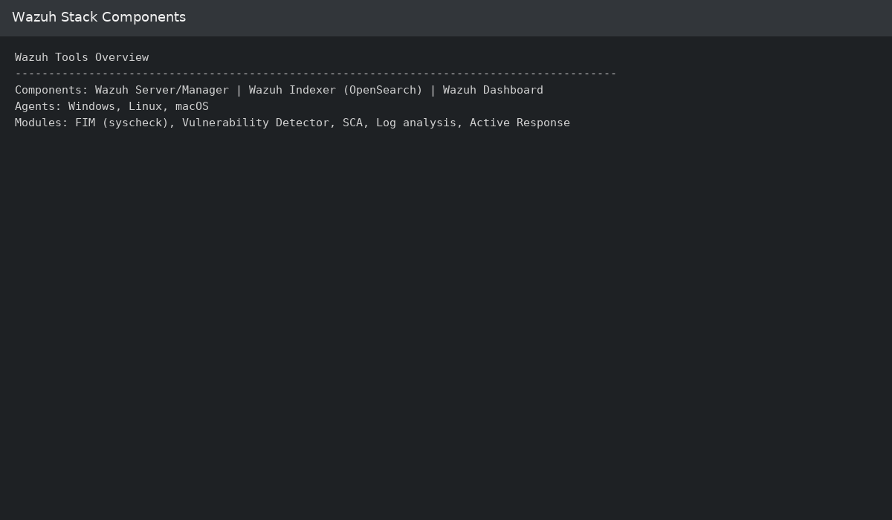
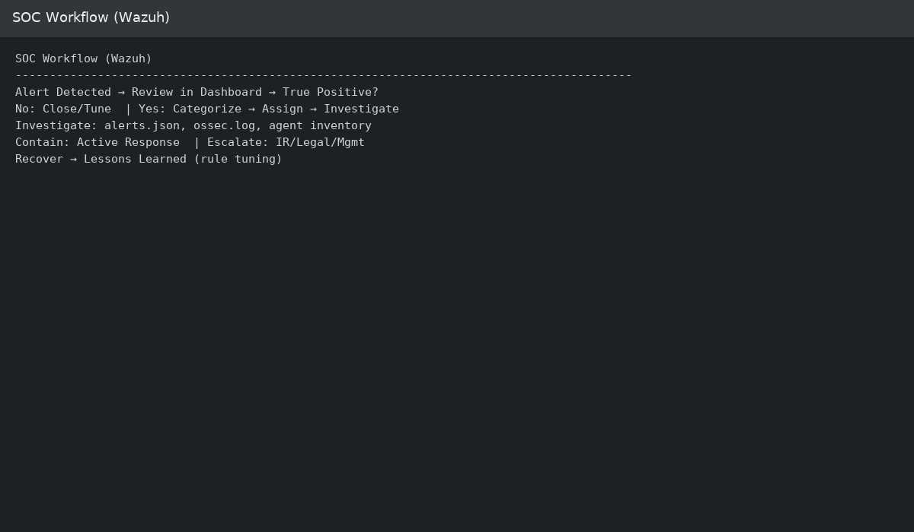
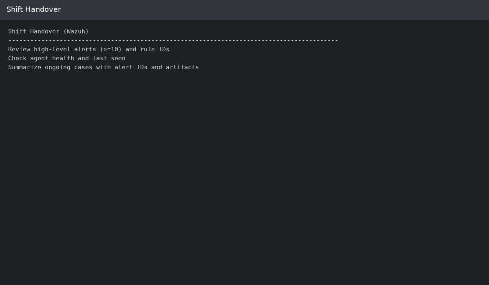
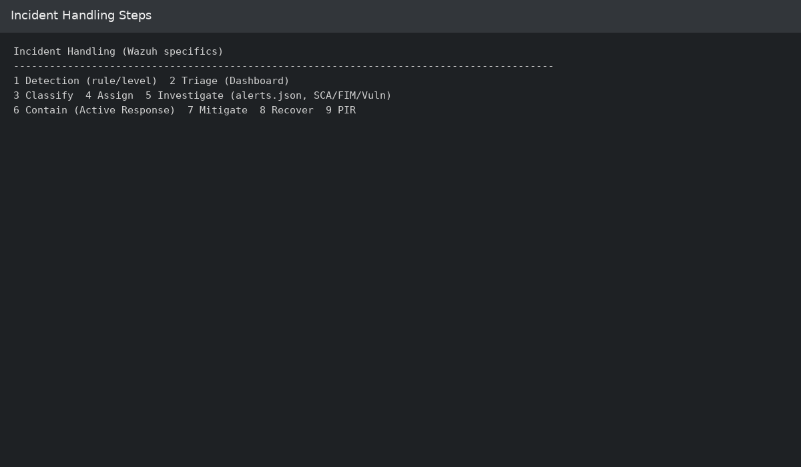
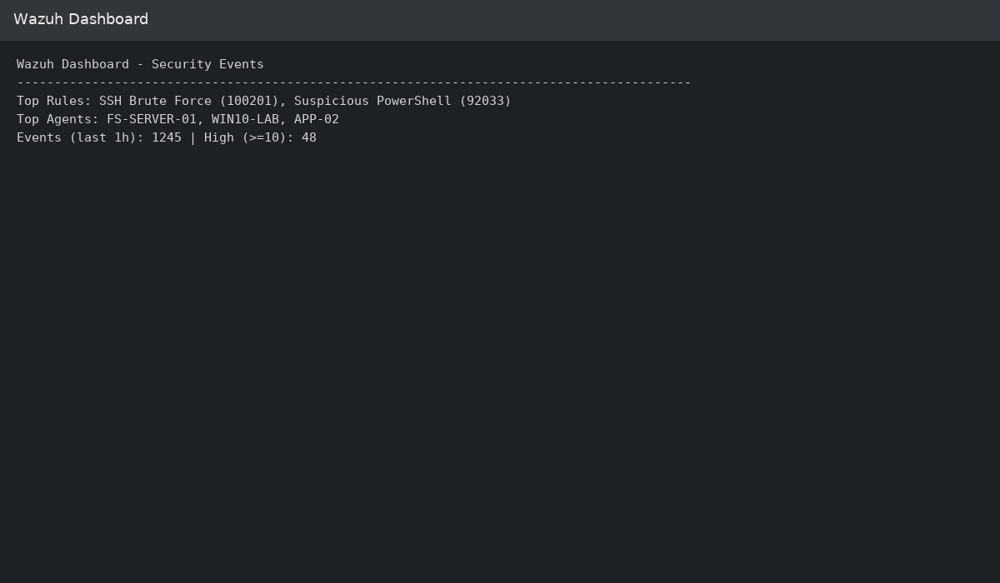
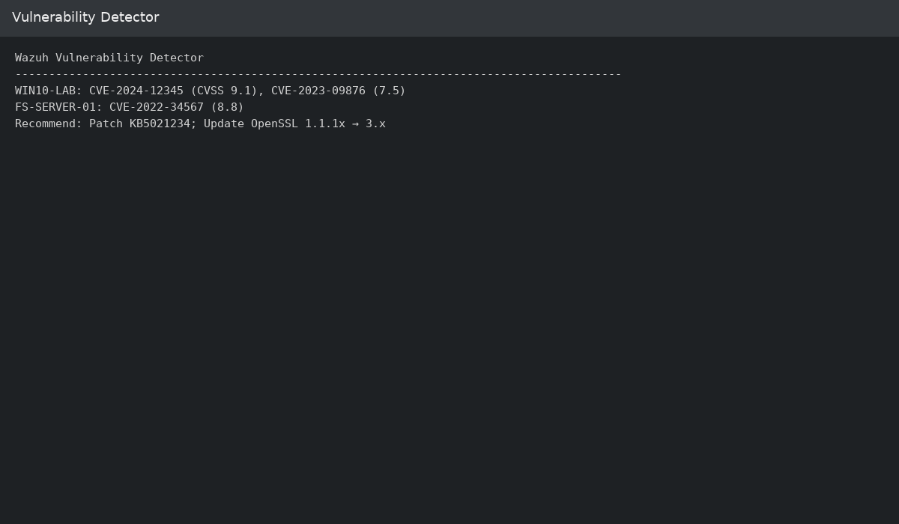
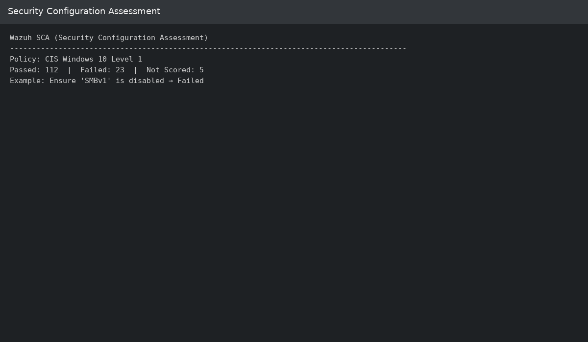

# SOC Operations Documentation — Wazuh Adaptation

This document describes SOC operations tailored to the **Wazuh Stack** (Wazuh Server/Manager, Wazuh Indexer, and Wazuh Dashboard) with realistic examples, diagrams, and screenshots.

---

## 1. Essential SOC Tools (Wazuh-Centric)



| Tool Type | Example Tools | Purpose | Function |
|---|---|---|---|
| **SIEM / Security Platform** | **Wazuh Stack** (Server/Manager, Indexer, Dashboard) | Centralize and correlate security telemetry | Collect agent logs, decode with decoders, correlate via rules/levels, generate alerts mapped to MITRE ATT&CK |
| **Endpoint Agents** | **Wazuh Agent** (Windows, Linux, macOS) | Telemetry + policy checks + FIM | Send logs, Sysmon/OSQuery ingestion, File Integrity Monitoring (syscheck), SCA checks, inventory |
| **Threat & Vulnerability** | Wazuh **Vulnerability Detector**, **SCA** | Risk discovery & hardening | Detect CVEs from OVAL/NVD; benchmark configs (CIS/SCA) |
| **Response** | **Active Response** | Automated containment | Run scripts (e.g., firewall-drop) on agent/server when rules match |
| **Ticketing** | ServiceNow, Jira (external) | Case management & audit trail | Create/track incidents; link Wazuh alert IDs and artifacts |
| **Infra Monitoring (optional)** | Zabbix, Prometheus | Availability & performance | Complement security view with health metrics |

**Key Wazuh paths (Linux server):**  
- Alerts JSON: `/var/ossec/logs/alerts/alerts.json`  
- Manager log: `/var/ossec/logs/ossec.log`  
- Agent list/status: `agent_control -l` / `agent_groups`  
- Local rules: `/var/ossec/etc/rules/local_rules.xml`  
- Active response scripts: `/var/ossec/active-response/bin/`

---

## 2. SOC Workflow Diagram (Mermaid)



```mermaid
flowchart TD
    A[Alert Detected by Wazuh Rule/Level] --> B[Initial Alert Review (Dashboard)]
    B --> C{True Positive?}
    C -- No --> D[Close Alert - FP / Tune Rule]
    C -- Yes --> E[Incident Categorization]
    E --> F[Assign to Analyst / Create Ticket]
    F --> G[Investigation: alerts.json, ossec.log, agent data]
    G --> H{Incident Severity}
    H -- Low --> I[Contain via Active Response & Monitor]
    H -- Medium/High --> J[Escalate to IR / Legal / Mgmt]
    J --> K[Mitigation & Recovery]
    K --> L[Post-Incident Review, Rule Tuning, Lessons Learned]
```

---

## 3. Shift Transition & Handover Procedures



- **Handover Checklist**
  - Review open tickets and Wazuh alerts (by level, rule ID, agent).
  - Confirm agent health & coverage (Dashboard → Agents).
  - Share ongoing investigations (link alert IDs, hashes, IPs).
  - Highlight critical rules with sustained firing (levels ≥ 10).

- **Channels**
  - SOC Shift Log / Ticketing platform
  - Direct briefing / war room (if active incident)

- **Required Documentation**
  - Updated ticket notes with **Wazuh rule IDs**, agent IDs, and timelines.
  - Attach relevant artifacts (alerts.json excerpts, screenshots).

---

## 4. Detailed Incident Handling Steps (with Wazuh specifics)



| Step | Action | Wazuh-Specific Notes |
|------|--------|-----------------------|
| 1 | **Detection** | Alert triggered by Wazuh rule/decoder with severity (level 0–15), MITRE mapping |
| 2 | **Triage** | Validate in **Wazuh Dashboard**; pivot by **agent**, **rule.id**, **data.srcip** |
| 3 | **Classification** | Tag incident type (e.g., Brute Force, Malware, DNS Tunneling) |
| 4 | **Assignment** | Create ticket; include **rule.id**, **agent.id**, **timestamp** |
| 5 | **Investigation** | Review `/var/ossec/logs/alerts/alerts.json`, `ossec.log`, agent logs; check **FIM/SCA/Vuln** panels |
| 6 | **Containment** | Trigger **Active Response** (e.g., firewall-drop) or isolate host via EDR/Network |
| 7 | **Mitigation** | Remove artifacts, patch CVEs (from Vulnerability Detector) |
| 8 | **Recovery** | Restore services; validate normal telemetry |
| 9 | **Post-Incident** | Tune `local_rules.xml`/CDB lists; update playbooks; share lessons learned |

**Sample local rule (SSH brute force) — `/var/ossec/etc/rules/local_rules.xml`:**
```xml
<group name="local,authentication,syslog,">
  <rule id="100201" level="10">
    <if_sid>5710</if_sid>
    <same_source_ip />
    <frequency>5</frequency>
    <timeframe>300</timeframe>
    <description>Multiple failed SSH logins from same IP (local)</description>
    <mitre_id>T1110</mitre_id>
    <group>authentication_failed,</group>
  </rule>
</group>
```

**Active Response mapping (server `ossec.conf`):**
```xml
<command>
  <name>firewall-drop</name>
  <executable>firewall-drop.sh</executable>
  <timeout_allowed>yes</timeout_allowed>
</command>

<active-response>
  <command>firewall-drop</command>
  <location>server</location>
  <rules_id>100201</rules_id>
  <timeout>600</timeout>
</active-response>
```

---

## 5. Screenshots & Wazuh Panels

- **Wazuh Dashboard — Security Events**  
    
  Overview of alerts by rule level, top agents, and frequently triggered rules.

- **File Integrity Monitoring (FIM/syscheck)**  
    
  Changes to critical files/directories with before/after hashes and paths.

- **Vulnerability Detector**  
    
  Detected CVEs per agent, CVSS scores, and remediation priorities.

- **Security Configuration Assessment (SCA)**  
    
  Compliance checks (e.g., CIS), pass/fail metrics, and remediation hints.

- **Active Response Execution**  
    
  Evidence of automated response (e.g., firewall-drop) with timestamps and target IP.

---

## 6. Notes

- Keep **agent coverage** high: ensure all critical assets run the Wazuh agent.
- Continuously **tune rules** (reduce noise; add `mitre_id` and groups).
- Link alerts to tickets for audit; attach **alert excerpts** and **screenshots**.
