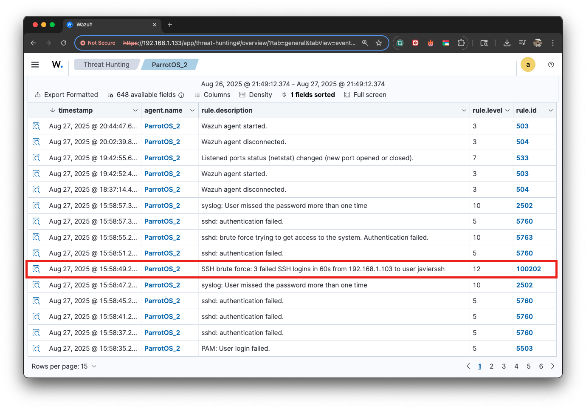

# SIEM Setup & Alerts – Wazuh

**Date:** August 27, 2025  
**Analyst:** Javier Napoles 
**Platform:** Wazuh SIEM (Open Source)  

---

## 1. SIEM Setup

- **Environment:**  
  - Wazuh Manager deployed via Docker on macOS host.  
  - Wazuh Agent installed on `ParrotOS_2` VM.  
  - Logs ingested: syslog, authentication, PAM, and sshd events.

- **Configuration Steps:**  
  1. Installed Wazuh Manager and connected agent (`ParrotOS_2`).  
  2. Verified communication between agent and manager.  
  3. Configured Wazuh to ingest authentication logs.  
  4. Created and deployed a **custom rule** (`ssh-bruteforce.xml`) to detect repeated SSH login failures.

---

## 2. Rule Configuration

The rule detects **3 failed SSH login attempts within 60 seconds** from the same IP address.  

**Rule file (`ssh-bruteforce.xml`):**

```xml
<group name="local,ssh,bruteforce">
  <!-- 3 failed ssh events (5760/5710/5503) within 60s from same IP -->
  <rule id="100202" level="12" frequency="3" timeframe="60">
    <if_matched_sid>5760</if_matched_sid> <!-- sshd: authentication failed -->
    <if_matched_sid>5710</if_matched_sid> <!-- sshd: non-existent user -->
    <if_matched_sid>5503</if_matched_sid> <!-- PAM: User login failed -->
    <same_source_ip />
    <description>SSH brute force: 3 failed SSH logins in 60s from $(srcip) to user $(dstuser)</description>
    <mitre id="T1110"/>
    <group>ssh,bruteforce,</group>
  </rule>
</group>
```

**Screenshot – Rule Configuration:**  


---

## 3. Triggered Alert

After simulating repeated failed SSH login attempts from an attacker VM (`192.168.1.103`), the rule was successfully triggered.

**Screenshot – Wazuh Threat Hunting Dashboard:**  


**Screenshot – Alert Details:**  


- **Rule ID:** `100202`  
- **Rule Level:** 12 (High)  
- **Description:** SSH brute force: 3 failed SSH logins in 60s from `192.168.1.103` to user `javierssh`

---

## 4. Evidence Summary

- The SIEM was successfully configured to ingest authentication logs.  
- Custom rule (`100202`) was deployed to detect repeated failed SSH login attempts.  
- Attack simulation generated multiple failed SSH attempts, which **triggered an alert** in the SIEM dashboard.  

---

## ✅ Conclusion

The setup was successful:  
- Logs were ingested from the monitored system.  
- A detection rule was configured and deployed.  
- An alert was triggered and validated, proving that the SIEM is working as expected.  
