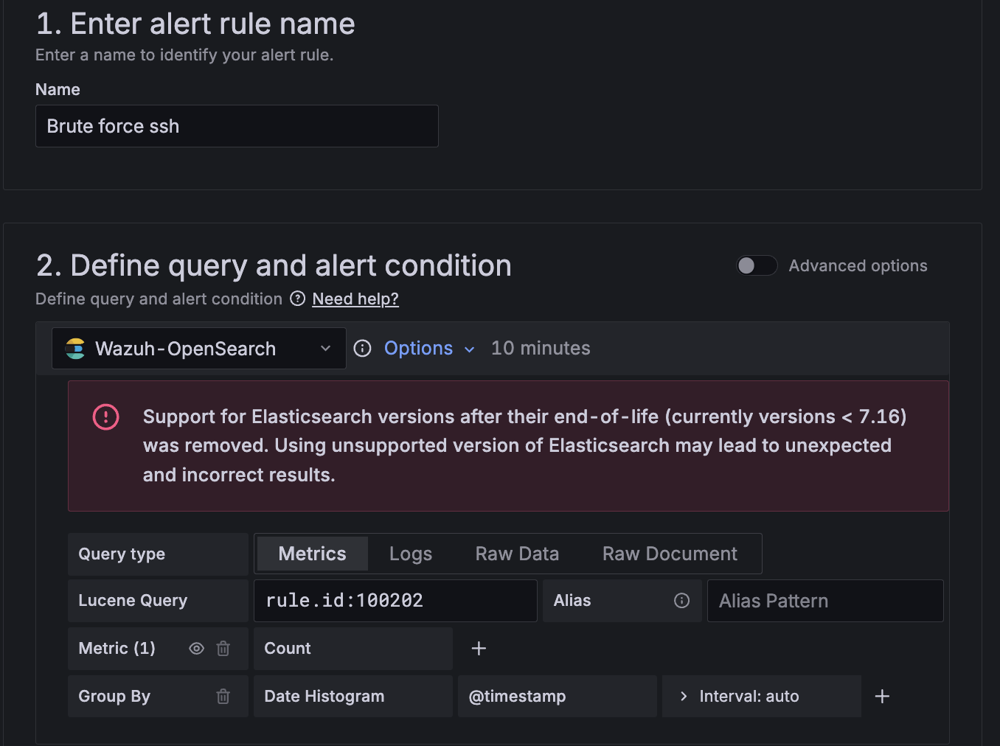
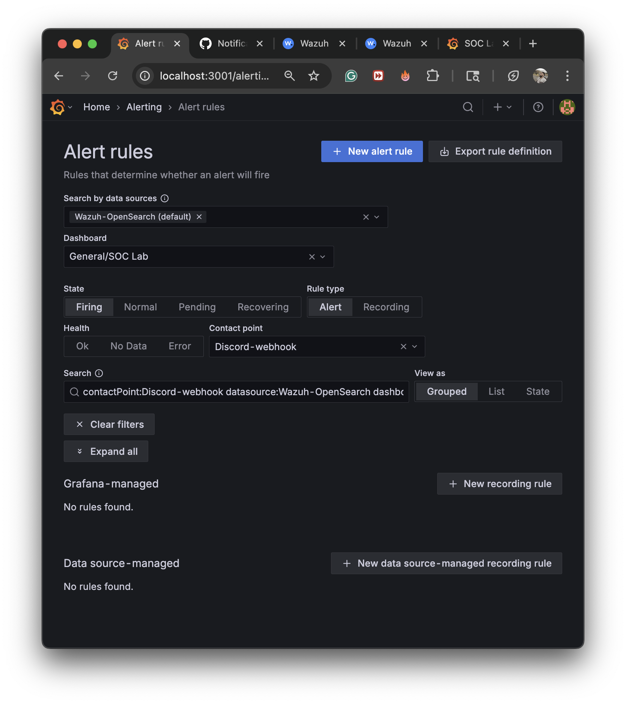
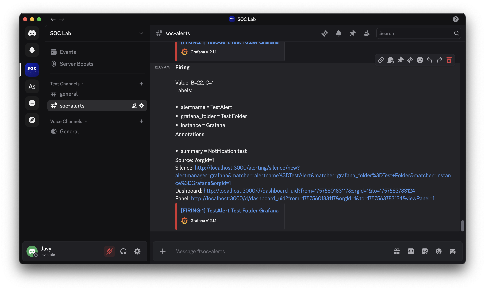
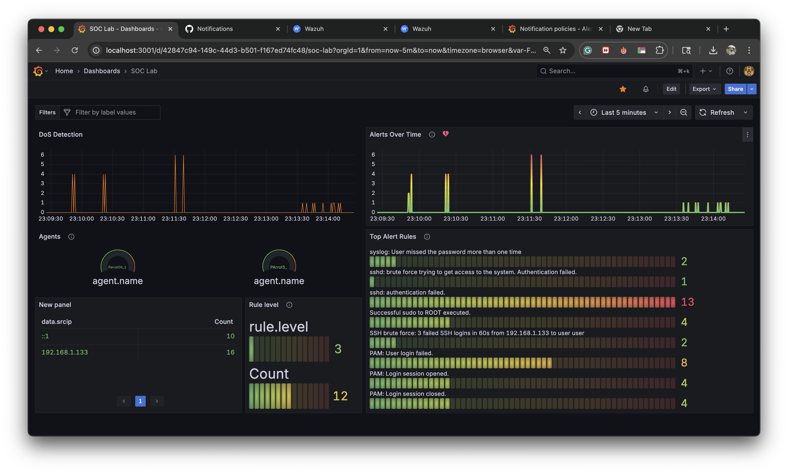

# Divide and Defend: Mini SOC with Micro-Segmentation

## Project Summary
**Divide and Defend** is a lab project designed to simulate a **Security Operations Center (SOC)** in a controlled environment. The main goal was to **detect, analyze, and respond to cyber threats** while applying the principle of **micro-segmentation** to reduce the attack surface and strengthen defense-in-depth strategies.

Over three months, a multi-VM infrastructure was built in **UTM**, a **SIEM (Wazuh Manager in Docker on macOS)** was deployed for log collection and correlation, **Threat Intelligence integration with OpenCTI** was configured, **attack simulations were executed with Kali Linux**, and **vulnerability management and incident response practices** were applied.

---

## Tools and Technologies Used

### Infrastructure and Virtualization
- **UTM (macOS)** → virtualization platform for VMs:
  - **3 Parrot OS VMs** → configured as **Wazuh agents**.
  - **1 Kali Linux VM** → used for attack simulation.
- **Docker (macOS)** → containers for Wazuh Manager, Elastic, MinIO, and RabbitMQ.

### SIEM and Monitoring
- **Wazuh SIEM**
  - **Wazuh Manager** deployed in Docker (macOS).
  - **3 Wazuh agents on Parrot OS** sending system and authentication logs.
  - Event visualization in the **Wazuh Dashboard** (Elastic/Kibana).
  - Creation of **custom detection rules** for:
    - SSH brute force (3 failed attempts in 60s).
    - Denial of Service (DoS) attempts.
    - Suspicious login activity.

### Threat Intelligence
- **OpenCTI**
  - Ingestion of **Indicators of Compromise (IOCs)**.
  - Correlation with SIEM-detected events.

### Micro-Segmentation
- Configuration of **separated subnets** for each VM.
- Traffic restrictions between:
  - **Kali Linux (attacker)**
  - **Parrot OS (Wazuh agents)**
  - **Wazuh Manager in macOS (monitoring server)**

### Vulnerability Management
- **Nmap** → host and service discovery.
- **OpenVAS** → vulnerability scanning.
- Documentation of findings with screenshots.

### Incident Response
- Development of an **Incident Response Plan (IRP)** following the five phases:
  1. Preparation
  2. Identification
  3. Containment
  4. Eradication
  5. Recovery
- Incident classification using a **severity matrix**.
- Timeline creation with correlated event analysis.

### Attack Simulation
- **Kali Linux**
  - SSH brute force.
  - Denial of Service (DoS).
  - Validation of alerts in Wazuh Dashboard.

---

## Results
- Deployment of a fully functional **Mini SOC** with 3 Parrot OS agents and a Wazuh Manager running in Docker (macOS).
- **Detection and documentation of security incidents** through Wazuh.
- Successful integration of **SIEM + Threat Intelligence**.
- Practical demonstration of how **micro-segmentation** helps contain attacks.
- Professional documentation including **README, abstract diagrams, screenshots, and technical reports** prepared for portfolio presentation.

---

# Automation & Orchestration — Discord Alerts

## Objective
As part of the project, I implemented an automated response workflow. The purpose was to trigger an action when a SIEM alert was generated, ensuring that analysts received notifications instantly without requiring manual intervention.

## Chosen Method
Instead of using email or incident record notes, I selected **Discord** as the notification channel.
- **Reason:** Discord provides real-time push notifications across devices (desktop and mobile).
- **Benefit:** Fast setup, lightweight integration, and aligned with modern SOC workflows that leverage chat-based alerting systems.

## Workflow
1. **Wazuh SIEM** detects an alert (for example, multiple failed SSH login attempts).
2. **Grafana Alerting** rules trigger when predefined thresholds are met.
3. Grafana sends the alert to a **Discord Webhook** connected to a private SOC channel.
4. The message includes:
   - Rule name (e.g., SSH Brute Force Detection)
   - Affected host (e.g., parrot-agent-1)
   - Timestamp and severity level

## Implementation Steps

### 1. Create the Webhook in Discord
- Open **Server Settings → Integrations → Webhooks**.
- Create new webhook, select channel, and copy the Webhook URL.

### 2. Configure Contact Point in Grafana
- Go to **Alerting → Contact points → New contact point**.
- Type: **Webhook**.
- URL: Discord Webhook URL.
- Method: POST, Content type: application/json.
- Example Body:
```json
{
  "content": "[{{ .Status | toUpper }}] {{ len .Alerts }} alert(s)\nRule: {{ (index .Alerts 0).Labels.alertname }}\nHost: {{ (index .Alerts 0).Labels.host }}\nSeverity: {{ (index .Alerts 0).Labels.severity }}\nTime: {{ (index .Alerts 0).StartsAt }}"
}
```

### 3. Create the Alert Rule in Grafana
- Name: SSH Brute Force Detection.
- Data source: Elasticsearch (wazuh-alerts-*).
- Query: authentication_failed events from sshd.
- Condition: Count > 5 in 1 minute.
- Labels: alertname, severity, host.
- Contact point: discord-soc.

### 4. Test the Integration
- Use **Send test notification** in Grafana.
- Trigger alerts with simulated SSH brute force attempts.

## Evidence
**Brute Force Rule Set-Up** 


**Grafana Alert Rule Screenshot**



**Discord Channel Screenshot**  



**Grafana Rule Screenshot**  



**Example Log Output:**
```json
{
  "content": "[ALERT] SSH Brute Force Detected\nHost: parrot-agent-1\nSeverity: High\nTime: 2025-09-10 22:41 UTC"
}
```

## Results
- Automation successfully connected **SIEM detections → Grafana → Discord channel**.
- Analysts were able to respond faster by receiving alerts in real time.
- This solution demonstrates the value of **automation and orchestration** in SOC operations, even with simple and free tools.

