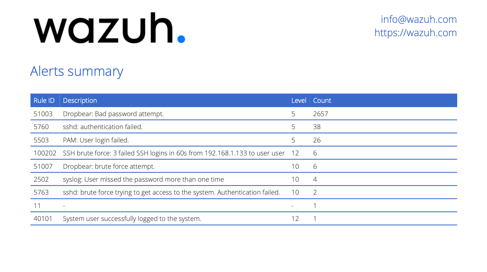
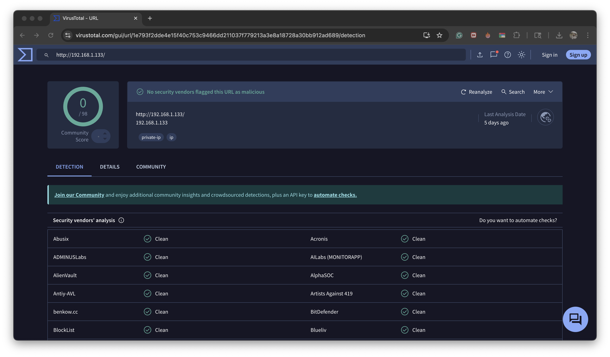

# Threat Hunting & Threat Intelligence Report

**Date:** 2025-09-16  
**Analyst:** Javier Napoles

---

## Objective  
Perform a threat-hunting search in Wazuh logs to detect unusual activity (SSH brute force attempts) and validate the discovered indicator using a free Threat Intelligence platform (VirusTotal).

---

## Environment  
- **SIEM:** Wazuh  
- **Log Source:** Linux/SSH logs  
- **Time Range:** `2025-09-09T08:25:48` to `2025-09-16T08:25:48`

---

## Search Performed  
**Query:**  
```text
manager.name: wazuh.manager AND data.srcip:*
```

**Result:**  
An unusual source IP `192.168.1.133` was detected with multiple failed SSH login attempts, triggering **Rule ID 100202** (SSH brute force).

---

## Findings  

| Rule ID | Description                                        | Level | Source IP       |
|--------|----------------------------------------------------|-------|---------------|
| 100202 | SSH brute force: 3 failed SSH logins in 60s        | 12    | 192.168.1.133 |
| 51007  | Dropbear: brute force attempt                      | 10    | 192.168.1.133 |
| 5763   | sshd: brute force trying to get access to the system | 10    | 192.168.1.133 |

**Evidence Screenshot:**  

  

---

## Threat Intelligence Verification  
**Tool Used:** [VirusTotal](https://www.virustotal.com)  

**Verification Result:**  

  

- **Summary:** The IP is not listed in any threat intelligence feeds.  
- **Interpretation:** Likely an internal host generating brute-force attempts.

---

## Conclusion & Recommendations  
**Conclusion:**  
- The source IP `192.168.1.133` shows clear signs of brute force attack activity.  
- While the IP appears to be internal, this behavior may indicate a compromised machine or misconfigured automated process.  

**Recommended Actions:**  
- Investigate host `192.168.1.133` to confirm whether it is authorized to perform SSH attempts.  
- Block or rate-limit SSH access from this host until analysis is complete.  
- Adjust SIEM rules to trigger alerts earlier for similar brute-force patterns.  
- Review authentication logs for successful logins from the same IP.

---

## Additional Notes  
- If this activity is confirmed malicious, escalate to Incident Response Team for containment and remediation.  
- Document any successful compromise and include forensic artifacts in follow-up reports.
