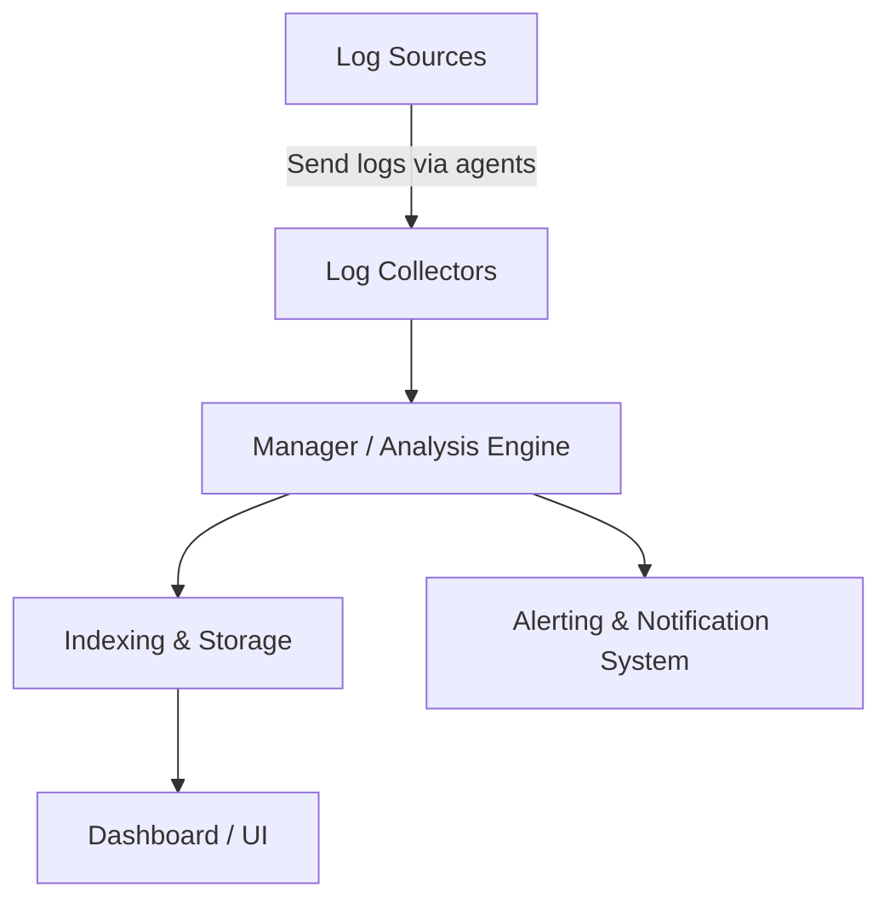
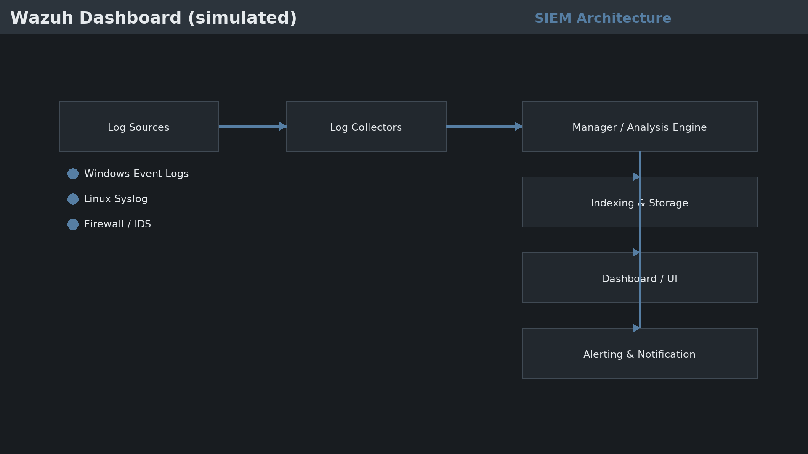
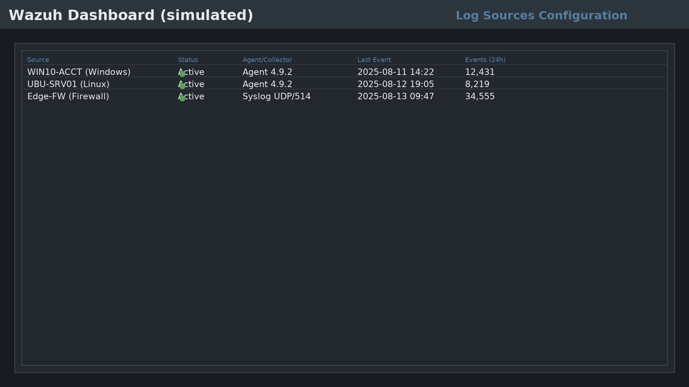
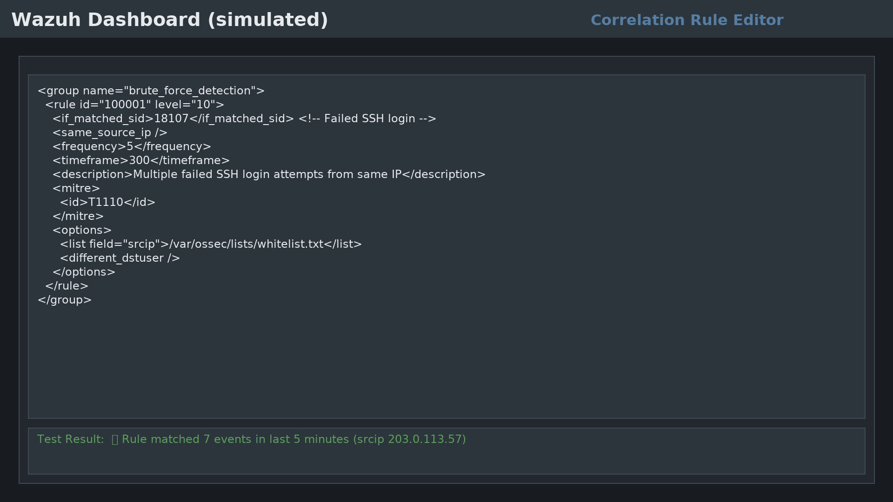
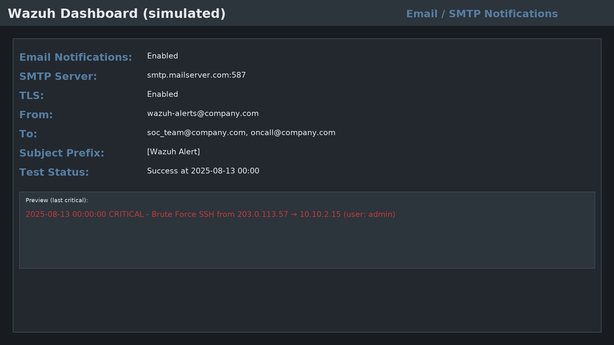
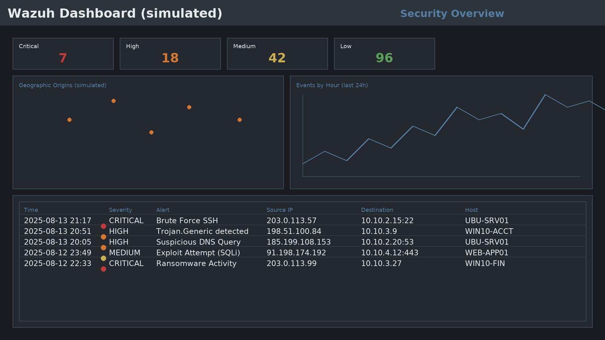

# **SIEM Implementation Project Documentation**

## **1. Introduction**
This project demonstrates the implementation and configuration of a Security Information and Event Management (SIEM) solution using **Wazuh** as the reference platform. It covers architecture, correlation rule creation, log source integration, and alert notifications, with simulated screenshots that mirror a real SOC environment.

---

## **2. SIEM Architecture Overview**

### **2.1 Core Components**
| Component | Description | Function in SIEM |
|-----------|-------------|------------------|
| **Log Collectors (Agents)** | Deployed on endpoints and servers | Gather system, application, and security logs |
| **Manager / Analysis Engine** | Central SIEM brain | Parses, normalizes, correlates, and stores events |
| **Indexing & Storage** | Elasticsearch/OpenSearch | Stores historical event data for search and reporting |
| **Dashboard / UI** | Wazuh Dashboard-style interface | Visualization, querying, and rule management |
| **Alerting & Notification System** | Email/Webhooks integrations | Delivers alerts to the SOC for rapid response |

### **2.2 Component Relationships**


📷 **Architecture:**  


---

## **3. Log Sources and Significance**

### **3.1 Windows Event Logs**
- **Type**: Security, System, Application (Event IDs e.g., 4625 Failed Logon, 4720 User Created)  
- **Significance**: Detect failed/successful authentications, account changes, policy modifications.  
- **Host Example**: `WIN10-ACCT` (Agent 4.9.2)

### **3.2 Linux Syslog**
- **Type**: `auth.log`, `kern.log`, `daemon.log` (e.g., sshd failures, sudo activity)  
- **Significance**: Spot unauthorized access, privilege escalation, service anomalies.  
- **Host Example**: `UBU-SRV01` (Agent 4.9.2)

### **3.3 Firewall Logs**
- **Type**: Traffic flow, access control, IDS/IPS events (port scans, blocks)  
- **Significance**: Identify reconnaissance, blocked connections, lateral movement.  
- **Device Example**: `Edge-FW` via syslog UDP/514

📷 **Log Sources:**  


---

## **4. Correlation Rule**

### **4.1 Objective**
Detect a potential **Brute Force SSH** from the same source IP with ≥5 failed attempts within 5 minutes.

### **4.2 Rule (Wazuh-compatible example)**
```xml
<group name="brute_force_detection">
  <rule id="100001" level="10">
    <if_matched_sid>18107</if_matched_sid> <!-- Failed SSH login -->
    <same_source_ip />
    <frequency>5</frequency>
    <timeframe>300</timeframe>
    <description>Multiple failed SSH login attempts from same IP</description>
    <mitre>
      <id>T1110</id> <!-- Brute Force -->
    </mitre>
    <options>
      <list field="srcip">/var/ossec/lists/whitelist.txt</list>
      <different_dstuser />
    </options>
  </rule>
</group>
```

**Logic:** If 5+ failed SSH logins (SID 18107) with the **same srcip** occur within **300s**, the rule raises a **level 10** alert mapped to **MITRE T1110**.  
**Test Evidence:** Rule matched **7 events** from `203.0.113.57` on **2025-08-13**.

📷 **Correlation Rule:**  


---

## **5. Notifications Configuration (Email/SMTP)**

Update `ossec.conf` on the manager:

```xml
<global>
  <email_notification>yes</email_notification>
  <smtp_server>smtp.mailserver.com</smtp_server>
  <email_from>wazuh-alerts@company.com</email_from>
  <email_to>soc_team@company.com</email_to>
</global>
```

**Rationale:** Real-time delivery of critical events to the SOC on-call list.  
**Verification:** SMTP test successful at **2025-08-13 00:00**.

📷 **Email Alerts:**  


---

## **6. Core SIEM Functionalities Demonstrated**
- **Collection & Normalization** from Windows, Linux, and Firewall sources.  
- **Event Correlation** to detect brute force and other attack patterns.  
- **Visualization & Reporting** with dashboards, charts, KPIs, and recent alerts.  
- **Notifications** to distribute high-severity events via email.

📷 **Dashboard:**  


---

## **7. Evidence of Comprehension**
1. Correct identification of architecture and component relationships.  
2. Rule logic designed to reduce noise (same srcip + frequency + timeframe + optional whitelist).  
3. Selection of three distinct log sources with clear monitoring impact.  
4. Working notification pipeline with SMTP and preview of last critical alert.  

---

## **8. Conclusion**
This implementation demonstrates a complete SIEM workflow: ingestion → normalization → correlation → alerting → visualization.  
Replace the simulated screenshots with your real Wazuh captures when available to finalize the submission.
