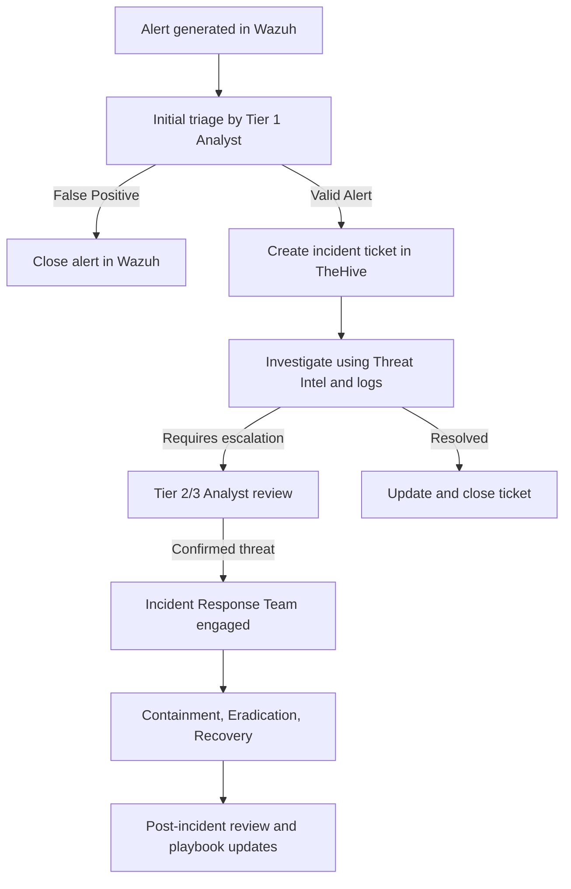

# SOC Operations Documentation

This document describes the essential operations of a Security Operations Center (SOC), including the use of key tools such as SIEM systems, ticketing platforms, and monitoring solutions.  
It also includes workflow diagrams, shift transition procedures, and an incident handling template.

---

## 1. Overview of SOC Tools

### 1.1 SIEM System – Wazuh
**Purpose:** Centralizes log collection, correlates events, and generates alerts based on security rules.  
**Function:** Collects logs from firewalls, endpoints, servers, and applications; applies correlation rules to detect suspicious patterns.  

**Screenshot Example:**  
  
*Explanation:* The Wazuh dashboard displays active alerts, classified by severity, along with real-time metrics from monitored hosts.

---

### 1.2 Ticketing Platform – TheHive
**Purpose:** Manage incidents from detection to resolution, assigning responsibilities and documenting every step.  
**Function:** Registers the incident, assigns it to an analyst, stores evidence, and ensures traceability.  

**Screenshot Example:**  
  
*Explanation:* An active incident case in TheHive showing severity, incident description, assigned analyst, and recorded actions.

---

### 1.3 Monitoring Solution – Zabbix
**Purpose:** Real-time monitoring of network performance, servers, and critical systems.  
**Function:** Detects anomalies in CPU usage, memory consumption, network latency, or service status, providing context for SIEM alerts.  

**Screenshot Example:**  
  
*Explanation:* The Zabbix panel showing server status, network response times, and availability metrics.

---

## 2. SOC Workflow Diagram (Mermaid)

---

## 3. Shift Transition & Handover Procedures

**Objective:** Ensure continuous SOC operations between shifts.

### Procedure:
1. **Update Ticketing System:**  
   - All ongoing incidents must have clear and up-to-date investigation notes.
2. **Document Open Alerts:**  
   - Provide alert IDs, severity, status, and pending actions.
3. **Communicate via Handover Report:**  
   - Share a structured summary of active incidents, tool issues, and scheduled maintenance.
4. **Verify Monitoring Systems:**  
   - Ensure Wazuh, Zabbix, and TheHive are fully operational.
5. **Acknowledge Handover:**  
   - Incoming shift confirms receipt of the handover and assumes responsibility.

---

## 4. Incident Handling Steps (Example Template)

**Incident ID:** WZH-2025-001  
**Date/Time Detected:** 2025-08-13 14:32 UTC  
**Detected By:** Wazuh Rule ID 5710 – Brute Force Attempt  
**Severity:** High  

**Step 1 – Detection:**  
- Wazuh detected multiple failed SSH login attempts from the same IP address.

**Step 2 – Triage:**  
- Confirm the source IP is not internal or a legitimate service.  
- Verify logs in `/var/log/auth.log`.

**Step 3 – Containment:**  
- Block the IP in the firewall using `ufw` or `iptables`.

**Step 4 – Investigation:**  
- Review event correlation in Wazuh.  
- Check VirusTotal / AbuseIPDB for malicious IP reports.

**Step 5 – Eradication:**  
- Ensure no accounts were compromised.  
- Change passwords if necessary.

**Step 6 – Recovery:**  
- Remove the block if it’s a false positive or keep it if the threat is real.  
- Monitor the server for 24 hours post-incident.

**Step 7 – Post-Incident:**  
- Document lessons learned.  
- Update Wazuh detection rules for improved correlation.

---

## 5. Screenshots & Explanations

### Wazuh Dashboard  
  
*Displays alert list by severity, time trends, and agent status.*

### TheHive Incident Ticket  
  
*Shows incident severity, assigned analyst, timeline of actions, and attached evidence.*

### Zabbix Monitoring Panel  
  
*Shows CPU usage, memory consumption, availability, and network response times.*

---

## Final Notes
- Replace `screenshots/*.png` placeholders with real lab captures.  
- Mask sensitive information before sharing or publishing.  
- Use the **Incident Handling Template** for documenting each real-world case.
