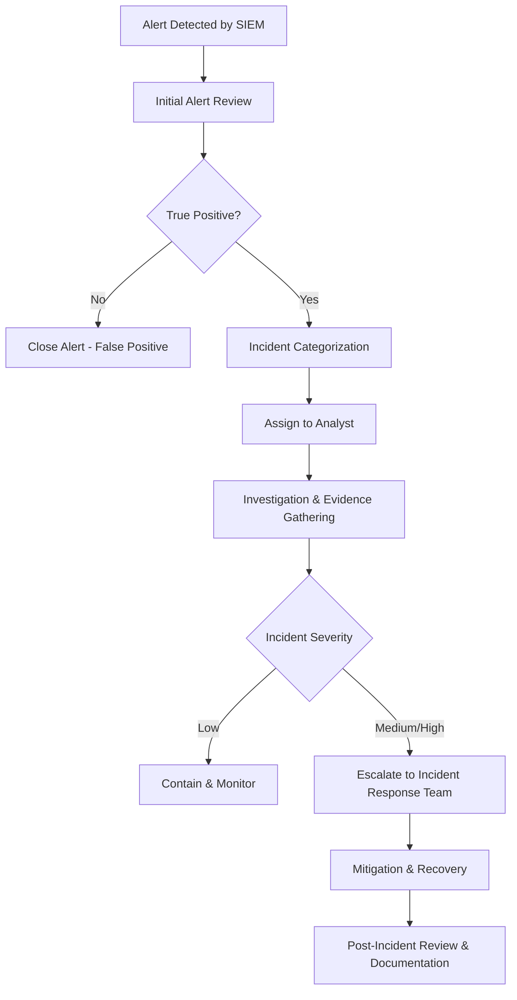

# SOC Operations Documentation

This document outlines the core processes, tools, and workflows of a Security Operations Center (SOC), providing clear explanations, diagrams, and procedures to ensure consistent and effective security monitoring and incident response.

---

## 1. Essential SOC Tools

| Tool Type | Example Tools | Purpose | Function |
|---|---|---|---|
| **SIEM System** | Splunk, Wazuh, QRadar | Centralize and correlate security event data | Collect logs from endpoints, network devices, and applications; detect suspicious activity through correlation rules |
| **Ticketing Platform** | ServiceNow, Jira, RTIR | Manage and track incidents | Create, assign, and update tickets for incidents, ensuring proper documentation and resolution tracking |
| **Monitoring Solutions** | Zabbix, Nagios, Elastic Stack | Real-time infrastructure and application health monitoring | Detect service outages, performance degradation, and security anomalies |

---

## 2. SOC Workflow Diagram

This visual diagram mirrors the flow defined in Mermaid.

Mermaid (for reference in text form):

---

## 3. Shift Transition & Handover Procedures

- **Handover Checklist**:
  - Review all open incidents and their status
  - Ensure ticket updates are clear and complete
  - Share any ongoing investigations with the next shift
  - Highlight any critical alerts or pending escalations
  - Confirm tool/system operational status

- **Communication Channels**:
  - SOC Shift Log
  - Incident Management Platform
  - Direct briefing (if possible)

- **Required Documentation**:
  - Updated ticket notes
  - Shift handover form
  - Summary of high-priority events

---

## 4. Detailed Incident Handling Steps

| Step | Action | Description |
|------|--------|-------------|
| 1 | **Detection** | Receive alert from SIEM, monitoring tool, or user report |
| 2 | **Triage** | Determine if the alert is a true positive or false positive |
| 3 | **Classification** | Categorize the incident (Malware, Phishing, DoS, etc.) |
| 4 | **Assignment** | Assign incident to the appropriate analyst or team |
| 5 | **Investigation** | Gather evidence: logs, PCAPs, threat intelligence |
| 6 | **Containment** | Isolate affected systems to prevent spread |
| 7 | **Mitigation** | Remove malicious artifacts, patch vulnerabilities |
| 8 | **Recovery** | Restore services and confirm normal operations |
| 9 | **Post-Incident Review** | Document root cause, lessons learned, and improvement actions |

---

## 5. Screenshots & Tool Explanations

- **Splunk Dashboard**  
    
  Displays real-time alerts, log queries, and event correlation.

- **ServiceNow Ticket**  
    
  Shows incident ticket details, workflow, and resolution notes.

- **Zabbix Monitoring**  
    
  Graphs and alerts for infrastructure health and uptime.

---

## 6. Notes

- Maintain consistency in incident documentation for audit and compliance.
- All analysts must follow the defined escalation paths to avoid delays.
- Continuous improvement: Regularly review workflow efficiency and tool performance.
