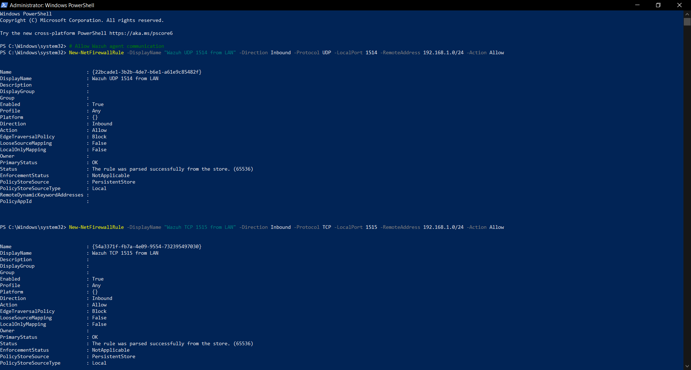
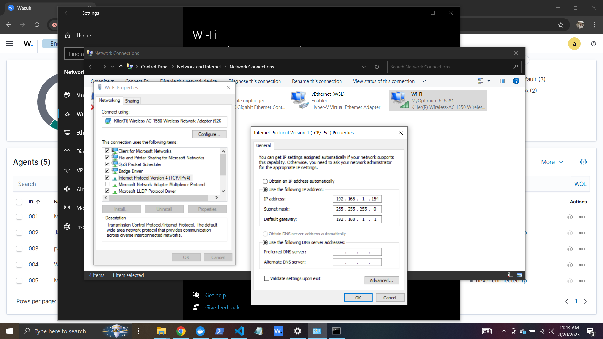
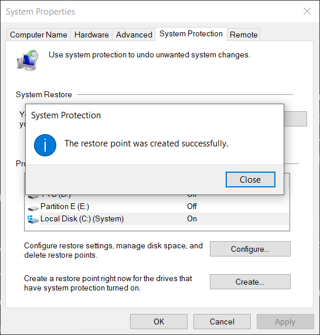
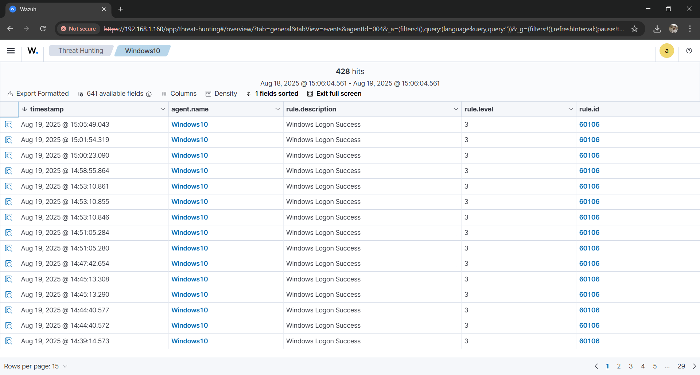
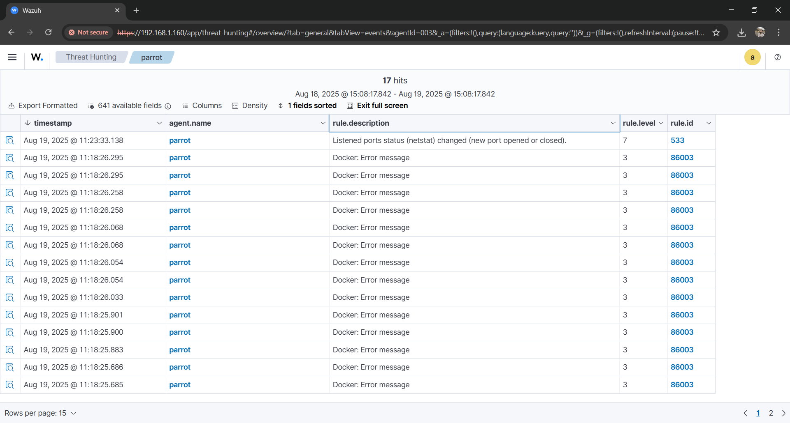
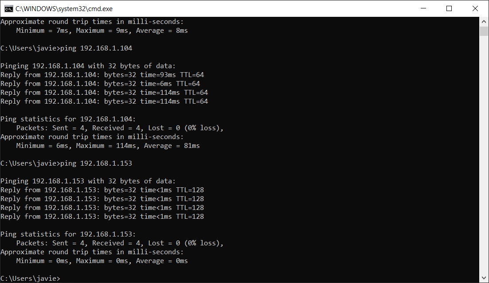

# Security Event Analysis Report

> **Project:** Mini SOC with Micro-Segmentation  
> **Date Range:** Aug 20–24, 2025  
> **Hosts:** Windows 10 (Wazuh Manager + Dashboard), Ubuntu/WSL, Parrot OS  
> **Analyst:** [Your Name]

---

## 1. Introduction

**Objective:**  
Perform deep security log analysis, correlate suspicious activities, validate micro-segmentation rules, and demonstrate a complete detection and investigation workflow using Wazuh and multiple log sources.  

**Scope:**  
- **Log Sources:** Windows Firewall & Security Logs, Linux/WSL Authentication Logs, IDS/SIEM Alerts (Wazuh), and Parrot OS event logs.  
- **Tools:** Wazuh Dashboard, Windows Event Viewer, Parrot OS terminal logs, Dockerized Wazuh components.  
- **Deliverables:** Annotated logs, screenshots, correlation timeline, triage workflow, findings, and recommendations.

**Environment Setup:**  
- **Windows 10 Host (192.168.1.154):** Running Docker-based Wazuh stack and Windows Defender Firewall.  
- **Ubuntu WSL Agent:** Collecting SSH and system logs.  
- **Parrot OS (192.168.1.212):** Used to simulate attacker behavior.  
- **Dockerized Services:** Wazuh Manager, Dashboard, Agents.  
- **Segmentation:** Firewall rules controlling inbound SMB/RDP, allowing only Wazuh agent-manager communication.  

**Reference Screenshots:**  
-   
-   
-   
-   
-   
-   
-   

---

## 2. Log Sources Overview

- **Firewall Logs:** Capture dropped/allowed network connections. Used to confirm segmentation is effective.  
- **Authentication/System Logs:**  
  - Windows Event Log (e.g., 4624 successful logon, 4625 failed logon).  
  - Linux `/var/log/auth.log` for SSH events.  
- **SIEM Logs (Wazuh):** Normalized alerts, severity assignment, and rule correlation.  
- **Parrot OS Logs:** Evidence of attacker-side attempts for validation.  

---

## 3. Analysis Methodology

1. Confirm agent connectivity in Wazuh.  
2. Pivot analysis around suspicious IP (192.168.1.212).  
3. Correlate events across Firewall, Windows, Linux, and Wazuh.  
4. Interpret findings and determine severity.  

**Tools Used:** Wazuh Dashboard, Event Viewer, Linux CLI, Docker logs.  

---

## 4. Log Analysis & Interpretation

### 4.1 Firewall Logs
```
2025-08-21 18:32:45 DROP TCP 192.168.1.212 192.168.1.154 ... 445
2025-08-21 18:33:02 DROP TCP 192.168.1.212 192.168.1.154 ... 3389
```
> SMB and RDP probing blocked by firewall rules.  

  
  

---

### 4.2 Authentication/System Logs

**Windows Failed RDP (4625):**
```
EventID=4625  TargetUserName=Administrator  
SourceIP=192.168.1.212  LogonType=10
```

**Linux WSL SSH Failures:**
```
Aug 21 18:32:14 sshd[2176]: Failed password for root from 192.168.1.212
Aug 21 18:32:19 sshd[2181]: Failed password for root from 192.168.1.212
```

  
  

---

### 4.3 Wazuh SIEM Alerts
```
{"rule":{"id":"5710","description":"sshd: authentication failed."},"srcip":"192.168.1.212"}
{"rule":{"id":"60101","description":"Windows logon failure (4625)."},"srcip":"192.168.1.212"}
```
> Wazuh correlates SSH and RDP brute force into unified alerts.  

  
  

---

### 4.4 Parrot OS Logs
Attacker-side evidence shows brute force attempts.  

  

---

## 5. Correlation of Events

- **Firewall:** Blocked SMB/RDP from 192.168.1.212.  
- **Windows:** Failed RDP login attempts recorded.  
- **Linux:** SSH brute force logged.  
- **Wazuh:** Centralized correlation of all events.  
- **Parrot:** Attacker’s log confirms activity.  

---

## 6. Incident Detection Scenario

**Timeline (Aug 21, 2025):**
- 18:32:14 – SSH failure (Ubuntu).  
- 18:32:45 – Firewall blocks SMB.  
- 18:33:02 – Firewall blocks RDP.  
- 18:33:05 – Windows logs RDP failure.  
- 18:33:06 – Wazuh raises correlated alerts.  

> **Outcome:** Lateral movement attempt blocked. No compromise observed.  

---

## 7. Triage & Investigation

- **Severity:** High (multiple services, privileged accounts).  
- **False Positives:** Low likelihood; confirmed attack from Parrot OS.  
- **Escalation Criteria:** Successful logon (4624, SSH “Accepted”), persistence activity, or lateral spread.  

---

## 8. Findings & Recommendations

**Findings:**  
- Multi-service brute force attempts from Parrot OS.  
- Firewall segmentation worked correctly.  
- No successful compromise.  

**Gaps:**  
- SSH brute force not throttled.  
- Limited correlation rules in Wazuh.  

**Recommendations:**  
1. Enforce MFA for RDP, disable root SSH login.  
2. Apply deny-by-default firewall rules.  
3. Deploy fail2ban on Linux SSH.  
4. Enhance SIEM correlation (multi-service failure from same IP).  
5. Maintain restore points (see screenshot).  

  

---

## 9. Appendix

**Extra Evidence:**  
- Ping connectivity test:   
- Wazuh Docker login:   
- Wazuh Setup:   
- Static IP config:   

**References:**  
- MITRE ATT&CK T1110 (Brute Force), T1021 (Remote Services).  
- NIST SP 800-61 r2 Incident Handling Guide.  
